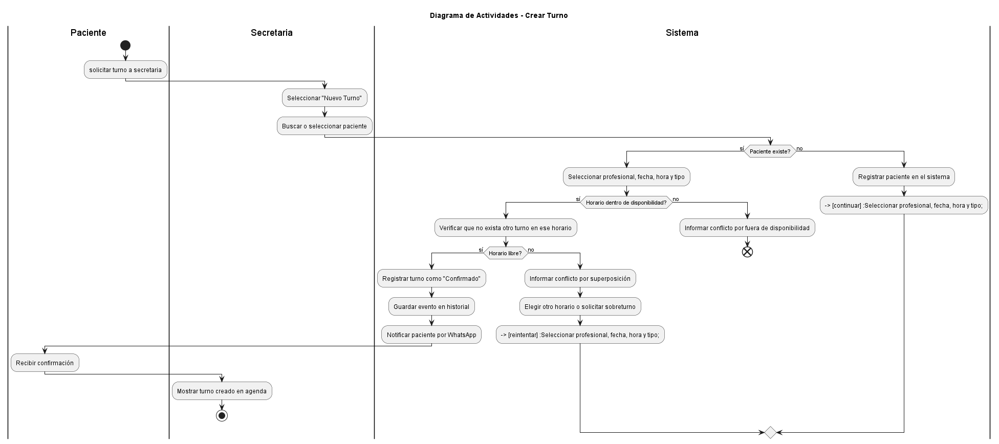
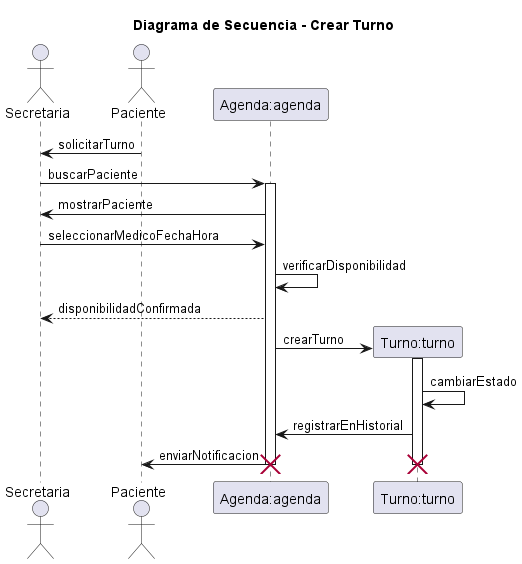
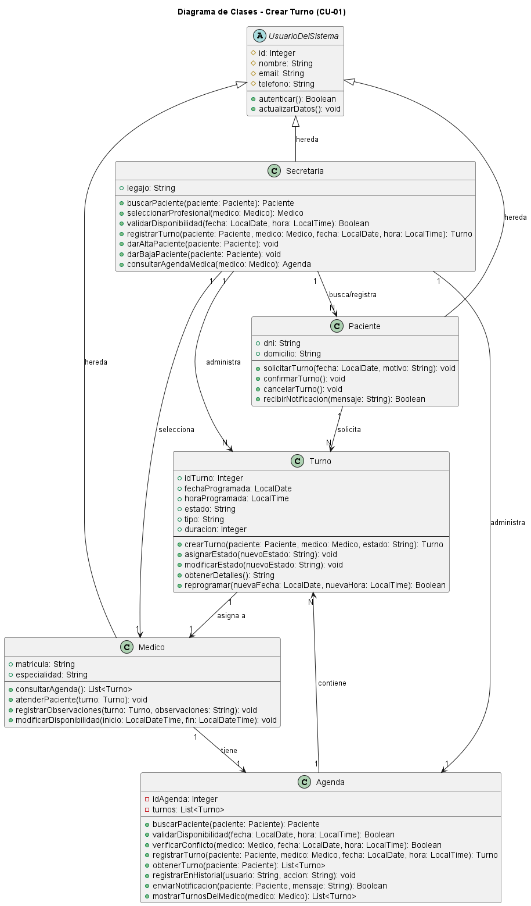

# Caso de Uso N°1 - Crear Turno


## 1. Descripción y Trazabilidad con Requisitos Funcionales

**Actor/es:** Secretaria (Laura), Paciente (Juan García), Sistema

**Objetivo:** La secretaria registra un nuevo turno para un paciente con el profesional, verificando disponibilidad y evitando superposiciones.

**Flujo principal:**

1. La secretaria selecciona "Nuevo Turno".
2. Busca o selecciona al paciente por nombre o identificador.
3. Selecciona profesional, fecha, hora y tipo de consulta (control o primera vez).
4. El sistema verifica que el horario esté dentro de la disponibilidad del profesional.
5. El sistema verifica que no haya otro turno en ese horario.
6. El sistema registra el turno como "Confirmado" con duración estimada (15 min control, 30 min primera vez).
7. El sistema guarda el evento en el historial del turno.
8. El sistema notifica al paciente por WhatsApp o mail.

## Tabla 1: Metadatos del Escenario

| Campo | Valor |
|-------|-------|
| **Nombre Escenario** | Crear Turno de Control Médico - Caso Exitoso |
| **Nombre Caso de Uso** | UC-01: Crear Turno |
| **ID Única** | 03-CU01-FP |
| **Área** | Gestión de Turnos |
| **Actor(es)** | Secretaria (Laura), Paciente (Juan García), Sistema |
| **Descripción** | La secretaria registra un nuevo turno de control médico en el sistema cuando un paciente solicita cita con el médico |

## Tabla 2: Evento/Señal Activador

| Campo | Valor |
|-------|-------|
| **Activar Evento** | Secretaria inicia proceso de crear nuevo turno |
| **Identificadores e iniciadores** | Usuario: Laura (Secretaria), Timestamp: 2026-04-16 14:30, Hora sistema |
| **Tipo Señal** | ☑ Sistema ☐ Usuario ☐ Externo |

## Tabla 3: Pasos Desempeñados

| Pasos desempeñados | Información para los pasos |
|--------------------|---------------------------|
| 1. Acceder a módulo "Nuevo Turno" | Secretaria Laura autenticada, accede a interfaz de creación |
| 2. Buscar paciente en base de datos | Se busca y selecciona "Juan García" del sistema |
| 3. Seleccionar profesional | Dr. Molina seleccionado como médico responsable |
| 4. Seleccionar fecha | 2026-04-21 (martes próximo) |
| 5. Seleccionar hora | 10:00 AM, duración: 15 minutos (tipo: Control) |
| 6. Validar disponibilidad | Sistema verifica que 10:00-10:15 está libre en agenda Dr. Molina |
| 7. Verificar conflictos | Sistema verifica que NO existe otro turno en ese horario |
| 8. Registrar turno | Sistema crea turno con estado "Confirmado", ID: 12345 |
| 9. Guardar en historial | Registro: [2026-04-16 14:30, usuario:Laura, acción:crear_turno, turno_id:12345] |
| 10. Enviar notificación | WhatsApp a Juan García: "Turno confirmado para 21/04 10:00 AM con Dr. Molina" |
| 11. Mostrar confirmación | Secretaria visualiza turno creado en agenda del Dr. Molina |

## Tabla 4: Condiciones de Contexto

| Elemento | Descripción |
|----------|-------------|
| **Precondiciones** | Secretaria autenticada, Paciente existe en sistema, Dr. Molina tiene disponibilidad en horario 10:00 AM |
| **Poscondiciones** | Turno en estado "Confirmado", Paciente notificado vía WhatsApp, Historial registrado con trazabilidad completa, Horario 10:00-10:15 del 21/04 no disponible |
| **Suposiciones** | La hora seleccionada está dentro de agenda normal del médico, WhatsApp está operativo |
| **Reunir Requerimientos** | R-01: Crear turno, R-02: Validar disponibilidad, R-03: Enviar notificación |
| **Aspectos Sobresalientes** | Notificación automática al paciente, Validación de disponibilidad en tiempo real, Trazabilidad completa |
| **Prioridad** | Alta |
| **Riesgo** | Bajo (flujo exitoso estándar) |

**Flujos alternativos:**
- FA-01A: Si el horario está fuera de disponibilidad, el sistema informa el conflicto y no registra el turno.
- FA-01B: Si ya existe un turno en ese horario, el sistema advierte la superposición y bloquea el registro. La secretaria puede elegir otro horario o solicitar sobreturno (ver CU-04).
- FA-01C: Si el paciente no existe, la secretaria puede darlo de alta antes de continuar.

**Requisitos funcionales que satisface:**

| CU-01 | * RF01: Permitir a los pacientes solicitar turnos médicos | El caso de uso cumple este requisito funcional ya que permite al usuario (paciente) solicitar un turno médico en el sistema |
|----|------------------------------------------------------|-------------------------------------|

---

## 2. Diagrama de Casos de Uso


**Actores y relaciones:**
- [Paciente] → [qué hace en este caso de uso] Solicita la creación de un turno.
- [Secretaria] → Verifica la disponibilidad de dicho turno y, si el horario lo permite, lo confirma. También registra al paciente.
- Include/Extend: [si aplica, explicá por qué se modeló así] El método **Crear Turno** incluye también a **Confirmar Turno**, **Verificar Disponibilidad** y se extiende a **Registrar Paciente**. Esto debido a que la Secretaria tiene los permisos necesarios para utilizar **Crear Turno** y todos sus métodos adyacentes.

---

## 3. Diagrama de Actividades



**Swimlanes:**

- **Paciente:** Inicia el proceso solicitando un turno a la secretaria y recibe la confirmación final. Su participación es mínima porque es la secretaria quien interactúa con el sistema.
- **Secretaria:** Actúa como intermediaria entre el paciente y el sistema. Selecciona el módulo, busca/selecciona al paciente y visualiza la confirmación final en la agenda del médico.
- **Sistema:** Valida las condiciones de negocio (existencia del paciente, disponibilidad horaria, conflictos) y registra el turno. Centraliza toda la lógica de validación y persistencia.

**Decisiones clave del flujo:**

**¿Paciente existe? (Bifurcación 1)**

**Condición SÍ:** El paciente ya está registrado, se continúa con la selección de profesional y horario.
**Condición NO:** Flujo alternativo FA-01C. Se ejecuta registrarTurno() en el sistema para dar de alta al paciente, luego se redirige ([continuar]) a la selección de profesional, fecha, hora y tipo.

**¿Horario dentro de disponibilidad? (Bifurcación 3)**

**Condición SÍ:** El horario solicitado está dentro de los horarios disponibles del médico, se procede a verificar conflictos.
**Condición NO:** Flujo alternativo FA-01A. El sistema informa el conflicto por fuera de disponibilidad y el proceso termina (end). No se registra el turno.

**¿Horario libre? (Bifurcación 3)**

**Condición SÍ:** No hay otro turno en ese horario, se procede a registrar el turno como "Confirmado". Se guarda en historial y se notifica al paciente. Caso exitoso.
**Condición NO:** Flujo alternativo FA-01B. El sistema advierte conflicto por superposición e invita a la secretaria a elegir otro horario o solicitar sobreturno. Se ejecuta un bucle ([reintentar]) que regresa a la actividad de selección de profesional, fecha, hora y tipo.

---

## 4. Diagrama de Secuencia




**Participantes:**

- Paciente - actor (representa al usuario paciente que solicita el turno)
- Secretaria - actor (representa al usuario secretaria que gestiona la creación)
- Medico - actor (representa al usuario médico seleccionado para atender)
- Agenda:agenda - objeto de clase Agenda (instancia que administra los turnos)
- Turno:turno - objeto de clase Turno (instancia creada durante la secuencia)

**Mensajes clave:**

- solicitarTurno(fecha, motivo) → Inicia el proceso de creación de turno desde el paciente hacia la secretaria
- buscarPaciente(paciente) → La secretaria verifica que el paciente existe en el sistema
- seleccionarProfesional(medico) → La secretaria selecciona el médico que atenderá al paciente
- validarDisponibilidad(fecha, hora) → Se valida que el horario solicitado está disponible en la agenda del médico
- registrarTurno(paciente, medico, fecha, hora) → Se registra el turno en la agenda del médico
- crearTurno(paciente, medico, estado=Confirmado) → Se crea la instancia de Turno con estado inicial "Confirmado"
- asignarEstado("Confirmado") → Se asigna explícitamente el estado "Confirmado" a la instancia de turno
- registrarEnHistorial(usuario=secretaria) → Se guarda un registro de la acción en el historial para mantener trazabilidad
- enviar notificacion → Se envía notificación al paciente confirmando que su turno fue creado

**Objetos temporales destruidos:**

- Turno:turno - Se crea durante la secuencia con create turno y se destruye con destroy turno. En la notación del diagrama, la instancia se elimina porque ya no participa en mensajes posteriores. Sin embargo, en el dominio del sistema, el Turno sí persiste en la Agenda y en la base de datos después de ser creado.
- Agenda:agenda - Se activa durante la secuencia y se desactiva/destruye al final. En la notación del diagrama, se marca como destruida porque finaliza su participación. Sin embargo, en el sistema real, la Agenda persiste como componente central que almacena los turnos.

---

## 5. Diagrama de Clases del Caso de Uso



**Clases involucradas:**

| Clase | Responsabilidad (según tarjeta CRC) | Tarjeta CRC |
|-------|-------------------------------------|-------------|
| Paciente | Solicitar turno médico, autenticarse en el sistema, confirmar o cancelar turno, recibir notificaciones de turno y gestionar datos personales | [link al archivo .md](../../herramientas-agile/tarjetas-crc/01-tarjeta-crc-paciente.md) |
| Medico | Consultar agenda de turnos, atender pacientes, registrar observaciones médicas y modificar disponibilidad | [link al archivo .md](../../herramientas-agile/tarjetas-crc/02-tarjeta-crc-medico.md) |
| Turno | Registrar solicitud de turno, asignar turno a paciente y médico, modificar estado del turno y reprogramar turno | [link al archivo .md](../../herramientas-agile/tarjetas-crc/03-tarjeta-crc-turno.md) |
| Agenda | Registrar disponibilidad de médicos, mostrar turnos programados y permitir búsqueda de turnos | [link al archivo .md](../../herramientas-agile/tarjetas-crc/04-tarjeta-crc-agenda.md) |
| Secretaria | Gestionar turnos, dar alta y baja a pacientes y consultar/modificar agendar médicas | [link al archivo .md](../../herramientas-agile/tarjetas-crc/05-tarjeta-crc-secretaria.md) |
|

**Relaciones UML:**

| Relación | Clases | Justificación |
|----------|--------|---------------|
| Herencia | UsuarioDelSistema ```<--``` Paciente | Paciente comparte atributos comunes (id, nombre, email, teléfono) y comportamientos (autenticar, actualizarDatos) definidos en la clase abstracta base. |
| Herencia | UsuarioDelSistema ```<--``` Secretaria | Secretaria reutiliza los atributos y métodos generales del sistema como usuario registrado. |
| Herencia | UsuarioDelSistema ```<--``` Medico | Medico hereda información común de todos los usuarios del sistema (identidad, autenticación, datos de contacto). |
| Asociación | Secretaria ```-->``` Agenda | La Secretaria requiere acceso directo y continuo a Agenda para buscar pacientes, validar disponibilidad y registrar turnos durante el flujo de CU-01. |
| Asociación | Secretaria ```-->``` Paciente | La Secretaria busca y registra pacientes en el sistema. Necesita una relación directa para localizar al paciente y darlo de alta si es necesario. |
| Asociación | Secretaria ```-->``` Medico | La Secretaria selecciona el Medico disponible. Mantiene una relación de consulta directa para obtener información del profesional. |
| Agregación | Agenda ```"1" o--``` Turno ```0..*``` | Es agregación (no composición) porque Agenda contiene múltiples Turnos sin controlar su ciclo de vida completo. Los Turnos pueden existir lógicamente independientes de esta Agenda específica. |
| Asociación | Turno ```"1"-->``` Paciente ```"1"``` | Cada Turno se asigna a exactamente un Paciente específico. Es asociación porque existe una relación de negocio significativa: el turno registra la cita médica del paciente. |
| Asociación | Turno ```"1"-->``` Medico ```"1"``` | Cada Turno se asigna a exactamente un Medico que lo atiende. Es asociación porque la relación es fundamental para el dominio: identifica quién atiende la cita. |

---

## 6. Pseudocódigo

```
INICIO Crear Turno

// El paciente solicita la creación de un turno al contactar la secretaria
// La secretaria accede al módulo de creación de turnos

Paciente paciente
Secretaria secretaria = nueva Secretaria()
Medico medico
Agenda agenda = nueva Agenda()
Turno turno
LocalDate fechaProgramada
LocalTime horaProgramada
String motivoConsulta

// El paciente solicita un turno, especificando fecha y motivo
paciente.solicitarTurno(fechaProgramada, motivoConsulta)

// La secretaria busca el paciente en el sistema
paciente = agenda.buscarPaciente(paciente)

SI paciente no existe
    // Flujo alternativo: registrar paciente nuevo antes de crear turno
    secretaria.darAltaPaciente(paciente)
FIN SI

// La secretaria selecciona el médico que atenderá al paciente
medico = secretaria.seleccionarProfesional(medico)

// La secretaria valida que el horario solicitado esté disponible
// en la agenda del médico seleccionado
Boolean disponibleDisponible = agenda.validarDisponibilidad(fechaProgramada, horaProgramada)

SI disponible es FALSO
    // El horario está fuera de la disponibilidad del médico
    // Se informa el conflicto y se ofrecen alternativas
    Mostrar "Horario fuera de disponibilidad"
    Terminar proceso
FIN SI

// Se verifica que no exista otro turno en el mismo horario
// (validación de conflictos de superposición)
Boolean horarioLibre = agenda.verificarConflicto(medico, fechaProgramada, horaProgramada)

SI horarioLibre es FALSO
    // El horario ya está ocupado por otro turno
    Mostrar "Horario no disponible - conflicto de reserva"
    Terminar proceso
FIN SI

// Se procede a registrar el nuevo turno en la agenda
turno = agenda.registrarTurno(paciente, medico, fechaProgramada, horaProgramada)

// Se crea el turno con estado inicial "Confirmado"
turno = turno.crearTurno(paciente, medico, estado="Confirmado")

// Se asigna el estado al turno de forma explícita
turno.asignarEstado("Confirmado")

// Se registra el evento en auditoría para mantener trazabilidad
// del usuario (Secretaria) que realizó la acción
agenda.registrarEnHistorial(usuario="secretaria", accion="crear_turno")

// Se envía notificación al paciente confirmando su turno
agenda.enviarNotificacion(paciente, mensaje="Turno confirmado")

// Se muestra la confirmación a la secretaria en la agenda del médico
secretaria.consultarAgendaMedica(medico)

// El caso de uso finaliza exitosamente
Retornar turno confirmado

FIN Crear Turno

```