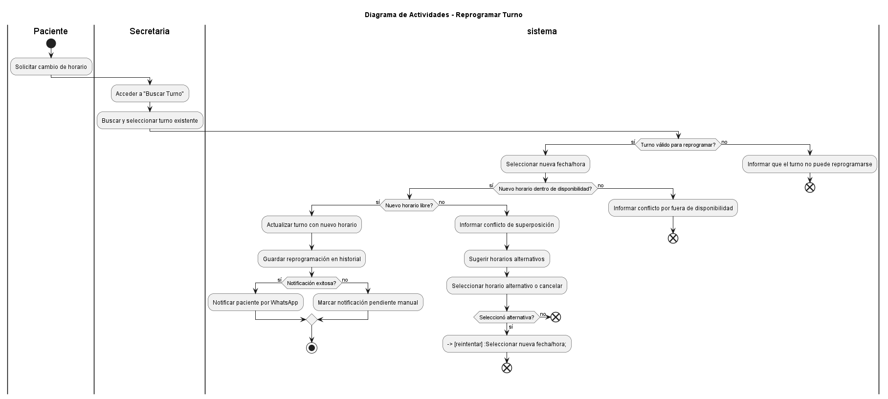
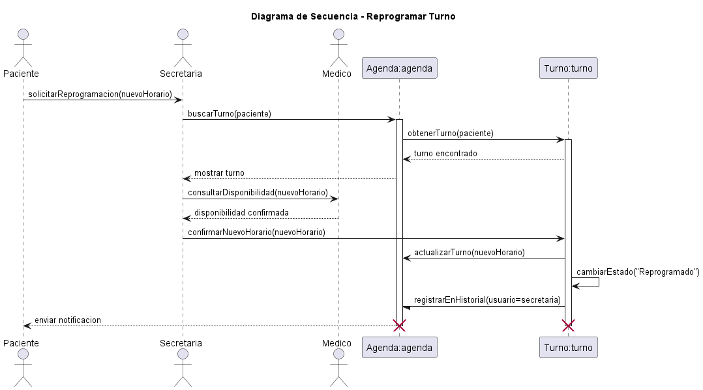
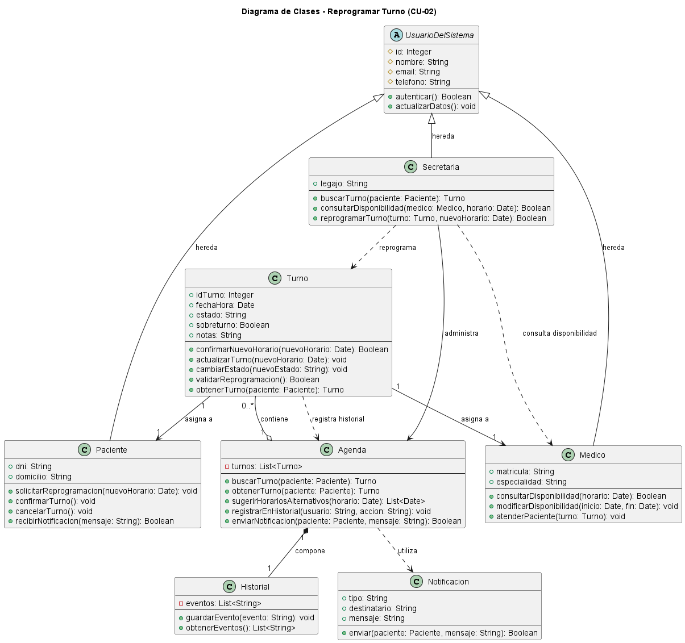

```md
# Caso de Uso N° 02 - Reprogramar Turno

---

## 1. Descripción y Trazabilidad con Requisitos Funcionales

**Actor/es:** Secretaria (Laura), Paciente (María Rodríguez), Sistema

**Objetivo:** La secretaria reprograma un turno cuando el paciente lo solicita, detectando conflictos y sugiriendo horarios alternativos.

**Flujo principal:**

1. Acceder a módulo "Buscar Turno".
2. Buscar turno.
3. Mostrar detalles.
4. Seleccionar "Reprogramar turno".
5. Proponer nuevo horario.
6. Validar disponibilidad.
7. Detectar conflicto.
8. Bloquear cambio.
9. Sugerir alternativas.
10. Seleccionar nuevo horario.
11. Validar y confirmar.
12. Actualizar turno.
13. Registrar en historial.
14. Enviar notificación.

**Flujos alternativos:**

- Si el sistema detecta que el horario propuesto ya se encuentra ocupado, bloquea el cambio y sugiere horarios alternativos.
- Si la secretaria no selecciona una alternativa sugerida, el proceso de reprogramación finaliza sin cambios.

**Requisitos funcionales que satisface:**

| ID | Requisito Funcional (texto exacto de introduccion.md) | Cómo lo satisface este caso de uso |
|----|------------------------------------------------------|-------------------------------------|
| RF02 | Permitir a los pacientes cancelar o reprogramar turnos. | Permite modificar la fecha y hora de un turno existente a solicitud del paciente. |
| RF05 | Gestionar la disponibilidad horaria de los profesionales. | Verifica disponibilidad y evita conflictos antes de confirmar la reprogramación. |

---

## 2. Diagrama de Casos de Uso


**Actores y relaciones:**

- Paciente → solicita la reprogramación de un turno existente.
- Secretaria → gestiona la búsqueda, validación y actualización del turno.
- Include/Extend: la reprogramación requiere consultar disponibilidad y validar conflictos antes de concretar el cambio.

---

## 3. Diagrama de Actividades



**Swimlanes:** Paciente, Secretaria y Sistema. Cada carril representa las responsabilidades de los participantes involucrados durante el proceso de reprogramación.

**Decisiones clave del flujo:** Validar si el turno puede reprogramarse, verificar que el nuevo horario se encuentre dentro de la disponibilidad del profesional, comprobar que no exista superposición con otros turnos y determinar si la notificación fue enviada correctamente.

---

## 4. Diagrama de Secuencia



**Participantes:** Paciente (actor), Secretaria (actor), Medico (actor), Agenda:agenda, Turno:turno.

**Mensajes clave:**

- solicitarReprogramacion(nuevoHorario) → inicia el proceso de reprogramación solicitado por el paciente.
- buscarTurno(paciente) → recupera el turno que será modificado.
- consultarDisponibilidad(nuevoHorario) → verifica la disponibilidad del profesional.
- confirmarNuevoHorario(nuevoHorario) → valida el horario elegido para la reprogramación.
- actualizarTurno(nuevoHorario) → registra el nuevo horario del turno.
- cambiarEstado("Reprogramado") → actualiza el estado del turno.
- registrarEnHistorial(usuario=secretaria) → deja trazabilidad de la modificación realizada.
- enviar notificacion → informa al paciente el nuevo horario asignado.

**Objetos temporales destruidos:** Turno:turno y Agenda:agenda finalizan su participación al concluir la interacción representada en el escenario.

---

## 5. Diagrama de Clases del Caso de Uso



**Clases involucradas:**

| Clase | Responsabilidad (según tarjeta CRC) | Tarjeta CRC |
|-------|-------------------------------------|-------------|
| Paciente | Solicitar turno médico | ../../herramientas-agile/tarjetas-crc/01-tarjeta-crc-paciente.md |
| Medico | Modificar disponibilidad | ../../herramientas-agile/tarjetas-crc/02-tarjeta-crc-medico.md |
| Turno | Reprogramar turno y modificar estado del turno | ../../herramientas-agile/tarjetas-crc/03-tarjeta-crc-turno.md |
| Agenda | Permitir búsqueda de turnos y mostrar turnos programados | ../../herramientas-agile/tarjetas-crc/04-tarjeta-crc-agenda.md |
| Secretaria | Gestionar turnos (reprogramar) | ../../herramientas-agile/tarjetas-crc/05-tarjeta-crc-secretaria.md |

**Relaciones UML:**

| Relación | Clases | Justificación |
|----------|--------|---------------|
| Herencia | UsuarioDelSistema → Paciente | Paciente comparte atributos y operaciones comunes definidas para los usuarios del sistema. |
| Herencia | UsuarioDelSistema → Secretaria | Secretaria reutiliza atributos y comportamientos generales del sistema. |
| Herencia | UsuarioDelSistema → Medico | Medico hereda información común de los usuarios registrados. |
| Asociación | Secretaria → Agenda | La secretaria utiliza la agenda para localizar y administrar turnos. |
| Dependencia | Secretaria → Medico | La secretaria consulta la disponibilidad del médico antes de confirmar el cambio. |
| Dependencia | Secretaria → Turno | La secretaria interactúa con el turno para ejecutar la reprogramación. |
| Agregación | Agenda → Turno | La agenda administra múltiples turnos sin controlar completamente su ciclo de vida. |
| Composición | Agenda → Historial | El historial forma parte de la agenda y depende de ella para existir. |
| Dependencia | Agenda → Notificacion | La agenda utiliza el servicio de notificaciones para informar cambios. |
| Asociación | Turno → Paciente | Cada turno se encuentra asociado a un paciente. |
| Asociación | Turno → Medico | Cada turno se encuentra asociado a un médico. |

---

## 6. Pseudocódigo

```text
INICIO Reprogramar Turno

// El paciente solicita modificar el horario de un turno existente

Paciente paciente = nuevo Paciente()
Secretaria secretaria = nuevo Secretaria()
Agenda agenda = nuevo Agenda()
Turno turno = nuevo Turno()

// La secretaria busca el turno solicitado por el paciente
turno = agenda.obtenerTurno(paciente)

// Se verifica la disponibilidad del nuevo horario solicitado
resultado = turno.confirmarNuevoHorario(nuevoHorario)

// Si el horario es válido se actualiza el turno
SI resultado es válido
    turno.actualizarTurno(nuevoHorario)
    turno.cambiarEstado("Reprogramado")

    // Se registra la modificación para mantener trazabilidad
    agenda.registrarEnHistorial("Secretaria", "Reprogramación de turno")

    // Se informa al paciente el nuevo horario asignado
    agenda.enviarNotificacion(paciente, "Turno reprogramado")
SINO
    // Se detecta un conflicto y se ofrecen horarios alternativos
    alternativas = agenda.sugerirHorariosAlternativos(nuevoHorario)
    
    SI usuario selecciona una alternativa de la lista
        turno.actualizarTurno(alternativaSeleccionada)
        turno.cambiarEstado("Reprogramado")
        agenda.registrarEnHistorial("Secretaria", "Reprogramación de turno")
        agenda.enviarNotificacion(paciente, "Turno reprogramado")
    SINO
        // Flujo alternativo: usuario no selecciona alternativa
        Retornar "Reprogramación cancelada - sin cambios"
    
FIN SI

// El sistema finaliza con el turno actualizado o con alternativas propuestas
Retornar resultado

FIN
````

```
```
