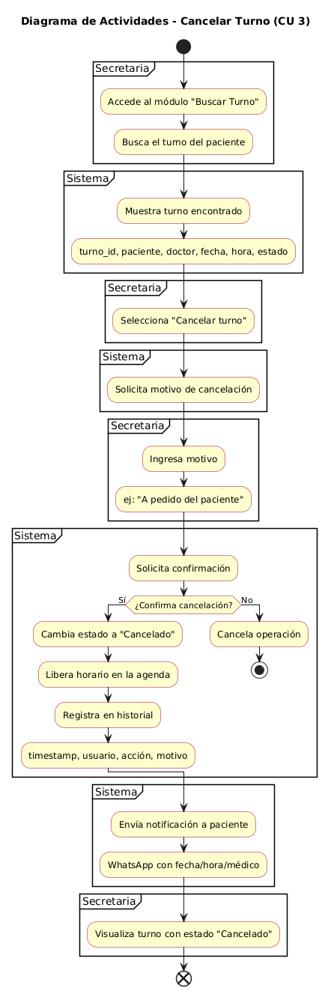
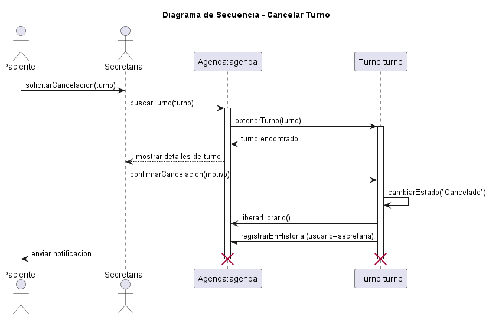
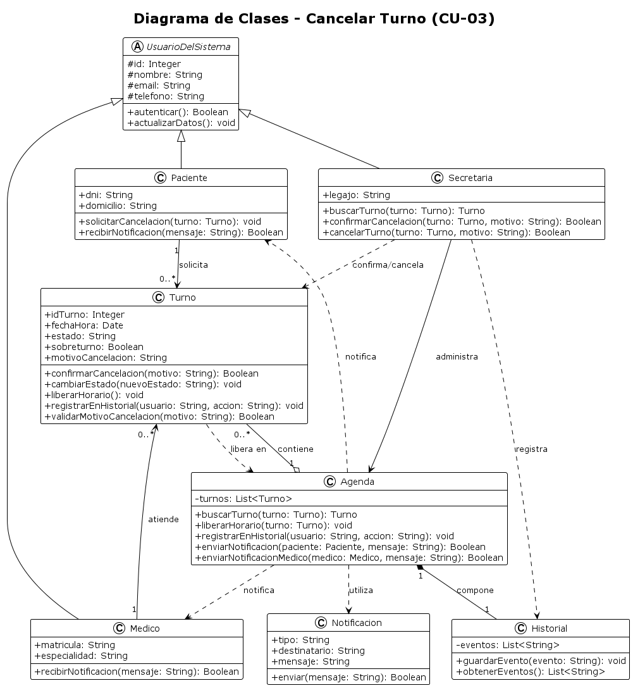

# Caso de Uso N° 03 - Cancelar Turno

---

## 1. Descripción y Trazabilidad con Requisitos Funcionales

**Actor/es:** Secretaria (Carlos), Paciente (Roberto López), Sistema

**Objetivo:** La secretaria cancela un turno existente cuando el paciente lo solicita, liberando el horario.

**Flujo principal:**

1. Acceder a módulo "Buscar Turno".
2. Buscar turno.
3. Mostrar detalles.
4. Seleccionar "Cancelar turno".
5. Solicitar motivo.
6. Ingresar motivo.
7. Confirmar acción.
8. Procesar cancelación.
9. Liberar horario.
10. Registrar en historial.
11. Enviar notificación.
12. Mostrar resultado.

**Requisitos funcionales que satisface:**

| ID | Requisito Funcional (texto exacto de introduccion.md) | Cómo lo satisface este caso de uso |
|----|------------------------------------------------------|-------------------------------------|
| RF02 | Permitir a los pacientes cancelar o reprogramar turnos. | Permite cancelar un turno existente a solicitud del paciente. |
| RF05 | Gestionar la disponibilidad horaria de los profesionales. | Libera el horario previamente ocupado por el turno cancelado. |

---

## 2. Diagrama de Casos de Uso


**Actores y relaciones:**

- Paciente → solicita la cancelación de un turno existente.
- Secretaria → busca el turno, registra el motivo y confirma la cancelación.
- Include/Extend: la cancelación requiere validar la solicitud, registrar el motivo y liberar el horario correspondiente.

---

## 3. Diagrama de Actividades



**Swimlanes:** Paciente, Secretaria y Sistema. Cada carril representa las responsabilidades de los participantes involucrados durante el proceso de cancelación.

**Decisiones clave del flujo:** Verificar que el turno exista, validar que el motivo de cancelación sea correcto y confirmar la cancelación antes de modificar el estado del turno.

---

## 4. Diagrama de Secuencia



**Participantes:** Paciente (actor), Secretaria (actor), Agenda:agenda, Turno:turno.

**Mensajes clave:**

- solicitarCancelacion(turno) → inicia el proceso de cancelación solicitado por el paciente.
- buscarTurno(turno) → recupera el turno que será cancelado.
- obtenerTurno(turno) → obtiene la información completa del turno.
- confirmarCancelacion(motivo) → valida la cancelación y registra el motivo.
- cambiarEstado("Cancelado") → modifica el estado del turno.
- liberarHorario() → deja disponible el horario previamente asignado.
- registrarEnHistorial(usuario=secretaria) → registra la acción realizada para mantener trazabilidad.
- enviar notificacion → informa al paciente sobre la cancelación del turno.

**Objetos temporales destruidos:** Turno:turno y Agenda:agenda finalizan su participación al concluir la interacción representada en el escenario.

---

## 5. Diagrama de Clases del Caso de Uso



**Clases involucradas:**

| Clase | Responsabilidad (según tarjeta CRC) | Tarjeta CRC |
|-------|-------------------------------------|-------------|
| Paciente | Confirmar o cancelar turno y recibir notificaciones de turno | ../../herramientas-agile/tarjetas-crc/01-tarjeta-crc-paciente.md |
| Medico | Consultar agenda de turnos | ../../herramientas-agile/tarjetas-crc/02-tarjeta-crc-medico.md |
| Turno | Modificar estado del turno | ../../herramientas-agile/tarjetas-crc/03-tarjeta-crc-turno.md |
| Agenda | Permitir búsqueda de turnos y mostrar turnos programados | ../../herramientas-agile/tarjetas-crc/04-tarjeta-crc-agenda.md |
| Secretaria | Gestionar turnos (cancelar) | ../../herramientas-agile/tarjetas-crc/05-tarjeta-crc-secretaria.md |

**Relaciones UML:**

| Relación | Clases | Justificación |
|----------|--------|---------------|
| Herencia | UsuarioDelSistema → Paciente | Paciente comparte atributos y operaciones comunes definidas para los usuarios del sistema. |
| Herencia | UsuarioDelSistema → Secretaria | Secretaria reutiliza atributos y comportamientos generales del sistema. |
| Herencia | UsuarioDelSistema → Medico | Medico hereda información común de los usuarios registrados. |
| Asociación | Paciente → Turno | El paciente solicita la cancelación de uno o varios turnos. |
| Asociación | Medico → Turno | El médico se encuentra asociado a los turnos asignados. |
| Asociación | Secretaria → Agenda | La secretaria utiliza la agenda para localizar y administrar turnos. |
| Dependencia | Secretaria → Turno | La secretaria confirma y ejecuta la cancelación del turno. |
| Dependencia | Secretaria → Historial | Registra las acciones realizadas durante la cancelación. |
| Agregación | Agenda → Turno | La agenda administra múltiples turnos sin controlar completamente su ciclo de vida. |
| Composición | Agenda → Historial | El historial forma parte de la agenda y depende de ella para existir. |
| Dependencia | Agenda → Notificacion | La agenda utiliza el servicio de notificaciones para informar cambios. |
| Dependencia | Agenda → Paciente | La agenda envía notificaciones al paciente. |
| Dependencia | Agenda → Medico | La agenda envía notificaciones al médico. |
| Dependencia | Turno → Agenda | El turno solicita la liberación del horario dentro de la agenda. |

---

## 6. Pseudocódigo

```text
INICIO Cancelar Turno

// El paciente solicita cancelar un turno existente

Paciente paciente = nuevo Paciente()
Secretaria secretaria = nuevo Secretaria()
Agenda agenda = nuevo Agenda()
Turno turno = nuevo Turno()

// La secretaria localiza el turno solicitado por el paciente
turno = agenda.buscarTurno(turno)

// Se valida el motivo de cancelación indicado
resultado = turno.confirmarCancelacion(motivo)

// Si la cancelación es válida se modifica el estado del turno
SI resultado es válido
    turno.cambiarEstado("Cancelado")

    // El horario queda nuevamente disponible para futuras reservas
    agenda.liberarHorario(turno)

    // Se registra la acción para mantener trazabilidad
    agenda.registrarEnHistorial("Secretaria", "Cancelación de turno")

    // Se informa al paciente sobre la cancelación realizada
    agenda.enviarNotificacion(paciente, "Turno cancelado")
SINO
    // La cancelación no puede completarse por datos inválidos
    Retornar "Cancelación rechazada"
FIN SI

// El sistema finaliza con el turno cancelado y el horario liberado
Retornar resultado

FIN