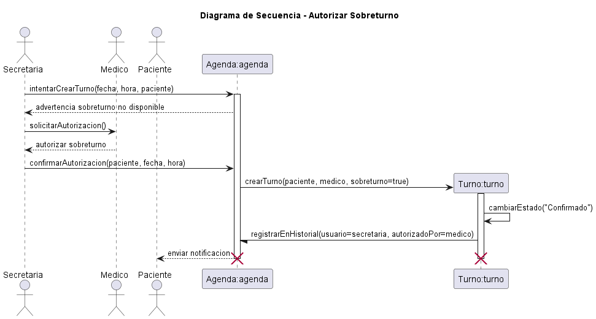
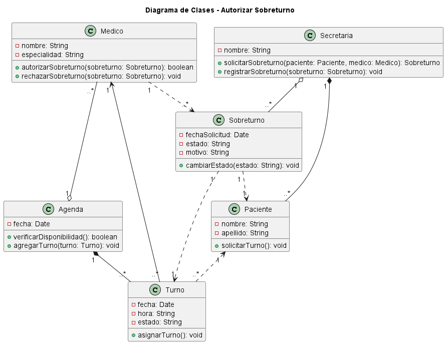

# Caso de Uso N°4 - Autorizar Sobreturno

## 1. Descripción y Trazabilidad con Requisitos Funcionales

**Actor/es:** Secretaria, Médico, Paciente, Sistema

**Objetivo:** Permitir que la secretaria solicite un sobreturno para un paciente cuando no existen turnos disponibles, y que el médico pueda autorizar o rechazar dicha solicitud verificando la disponibilidad de su agenda.

**Flujo principal:**

1. El paciente solicita un turno médico a la secretaria.
2. La secretaria verifica la disponibilidad del médico.
3. El sistema detecta que no existen horarios disponibles.
4. La secretaria registra una solicitud de sobreturno indicando paciente, médico, fecha y motivo.
5. El sistema crea el sobreturno con estado "Pendiente".
6. El médico consulta la solicitud de sobreturno.
7. El médico analiza la disponibilidad de su agenda.
8. El médico autoriza o rechaza la solicitud.
9. Si el médico autoriza, el sistema genera un nuevo turno.
10. El sistema actualiza el estado del sobreturno y notifica el resultado.

**Requisitos funcionales que satisface:**

| ID | Requisito Funcional | Cómo lo satisface este caso de uso |
|----|---------------------|-------------------------------------|
| RF04 | Gestionar solicitudes de sobreturno | Permite registrar, consultar y resolver solicitudes de sobreturno médico |
| RF05 | Autorizar o rechazar sobreturnos | Permite al médico aceptar o rechazar solicitudes según disponibilidad |

---

## 2. Diagrama de Casos de Uso


**Actores y relaciones:**

- **Paciente:** Solicita atención médica cuando no encuentra disponibilidad.
- **Secretaria:** Registra la solicitud de sobreturno y gestiona la comunicación.
- **Medico:** Evalúa la solicitud y decide autorizar o rechazar.
- **Sistema:** Valida información, registra cambios y genera el turno.

---

## 3. Diagrama de Actividades


**Swimlanes:**

- **Paciente:** Solicita atención médica y recibe la respuesta.
- **Secretaria:** Gestiona la creación y registro del sobreturno.
- **Medico:** Analiza la solicitud y toma la decisión final.
- **Sistema:** Controla validaciones, estados y generación del turno.

**Decisiones clave del flujo:**

- ¿Existe disponibilidad en agenda? → SÍ: turno normal / NO: solicitud de sobreturno
- ¿El médico autoriza el sobreturno? → SÍ: crear turno / NO: rechazar solicitud

---

## 4. Diagrama de Secuencia



**Participantes:**

- **Paciente:** Actor que solicita atención médica.
- **Secretaria:** Actor que registra la solicitud.
- **Medico:** Actor que autoriza o rechaza el sobreturno.
- **Sobreturno:sobreturno:** Objeto que representa la solicitud.
- **Turno:turno:** Objeto generado si la solicitud es aprobada.
- **Agenda:agenda:** Objeto encargado de validar disponibilidad.

**Mensajes clave:**

- `solicitarSobreturno(paciente, medico)` → Secretaria inicia la solicitud.
- `verificarDisponibilidad()` → Agenda valida horarios disponibles.
- `registrarSobreturno(sobreturno)` → Sistema almacena la solicitud.
- `autorizarSobreturno(sobreturno)` → Médico acepta el sobreturno.
- `rechazarSobreturno(sobreturno)` → Médico rechaza la solicitud.
- `cambiarEstado(estado)` → Actualiza el estado del sobreturno.
- `asignarTurno()` → Genera un nuevo turno.

---

## 5. Diagrama de Clases del Caso de Uso



**Clases involucradas:**

| Clase | Responsabilidad (según tarjeta CRC) | Tarjeta CRC |
|-------|-------------------------------------|-------------|
| Medico | Autorizar o rechazar solicitudes de sobreturno | [Tarjeta CRC - Medico](../../herramientas-agile/tarjetas-crc/02-tarjeta-crc-medico.md) |
| Secretaria | Crear y registrar solicitudes | [Tarjeta CRC - Secretaria](../../herramientas-agile/tarjetas-crc/05-tarjeta-crc-secretaria.md) |
| Paciente | Solicitar atención médica | [Tarjeta CRC - Paciente](../../herramientas-agile/tarjetas-crc/01-tarjeta-crc-paciente.md) |
| Sobreturno | Representar la solicitud de atención especial | [Tarjeta CRC -  Sobreturno](../../herramientas-agile/tarjetas-crc/09-tarjeta-crc-sobreturno.md) | |
| Turno | Registrar el turno generado | [Tarjeta CRC - Turno](../../herramientas-agile/tarjetas-crc/03-tarjeta-crc-turno.md) |
| Agenda | Verificar disponibilidad y administrar turnos | [Tarjeta CRC - Agenda](../../herramientas-agile/tarjetas-crc/04-tarjeta-crc-agenda.md) |


**Relaciones UML:**

| Relación | Clases | Justificación |
|----------|--------|---------------|
| Composición | Secretaria → Sobreturno | La secretaria crea la solicitud de sobreturno |
| Composición | Medico → Sobreturno | El médico autoriza o rechaza la solicitud |
| Dependencia | Sobreturno → Paciente | El sobreturno está asignado a un paciente |
| Composición | Sobreturno → Medico | El sobreturno está asociado a un médico |
| Dependencia | Sobreturno → Turno | Si se autoriza, se genera un turno |
| Composición | Agenda → Turno | La agenda administra múltiples turnos |
| Dependencia | Turno → Medico | El turno se asigna a un médico |
| Dependencia | Turno → Paciente | El turno se asigna a un paciente |

---

## 6. Pseudocódigo

```text
INICIO Autorizar Sobreturno

// El paciente solicita un turno y no hay disponibilidad
Paciente paciente = nuevo Paciente()
Secretaria secretaria = nuevo Secretaria()
Medico medico = nuevo Medico()
Agenda agenda = nuevo Agenda()
Sobreturno sobreturno = nuevo Sobreturno()

// La secretaria verifica la disponibilidad del médico
disponible = agenda.verificarDisponibilidad(medico, fecha, hora)

SI disponible == FALSO
    // No hay turnos disponibles, se crea solicitud de sobreturno
    sobreturno = secretaria.crearSobreturno(paciente, medico, fecha, motivo)
    sobreturno.cambiarEstado("Pendiente")
    
    // El médico consulta las solicitudes pendientes
    solicitudes = medico.consultarSolicitudesPendientes()
    
    // El médico evalúa la solicitud
    SI medico.autorizarSobreturno(sobreturno) == VERDADERO
        // Se autoriza el sobreturno
        sobreturno.cambiarEstado("Autorizado")
        
        // Se genera un nuevo turno
        turno = agenda.crearTurno(paciente, medico, fecha, hora, sobreturno=VERDADERO)
        turno.cambiarEstado("Confirmado")
        
        // Se notifica al paciente
        notificacion.enviar(paciente, "Sobreturno autorizado")
    SINO
        // Se rechaza el sobreturno
        sobreturno.cambiarEstado("Rechazado")
        notificacion.enviar(paciente, "Sobreturno rechazado")
    FIN SI
SINO
    // Hay disponibilidad normal, se crea turno regular
    turno = agenda.crearTurno(paciente, medico, fecha, hora, sobreturno=FALSO)
FIN SI

FIN