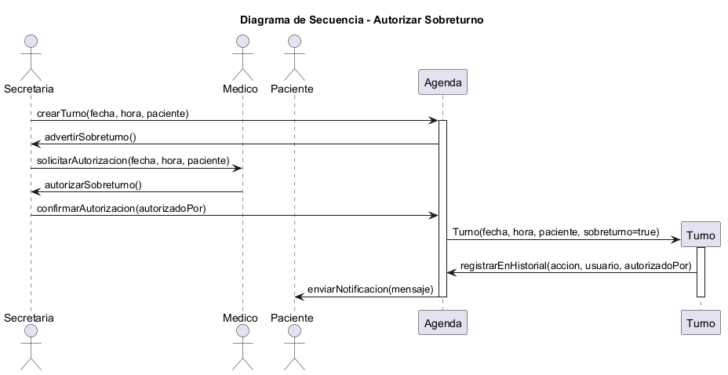

# Caso de Uso N°4 - Autorizar Sobreturno


## 1. Descripción y Trazabilidad con Requisitos Funcionales

**Actor/es:** Secretaria, Médico, Paciente, Sistema

**Objetivo:** Permitir que la secretaria solicite un sobreturno para un paciente cuando no existen turnos disponibles, y que el médico pueda autorizar o rechazar dicha solicitud verificando la disponibilidad de su agenda.


**Flujo principal:**

1. El paciente solicita un turno médico a la secretaria.
2. La secretaria verifica la disponibilidad del médico.
3. El sistema detecta que no existen horarios disponibles.
4. La secretaria registra una solicitud de sobreturno indicando paciente, médico, fecha y motivo.
5. El sistema crea el sobreturno con estado "Pendiente".
6. El médico consulta la solicitud de sobreturno.
7. El médico analiza la disponibilidad de su agenda.
8. El médico autoriza o rechaza la solicitud.
9. Si el médico autoriza, el sistema genera un nuevo turno.
10. El sistema actualiza el estado del sobreturno y notifica el resultado.


---

## Tabla 1: Metadatos del Escenario

| Campo | Valor |
|-------|-------|
| **Nombre Escenario** | Autorizar Sobreturno Médico - Caso Exitoso |
| **Nombre Caso de Uso** | UC-04: Autorizar Sobreturno |
| **ID Única** | 04-CU04-FP |
| **Área** | Gestión de Sobreturnos |
| **Actor(es)** | Secretaria, Médico, Paciente, Sistema |
| **Descripción** | El sistema permite gestionar solicitudes de sobreturno cuando no existe disponibilidad normal en la agenda médica |


---

## Tabla 2: Evento/Señal Activador

| Campo | Valor |
|-------|-------|
| **Activar Evento** | Secretaria solicita un sobreturno para un paciente |
| **Identificadores e iniciadores** | Usuario: Secretaria, Timestamp: 2026-04-16 15:00, Hora sistema |
| **Tipo Señal** | ☑ Usuario ☑ Sistema ☐ Externo |


---

## Tabla 3: Pasos Desempeñados

| Pasos desempeñados | Información para los pasos |
|--------------------|---------------------------|
| 1. Solicitar sobreturno | Paciente solicita atención médica fuera de los turnos disponibles |
| 2. Verificar disponibilidad | Sistema consulta la agenda del médico seleccionado |
| 3. Detectar falta de disponibilidad | Sistema informa que no existen horarios libres |
| 4. Crear solicitud de sobreturno | Secretaria registra paciente, médico, fecha y motivo |
| 5. Registrar sobreturno | Sistema crea solicitud con estado "Pendiente" |
| 6. Consultar solicitud | Médico visualiza solicitudes pendientes |
| 7. Evaluar agenda médica | Médico verifica si puede atender al paciente |
| 8. Autorizar o rechazar | Médico ejecuta autorizarSobreturno() o rechazarSobreturno() |
| 9. Generar turno | Si se acepta, el sistema crea un nuevo turno |
| 10. Actualizar estado | El sobreturno cambia a "Autorizado" o "Rechazado" |
| 11. Notificar resultado | Sistema informa la decisión al paciente y secretaria |


---

## Tabla 4: Condiciones de Contexto

| Elemento | Descripción |
|----------|-------------|
| **Precondiciones** | Paciente registrado, médico existente y solicitud de sobreturno creada |
| **Poscondiciones** | Sobreturno autorizado o rechazado, turno generado si corresponde y estado actualizado |
| **Suposiciones** | Médico con acceso a agenda y solicitudes pendientes |
| **Reunir Requerimientos** | RF04: Gestionar solicitudes de sobreturno, RF05: Autorizar o rechazar solicitudes |
| **Aspectos Sobresalientes** | Validación de agenda, control de disponibilidad y trazabilidad |
| **Prioridad** | Media |
| **Riesgo** | Medio |


---

## Flujos alternativos

- **FA-04A:** Si el médico no tiene disponibilidad, rechaza el sobreturno y el sistema actualiza el estado a "Rechazado".

- **FA-04B:** Si los datos del paciente son incorrectos, la secretaria corrige la información antes de enviar la solicitud.

- **FA-04C:** Si existe otro turno asignado en el horario solicitado, el sistema bloquea la creación del sobreturno.


---

## Requisitos funcionales que satisface

| CU | Requisito funcional | Descripción |
|----|---------------------|-------------|
| CU-04 | RF04: Gestionar solicitudes de sobreturno | Permite registrar, consultar y resolver solicitudes de sobreturno médico |
| CU-04 | RF05: Autorizar o rechazar sobreturnos | Permite al médico aceptar o rechazar solicitudes según disponibilidad |


---

# 2. Diagrama de Casos de Uso


**Actores y relaciones:**

- **Paciente:** Solicita atención médica cuando no encuentra disponibilidad.
- **Secretaria:** Registra la solicitud de sobreturno y gestiona la comunicación.
- **Medico:** Evalúa la solicitud y decide autorizar o rechazar.
- **Sistema:** Valida información, registra cambios y genera el turno.


---

# 3. Diagrama de Actividades


**Swimlanes:**

- **Paciente:** Solicita atención médica y recibe la respuesta.
- **Secretaria:** Gestiona la creación y registro del sobreturno.
- **Medico:** Analiza la solicitud y toma la decisión final.
- **Sistema:** Controla validaciones, estados y generación del turno.


**Decisiones clave del flujo:**


### ¿Existe disponibilidad en agenda?

**Condición SÍ:**  
Se asigna un turno normal y finaliza el proceso.

**Condición NO:**  
Se genera una solicitud de sobreturno.


### ¿El médico autoriza el sobreturno?

**Condición SÍ:**  
Se crea el turno asociado y el estado cambia a "Autorizado".

**Condición NO:**  
El sistema rechaza la solicitud y actualiza el estado.


---

# 4. Diagrama de Secuencia





**Participantes:**

- **Paciente:** Actor que solicita atención médica.
- **Secretaria:** Actor que registra la solicitud.
- **Medico:** Actor que autoriza o rechaza el sobreturno.
- **Sobreturno:sobreturno:** Objeto que representa la solicitud.
- **Turno:turno:** Objeto generado si la solicitud es aprobada.
- **Agenda:agenda:** Objeto encargado de validar disponibilidad.


**Mensajes clave:**

- `solicitarSobreturno(paciente, medico)` → Secretaria inicia la solicitud.
- `verificarDisponibilidad()` → Agenda valida horarios disponibles.
- `registrarSobreturno(sobreturno)` → Sistema almacena la solicitud.
- `autorizarSobreturno(sobreturno)` → Médico acepta el sobreturno.
- `rechazarSobreturno(sobreturno)` → Médico rechaza la solicitud.
- `cambiarEstado(estado)` → Actualiza el estado del sobreturno.
- `asignarTurno()` → Genera un nuevo turno.


---

# 5. Diagrama de Clases del Caso de Uso


**Clases involucradas:**

| Clase | Responsabilidad |
|-------|----------------|
| Medico | Autorizar o rechazar solicitudes de sobreturno |
| Secretaria | Crear y registrar solicitudes |
| Paciente | Solicitar atención médica |
| Sobreturno | Representar la solicitud de atención especial |
| Turno | Registrar el turno generado |
| Agenda | Verificar disponibilidad y administrar turnos |


**Relaciones UML:**

| Relación | Clases | Justificación |
|----------|--------|---------------|
| Asociación | Secretaria → Sobreturno | La secretaria crea y registra solicitudes |
| Asociación | Secretaria → Paciente | La secretaria gestiona solicitudes del paciente |
| Asociación | Medico → Sobreturno | El médico decide la aprobación |
| Asociación | Sobreturno → Turno | Un sobreturno autorizado genera un turno |
| Asociación | Paciente → Turno | El turno pertenece al paciente |
| Asociación | Agenda → Turno | La agenda administra los turnos |
| Asociación | Medico → Agenda | El médico consulta disponibilidad |


---

# 6. Pseudocódigo


```text
INICIO Autorizar Sobreturno

Paciente paciente
Secretaria secretaria
Medico medico
Sobreturno sobreturno
Turno turno
Agenda agenda


paciente.solicitarTurno()


disponible = agenda.verificarDisponibilidad()


SI disponible ES FALSO

    sobreturno = secretaria.solicitarSobreturno(paciente, medico)

    sobreturno.cambiarEstado("Pendiente")


    decision = medico.autorizarSobreturno(sobreturno)


    SI decision ES VERDADERO

        sobreturno.cambiarEstado("Autorizado")

        turno = nuevo Turno()

        turno.asignarTurno()


    SINO

        sobreturno.cambiarEstado("Rechazado")


    FIN SI


FIN SI


FIN Autorizar Sobreturno