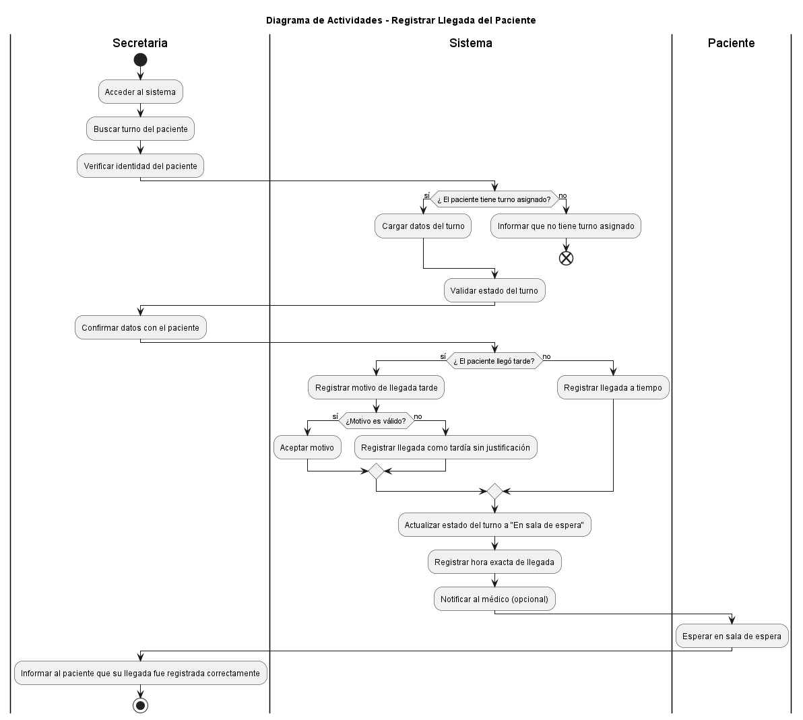
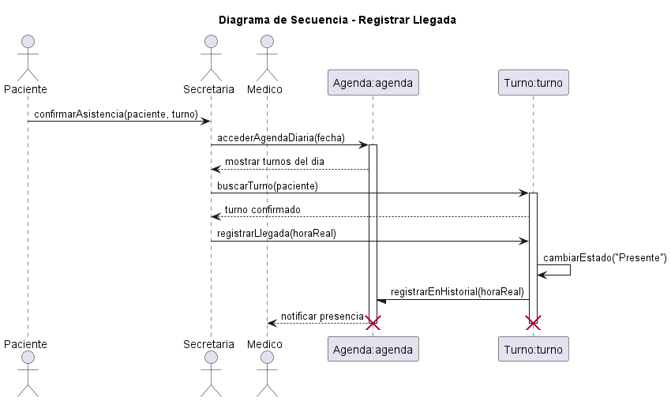

# Caso de Uso N°5 - Registrar Llegada del Paciente


## 1. Descripción y Trazabilidad con Requisitos Funcionales

**Actor/es:** Secretaria, Paciente, Sistema

**Objetivo:** Registrar la llegada del paciente al consultorio asociando su turno correspondiente, actualizando su estado y dejando trazabilidad del ingreso.


**Flujo principal:**

1. El paciente se presenta en el consultorio.
2. La secretaria busca el turno del paciente en la agenda.
3. El sistema valida que el turno exista y sea del día.
4. La secretaria registra la llegada del paciente.
5. Se crea el registro de LlegadaPaciente.
6. El sistema actualiza el estado del turno.
7. Se marca el turno como “En progreso”.
8. Se guarda la hora de llegada.
9. El paciente queda habilitado para ser atendido por el médico.

**Flujos alternativos:**

- **FA-05A:** Si el turno no existe → se informa error y no se registra la llegada.
- **FA-05B:** Si el turno no es del día → no se permite el registro.
- **FA-05C:** Si el paciente llega tarde → se registra igual pero se mantiene trazabilidad.


**Requisitos funcionales que satisface:**

| CU | Requisito funcional | Descripción |
|----|---------------------|-------------|
| CU-05 | RF06: Registrar llegada del paciente | Permite registrar la presencia del paciente y actualizar el estado del turno |


---

# 2. Diagrama de Casos de Uso


**Actores y relaciones:**

- Paciente → Se presenta al turno.
- Secretaria → Registra la llegada.
- Sistema → Valida turno y actualiza estado.


---

# 3. Diagrama de Actividades





**Swimlanes:**

- Paciente: llega al consultorio.
- Secretaria: busca turno y registra llegada.
- Sistema: valida y actualiza estado.
- Medico: recibe el turno actualizado.


---

**Decisiones clave del flujo:** Validar si el turno puede agendarse, verificar que el horario se encuentre dentro de la disponibilidad del profesional, comprobar que no exista superposición con otros turnos y determinar si la notificación fue enviada correctamente.

---

# 4. Diagrama de Secuencia





**Participantes:**

- Paciente
- Secretaria
- Turno
- Agenda
- LlegadaPaciente


**Mensajes clave:**

- `buscarTurno(paciente)`
- `validarTurnoDelDia()`
- `registrarLlegada(paciente, turno)`
- `registrar()`
- `cambiarEstado("EN_PROGRESO")`


---

# 5. Diagrama de Clases del Caso de Uso


**Clases involucradas (según UML):**

| Clase | Responsabilidad |
|------|----------------|
| Secretaria | Registra la llegada del paciente y actualiza el estado del turno |
| Paciente | Se presenta al sistema y consulta su turno |
| Turno | Representa la cita médica y su estado |
| LlegadaPaciente | Registra la hora de llegada del paciente |
| Agenda | Busca turnos asociados al paciente |
| EstadoTurno | Define los estados posibles del turno |


---

## Relaciones UML

| Relación | Clases | Justificación |
|----------|--------|---------------|
| Asociación | Secretaria → Paciente | La secretaria interactúa con el paciente en recepción |
| Asociación | Secretaria → Turno | Registra y actualiza el turno |
| Asociación | Secretaria → LlegadaPaciente | Crea el registro de llegada |
| Asociación | Paciente → Turno | El paciente posee un turno asignado |
| Asociación | Agenda → Turno | La agenda administra los turnos |
| Composición | LlegadaPaciente → Turno | La llegada depende del turno asociado |


## 6. Pseudocódigo

```text
INICIO Registrar Llegada
Paciente paciente
Secretaria secretaria
Agenda agenda
Turno turno
LlegadaPaciente llegada


// Buscar turno del paciente

turno = agenda.buscarTurno(paciente)


SI turno NO existe
    MOSTRAR "Turno inexistente"
    FIN
FIN SI


// Validar turno

SI turno.validarTurnoDelDia() = FALSO
    MOSTRAR "Turno no válido para hoy"
    FIN
FIN SI


// Registrar llegada

llegada = secretaria.registrarLlegada(paciente, turno)

llegada.registrar()


// Actualizar estado del turno

secretaria.actualizarEstadoTurno(turno, EN_PROGRESO)

turno.cambiarEstado("EN_PROGRESO")


=======
Paciente paciente = nuevo Paciente()
Secretaria secretaria = nuevo Secretaria()
Agenda agenda = nuevo Agenda()
Turno turno = nuevo Turno()

entrada = paciente.informarLlegada()

turno = agenda.buscarTurno(entrada.idTurno)

SI turno existe
    turno.marcarLlegada()
    turno.registrarHoraLlegada()
    turno.actualizarEstado("Paciente presente")

    agenda.guardarCambios(turno)

    Retornar "Llegada registrada correctamente"
SINO
    Retornar "Turno no encontrado"
FIN SI

FIN