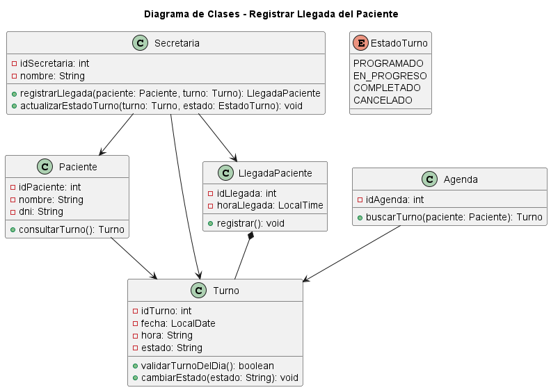

# Caso de Uso N°5 - Registrar Llegada del Paciente


## 1. Descripción y Trazabilidad con Requisitos Funcionales

**Actor/es:** Secretaria, Paciente, Sistema

**Objetivo:** Registrar la llegada del paciente al consultorio asociando su turno correspondiente, actualizando su estado y dejando trazabilidad del ingreso.


**Flujo principal:**

1. El paciente se presenta en el consultorio.
2. La secretaria busca el turno del paciente en la agenda.
3. El sistema valida que el turno exista y sea del día.
4. La secretaria registra la llegada del paciente.
5. Se crea el registro de LlegadaPaciente.
6. El sistema actualiza el estado del turno.
7. Se marca el turno como “En progreso”.
8. Se guarda la hora de llegada.
9. El paciente queda habilitado para ser atendido por el médico.


---

## Tabla 1: Metadatos del Escenario

| Campo | Valor |
|------|------|
| **Nombre Escenario** | Registrar Llegada del Paciente - Caso Exitoso |
| **Nombre Caso de Uso** | UC-05: Registrar Llegada |
| **ID Única** | 05-CU05-FP |
| **Área** | Gestión de Turnos |
| **Actor(es)** | Secretaria, Paciente, Sistema |
| **Descripción** | El sistema registra la llegada del paciente y actualiza el estado del turno para iniciar la atención médica |


---

## Tabla 2: Evento/Señal Activador

| Campo | Valor |
|------|------|
| **Activar Evento** | Paciente se presenta en recepción |
| **Identificadores e iniciadores** | Usuario: Secretaria, Timestamp: 2026-04-16 09:45 |
| **Tipo Señal** | ☑ Usuario ☑ Sistema ☐ Externo |


---

## Tabla 3: Pasos Desempeñados

| Pasos desempeñados | Información para los pasos |
|--------------------|---------------------------|
| 1. Identificación del paciente | El paciente llega y se identifica en recepción |
| 2. Búsqueda de turno | Secretaria utiliza Agenda.buscarTurno(paciente) |
| 3. Validación del turno | Sistema verifica que el turno sea válido y del día |
| 4. Registro de llegada | Secretaria ejecuta registrarLlegada(paciente, turno) |
| 5. Creación del registro | Se crea la entidad LlegadaPaciente |
| 6. Registro de hora | Se almacena horaLlegada |
| 7. Actualización de estado | Turno cambia a EN_PROGRESO |
| 8. Persistencia de datos | Se guarda la llegada en el sistema |
| 9. Habilitación de atención | El médico puede comenzar la consulta |


---

## Tabla 4: Condiciones de Contexto

| Elemento | Descripción |
|----------|-------------|
| **Precondiciones** | El paciente debe tener un turno programado |
| **Poscondiciones** | Turno actualizado a EN_PROGRESO y llegada registrada |
| **Suposiciones** | El paciente llega en el horario asignado |
| **Requisitos funcionales** | RF-06: Registrar llegada del paciente |
| **Prioridad** | Alta |
| **Riesgo** | Bajo |


---

## Flujos alternativos

- **FA-05A:** Si el turno no existe → se informa error y no se registra la llegada.
- **FA-05B:** Si el turno no es del día → no se permite el registro.
- **FA-05C:** Si el paciente llega tarde → se registra igual pero se mantiene trazabilidad.


---

## Requisitos funcionales que satisface

| CU | Requisito funcional | Descripción |
|----|---------------------|-------------|
| CU-05 | RF06: Registrar llegada del paciente | Permite registrar la presencia del paciente y actualizar el estado del turno |


---

# 2. Diagrama de Casos de Uso


**Actores:**

- Paciente → Se presenta al turno.
- Secretaria → Registra la llegada.
- Sistema → Valida turno y actualiza estado.


---

# 3. Diagrama de Actividades


**Swimlanes:**

- Paciente: llega al consultorio.
- Secretaria: busca turno y registra llegada.
- Sistema: valida y actualiza estado.
- Medico: recibe el turno actualizado.


---

## Decisiones clave del flujo


### ¿Existe turno válido?

- Sí → continuar registro de llegada  
- No → finalizar proceso  


### ¿Turno es del día?

- Sí → registrar llegada  
- No → rechazar registro  


---

# 4. Diagrama de Secuencia


**Participantes:**

- Paciente
- Secretaria
- Turno
- Agenda
- LlegadaPaciente


**Mensajes clave:**

- `buscarTurno(paciente)`
- `validarTurnoDelDia()`
- `registrarLlegada(paciente, turno)`
- `registrar()`
- `cambiarEstado("EN_PROGRESO")`


---

# 5. Diagrama de Clases del Caso de Uso





**Clases involucradas (según UML):**

| Clase | Responsabilidad |
|------|----------------|
| Secretaria | Registra la llegada del paciente y actualiza el estado del turno |
| Paciente | Se presenta al sistema y consulta su turno |
| Turno | Representa la cita médica y su estado |
| LlegadaPaciente | Registra la hora de llegada del paciente |
| Agenda | Busca turnos asociados al paciente |
| EstadoTurno | Define los estados posibles del turno |


---

## Relaciones UML

| Relación | Clases | Justificación |
|----------|--------|---------------|
| Asociación | Secretaria → Paciente | La secretaria interactúa con el paciente en recepción |
| Asociación | Secretaria → Turno | Registra y actualiza el turno |
| Asociación | Secretaria → LlegadaPaciente | Crea el registro de llegada |
| Asociación | Paciente → Turno | El paciente posee un turno asignado |
| Asociación | Agenda → Turno | La agenda administra los turnos |
| Composición | LlegadaPaciente → Turno | La llegada depende del turno asociado |


---

# 6. Pseudocódigo


```text
INICIO Registrar Llegada

Paciente paciente
Secretaria secretaria
Agenda agenda
Turno turno
LlegadaPaciente llegada


// Buscar turno del paciente

turno = agenda.buscarTurno(paciente)


SI turno NO existe
    MOSTRAR "Turno inexistente"
    FIN
FIN SI


// Validar turno

SI turno.validarTurnoDelDia() = FALSO
    MOSTRAR "Turno no válido para hoy"
    FIN
FIN SI


// Registrar llegada

llegada = secretaria.registrarLlegada(paciente, turno)

llegada.registrar()


// Actualizar estado del turno

secretaria.actualizarEstadoTurno(turno, EN_PROGRESO)

turno.cambiarEstado("EN_PROGRESO")


FIN