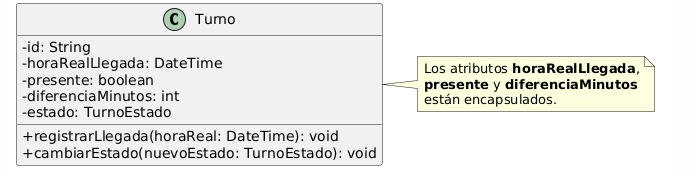
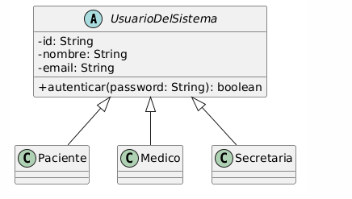
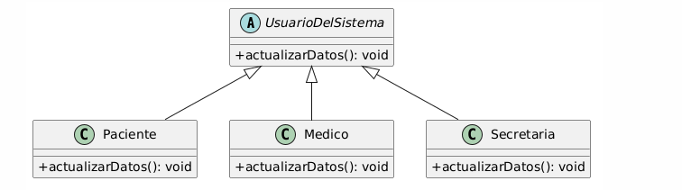
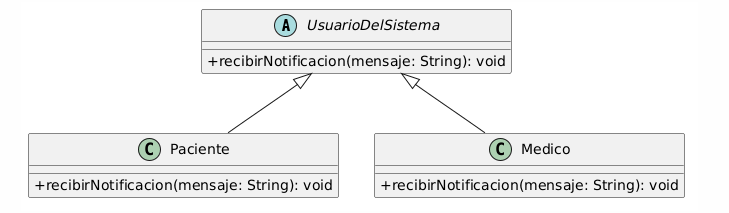
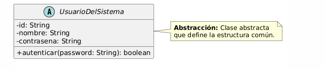
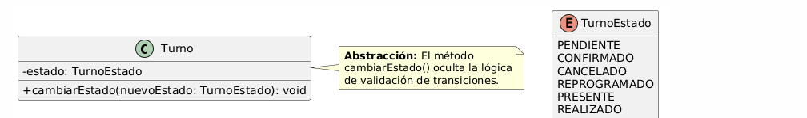

# Pilares de la Programación Orientada a Objetos (POO) aplicados a SistemaTurnosMedicos

Este documento detalla cómo se aplican los cuatro pilares fundamentales de la POO en el diseño del Sistema de Turnos Médicos, con ejemplos concretos extraídos del diagrama de clases final.

---

## 1. Encapsulamiento

**Definición:** Ocultar el estado interno de los objetos y exponer operaciones controladas (métodos) para interactuar con ellos, protegiendo la integridad de los datos.

### Ejemplo 1: Atributos encapsulados en `Turno`

La clase `Turno` mantiene encapsulados los atributos relacionados con la llegada del paciente (`horaRealLlegada`, `presente`, `diferenciaMinutos`). Estos se calculan internamente mediante el método `registrarLlegada(horaReal)`, sin permitir asignación directa desde el exterior.

**Justificación:** La lógica de negocio (cálculo de diferencia en minutos, determinación del estado `presente`) queda protegida dentro del método, evitando inconsistencias en los datos.

### Ejemplo 2: Atributo privado `contrasena` en `UsuarioDelSistema`

La clase abstracta `UsuarioDelSistema` define el atributo `contrasena` como privado (`-`), lo que significa que ninguna clase externa puede acceder directamente a él. Solo se puede validar mediante el método público `autenticar(password)`.

**Justificación:** Este encapsulamiento garantiza que las contraseñas no puedan ser leídas ni modificadas arbitrariamente desde fuera de la clase, cumpliendo con principios de seguridad básicos.

---

## 2. Herencia

**Definición:** Reutilizar comportamiento creando jerarquías de clases (superclase/subclase), donde las subclases heredan atributos y métodos de la superclase.

### Ejemplo 1: Jerarquía de usuarios del sistema

Las clases `Paciente`, `Medico` y `Secretaria` heredan de la clase abstracta `UsuarioDelSistema`. Comparten atributos comunes (`id`, `nombre`, `email`, `telefono`) y métodos (`autenticar()`, `actualizarDatos()`), pero cada una extiende el comportamiento con sus responsabilidades específicas.

**Justificación:** Esta jerarquía aplica el principio **DRY** (Don't Repeat Yourself), evitando duplicar código de autenticación y gestión de datos personales en cada tipo de usuario.

### Ejemplo 2: Extensibilidad futura con `Administrador`

Si en el futuro se requiere un nuevo tipo de usuario (por ejemplo, `Administrador`), puede extender `UsuarioDelSistema` sin modificar las clases existentes, aplicando el principio **OCP** (Open/Closed Principle).

**Justificación:** La herencia permite agregar nuevos tipos de usuario sin romper el código existente, facilitando la evolución del sistema.

---

## 3. Polimorfismo

**Definición:** Tratar objetos de distintas clases derivadas como instancias de la superclase, permitiendo que cada subclase implemente su propia versión de un método heredado.

### Ejemplo 1: Tratamiento unificado de usuarios

El sistema puede manejar una lista de `UsuarioDelSistema` donde cada elemento puede ser un `Paciente`, `Medico` o `Secretaria`. Al llamar a métodos heredados como `actualizarDatos()`, el sistema ejecuta la versión correspondiente según el tipo real del objeto en tiempo de ejecución.

**Justificación:** El polimorfismo permite escribir código genérico que funciona con cualquier tipo de usuario, mejorando la mantenibilidad y extensibilidad del sistema.

### Ejemplo 2: Método `notificarUsuario()` genérico

Un método como `notificarUsuario(usuario: UsuarioDelSistema, mensaje: String)` puede enviar notificaciones a cualquier tipo de usuario sin necesidad de conocer su tipo específico, aplicando el principio **LSP** (Liskov Substitution Principle).

**Justificación:** Las subclases pueden ser sustituidas por la superclase sin romper el comportamiento del sistema, cumpliendo con el principio de sustitución de Liskov.

---

## 4. Abstracción

**Definición:** Modelar entidades centrándose en sus características esenciales y comportamientos relevantes, ocultando detalles de implementación innecesarios para el nivel de diseño actual.

### Ejemplo 1: Clase abstracta `UsuarioDelSistema`

Se define una clase abstracta `UsuarioDelSistema` que captura los atributos y comportamientos comunes a todos los actores del sistema. Esta clase no puede instanciarse directamente, solo sirve como base para las subclases concretas.

**Justificación:** La abstracción permite definir un contrato común para todos los usuarios sin preocuparse por los detalles específicos de cada tipo en esta etapa del diseño.

### Ejemplo 2: Método `cambiarEstado()` en `Turno`

La clase `Turno` no permite modificar el atributo `estado` directamente. En su lugar, ofrece el método `cambiarEstado(nuevoEstado: TurnoEstado)`, que abstrae la lógica de validación de transiciones de estado (por ejemplo, no permitir pasar de `CANCELADO` a `REALIZADO`).

**Justificación:** La abstracción permite exponer una interfaz simple (`cambiarEstado()`) mientras se oculta la complejidad interna de las reglas de negocio que gobiernan las transiciones de estado.

---

## Conclusión

Los cuatro pilares de la POO (Encapsulamiento, Herencia, Polimorfismo y Abstracción) están presentes en el diseño del Sistema de Turnos Médicos, contribuyendo a un modelo de dominio cohesivo, mantenible y extensible. Cada pilar se ejemplifica con clases y métodos ya presentes en el diagrama de clases final y está alineado con las tarjetas CRC y los diagramas de secuencia del sistema.