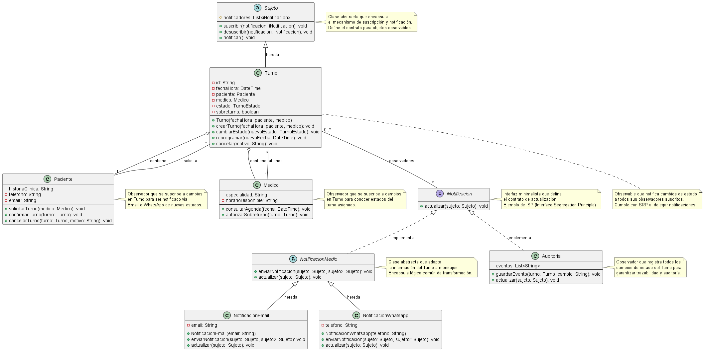

# Patrones de Diseño de Comportamiento y su Relación con los Principios SOLID

## Patrones de Comportamiento y su Relación con SOLID

En la Programación Orientada a Objetos, los **patrones de comportamiento** representan soluciones probadas y documentadas para problemas recurrentes relacionados con la interacción, comunicación y distribución de responsabilidades entre objetos. Su propósito fundamental es definir cómo los objetos colaboran entre sí, asignando responsabilidades de forma clara y mantenible.

### ¿Qué son los Patrones de Comportamiento?

Los patrones de comportamiento se centran en **algoritmos y asignación de responsabilidades**, facilitando que los sistemas sean:
- **Flexibles:** Permiten cambios sin alterar código existente
- **Extensibles:** Facilitan agregar nuevas funcionalidades
- **Desacoplados:** Reducen dependencias innecesarias entre clases
- **Mantenibles:** Mejoran la legibilidad y comprensión del código

Ejemplos clásicos incluyen: **Observer**, Strategy, Command, Mediator, State y Template Method.

### Relación Directa entre Patrones de Comportamiento y Principios SOLID

Los patrones de comportamiento no son independientes de los principios SOLID; de hecho, son la **materialización concreta** de estos principios en soluciones prácticas:

| Principio SOLID | Patrón de Comportamiento | Beneficio |
|-----------------|------------------------|-----------|
| **Single Responsibility Principle (SRP)** | Command, Observer | Cada clase tiene una única razón para cambiar |
| **Open/Closed Principle (OCP)** | Strategy, Observer | Extensión sin modificar código existente |
| **Liskov Substitution Principle (LSP)** | Observer, State | Las implementaciones pueden sustituirse sin romper contrato |
| **Interface Segregation Principle (ISP)** | Observer, Mediator | Interfaces específicas en lugar de generales |
| **Dependency Inversion Principle (DIP)** | Observer, Strategy | Depender de abstracciones, no de implementaciones |

En el **Sistema de Turnos Médicos**, la aplicación del patrón Observer demuestra cómo estos principios trabajan en conjunto para resolver un problema real de comunicación entre componentes.

---

## Propósito y Tipo del Patrón Seleccionado

### Propósito

El Sistema de Turnos Médicos requiere **notificar cambios de estado** a múltiples entidades (pacientes, médicos y auditoría) cuando un turno experimenta cambios significativos (creación, reprogramación, cancelación, registro de llegada, autorización de sobreturno).

Originalmente, la clase `Agenda` concentraba esta responsabilidad mediante el método `enviarNotificacion()`. Este enfoque generaba:

- **Violación de SRP:** Agenda asumía responsabilidades de comunicación además de gestión de disponibilidad
- **Violación de OCP:** Agregar nuevos canales de notificación (Telegram, SMS, etc.) requeriría modificar Agenda
- **Acoplamiento fuerte:** Agenda estaba acoplada directamente a las implementaciones específicas de notificación
- **Escalabilidad limitada:** El método se sobrecargaba conforme aumentaban los requisitos

### Tipo de Patrón: Observer (Patrón de Comportamiento)

El **patrón Observer** establece una relación de **dependencia uno-a-muchos** entre objetos:
- Cuando un objeto (Observable/Sujeto) cambia de estado, todos los objetos interesados (Observadores) son notificados y actualizados automáticamente
- Desvincula completamente al **emisor del evento** de los **receptores**
- Facilita la comunicación **dinámica** y **extensible** en sistemas orientados a objetos

**Características Clave:**
- Bajo acoplamiento entre componentes
- Fácil de extender con nuevos observadores sin modificar existentes
- Cumple con OCP y DIP de manera natural

---

## Motivación Detallada: Problema y Solución

### El Problema Original

En la arquitectura inicial, la clase `Agenda` asumía responsabilidades excesivas:

```
Agenda (SOBRECARGADA)
├── Gestionar disponibilidad de turnos
├── Crear turnos
├── Registrar cambios de estado
└── Enviar notificaciones por email
    └── Enviar notificaciones por WhatsApp
```

**Problemas técnicos generados:**

1. **Violación del SRP:** Agenda tenía múltiples razones para cambiar:
   - Cambios en la lógica de disponibilidad
   - Cambios en los formatos de notificación
   - Cambios en los canales de comunicación
   - Cambios en los requisitos de auditoría

2. **Violación del OCP:** Para agregar nuevos observadores (p. ej., SMS, notificaciones push, integración con CRM), era necesario modificar Agenda directamente.

3. **Acoplamiento fuerte:** Agenda estaba acoplada a clases concretas (`NotificacionEmail`, `NotificacionWhatsapp`, `Auditoria`), imposibilitando cambiar implementaciones sin afectar Agenda.

4. **Difícil de probar:** Las pruebas unitarias de Agenda se complicaban al tener que mockear múltiples dependencias.

5. **Mantenibilidad reducida:** Cada cambio en notificaciones corría el riesgo de afectar la lógica de disponibilidad.

### La Solución: Aplicación del Patrón Observer

El patrón Observer **desacoplada completamente** la responsabilidad de notificación, reorganizando así:

**Responsabilidades Redistribuidas:**

1. **Turno (Observable/Sujeto):**
   - Responsabilidad única: Representar el ciclo de vida de un turno
   - Hereda de `Sujeto` para obtener capacidad de notificación
   - Notifica automáticamente cuando cambia su estado

2. **Sujeto (Clase Abstracta):**
   - Responsabilidad única: Gestionar el mecanismo de suscripción/notificación
   - Encapsula métodos: `suscribir()`, `desuscribir()`, `notificar()`
   - Define el contrato que todos los observables deben cumplir

3. **iNotificacion (Interfaz):**
   - Responsabilidad única: Definir el contrato de actualización
   - Especifica el método `actualizar()` que todo observador debe implementar
   - Ejemplo de ISP: Interfaz minimalista y específica

4. **NotificacionMedio (Clase Abstracta):**
   - Responsabilidad única: Adaptación de información de turno a mensajes
   - Implementa `iNotificacion`
   - Encapsula la lógica común de transformación
   - Permite extensión para nuevos tipos de notificaciones

5. **NotificacionEmail (Implementación Concreta):**
   - Responsabilidad única: Enviar notificaciones vía Email
   - No conoce sobre la lógica de disponibilidad
   - Puede cambiar su implementación sin afectar Turno o Agenda

6. **NotificacionWhatsapp (Implementación Concreta):**
   - Responsabilidad única: Enviar notificaciones vía WhatsApp
   - Independiente de Email y de otros componentes
   - Fácil de reemplazar o extender

7. **Auditoria:**
   - Responsabilidad única: Registrar todos los cambios de estado
   - Se suscribe como observador
   - Garantiza trazabilidad sin afectar la lógica de negocio

### Cómo Cumple con los Principios SOLID

| Principio | Aplicación | Beneficio |
|-----------|-----------|----------|
| **SRP** | Cada clase tiene una única responsabilidad claramente definida | Fácil de entender, probar y mantener |
| **OCP** | Nuevos canales de notificación (SMS, Telegram) pueden agregarse sin modificar `Turno` o `Agenda` | Extensión sin modificación |
| **LSP** | Todas las implementaciones de `iNotificacion` pueden usarse indistintamente | Sustitución segura entre observadores |
| **ISP** | La interfaz `iNotificacion` solo especifica lo esencial (`actualizar()`) | Clientes no dependen de métodos innecesarios |
| **DIP** | `Turno` depende de la abstracción `iNotificacion`, no de implementaciones concretas | Desacoplamiento máximo |

---

## Estructura de Clases con Diagrama UML



---

## Justificación Técnica de la Solución Propuesta

### 1. Desacoplamiento mediante Abstracciones (DIP)

**Problema:** `Turno` no debe conocer ni depender de clases concretas como `NotificacionEmail` o `NotificacionWhatsapp`.

**Solución:**
- `Turno` solo depende de `iNotificacion` (abstracción)
- Los observadores específicos implementan `iNotificacion`
- Cambiar o extender observadores no requiere modificar `Turno`

```
ANTES (acoplado):        DESPUÉS (desacoplado):
Turno → NotificacionEmail   Turno → iNotificacion ← NotificacionEmail
     → NotificacionWhatsapp          ← NotificacionWhatsapp
     → Auditoria                     ← Auditoria
```

### 2. Extensibilidad sin Modificación (OCP)

**Escenario:** Se requiere agregar notificaciones por SMS.

**Solución:**
1. Crear `NotificacionSMS` que implemente `iNotificacion`
2. No es necesario modificar `Turno`, `Agenda` ni ninguna clase existente
3. El nuevo observador se suscribe automáticamente

### 3. Responsabilidad Única (SRP)

Cada clase en la estructura tiene **una única razón para cambiar:**

| Clase | Razón para Cambiar |
|-------|-------------------|
| `Turno` | Cambios en reglas de negocio de turnos |
| `Sujeto` | Cambios en el mecanismo de suscripción |
| `NotificacionEmail` | Cambios en configuración de Email (SMTP, plantillas) |
| `NotificacionWhatsapp` | Cambios en API de WhatsApp |
| `Auditoria` | Cambios en requisitos de auditoría |

### 4. Segregación de Interfaces (ISP)

**Problema:** Una interfaz genérica `IObserver` podría especificar múltiples métodos innecesarios.

**Solución:**
- `iNotificacion` solo especifica `actualizar()` 
- Las subclases pueden implementar métodos adicionales específicos
- Los clientes no dependen de métodos que no usan

### 5. Sustitución de Liskov (LSP)

Todas las implementaciones de `iNotificacion` respetan el contrato:
- `NotificacionEmail` puede ser reemplazada por `NotificacionWhatsapp`
- `Auditoria` puede ser reemplazada por otra implementación de auditoría
- El comportamiento esperado se mantiene consistente

**Garantía:** `Turno` puede suscribir cualquier implementación de `iNotificacion` sin conocer detalles específicos.

### 6. Flujo de Ejecución

**Cuando se crea un nuevo Turno:**
```
1. new Turno(fecha, paciente, medico)
2. Turno hereda suscribir() de Sujeto
3. paciente.suscribir(this)  // Paciente observa Turno
4. medico.suscribir(this)    // Médico observa Turno
5. auditoria.suscribir(this) // Auditoría observa Turno
```

**Cuando cambia el estado del Turno:**
```
1. turno.cambiarEstado(nuevoEstado)
2. this.notificar()  // Turno notifica a todos sus observadores
3. Para cada iNotificacion suscrita:
   - notificacion.actualizar()
   - En NotificacionEmail: enviarNotificacion(email, mensaje)
   - En NotificacionWhatsapp: enviarNotificacion(celular, mensaje)
   - En Auditoria: guardarEvento(turno, cambio)
```

### 7. Ventajas Técnicas Concretas

| Ventaja | Beneficio |
|---------|----------|
| **Bajo Acoplamiento** | Cambios independientes entre componentes |
| **Extensibilidad** | Agregar observadores sin modificar código existente |
| **Testabilidad** | Mockear observadores para pruebas unitarias |
| **Reusabilidad** | `Sujeto` puede usarse en otras clases observables |
| **Mantenibilidad** | Código claro, fácil de entender y modificar |
| **Escalabilidad** | Sistema crece sin complejidad acumulada |

### 8. Comparación: Antes vs. Después

**ANTES (violando SOLID):**
```
✗ Agenda contiene lógica de notificación
✗ Agregar nuevo canal requiere modificar Agenda
✗ Acoplamiento fuerte a implementaciones concretas
✗ Difícil de probar aisladamente
✗ Violaciones: SRP, OCP, DIP
```

**DESPUÉS (aplicando Observer + SOLID):**
```
✓ Turno es observable, notificadores son independientes
✓ Nuevos observadores se agregan sin modificaciones
✓ Desacoplamiento total mediante abstracciones
✓ Cada componente es testeable en aislamiento
✓ Cumplimiento de SRP, OCP, ISP, LSP, DIP
```

---

## Conclusión

El patrón Observer implementado en el Sistema de Turnos Médicos demuestra cómo los principios SOLID y los patrones de comportamiento trabajan conjuntamente para resolver problemas reales de diseño. 

**Resultado final:**
- Sistema flexible y extensible
- Código limpio y fácil de mantener
- Nuevos requisitos pueden implementarse sin afectar código existente
- Cada componente tiene clara responsabilidad
- Máxima reutilización y testabilidad

La combinación de patrón Observer + principios SOLID convierte el Sistema de Turnos Médicos en una solución robusta, profesional y escalable.