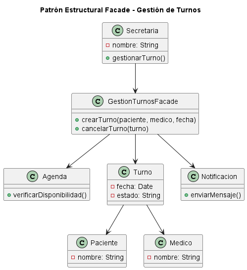

# Patrón de Diseño Estructural - Facade

## 1. Introducción a los patrones estructurales y su relación con SOLID

Los patrones de diseño estructurales son soluciones reutilizables que permiten organizar las relaciones entre clases y objetos dentro de un sistema. Su objetivo principal es mejorar la flexibilidad, mantenibilidad y escalabilidad del software, simplificando la comunicación entre componentes.

Estos patrones ayudan a reducir el acoplamiento entre clases, permitiendo que los cambios realizados en una parte del sistema tengan menor impacto sobre el resto de la aplicación.

Los patrones estructurales tienen una relación directa con los principios SOLID, principalmente con:

- **Principio de Responsabilidad Única (SRP):** cada clase debe tener una responsabilidad bien definida.
- **Principio Abierto/Cerrado (OCP):** el sistema debe permitir agregar nuevas funcionalidades sin modificar componentes existentes.
- **Principio de Inversión de Dependencias (DIP):** las clases de alto nivel no deben depender directamente de detalles de implementación.

La aplicación de patrones estructurales permite construir sistemas más organizados, desacoplados y preparados para futuras modificaciones.

---

# 2. Patrón seleccionado: Facade

## Propósito

El patrón **Facade** pertenece a la categoría de patrones estructurales y tiene como objetivo proporcionar una interfaz simplificada para interactuar con un conjunto complejo de clases o subsistemas.

Facade oculta la complejidad interna del sistema y permite que los clientes accedan a funcionalidades mediante un único punto de entrada.

## Tipo de patrón

- **Categoría:** Patrón estructural.
- **Intención:** Simplificar la interacción entre componentes complejos.
- **Beneficio principal:** Reducir el acoplamiento entre los clientes y los subsistemas internos.

---

# 3. Motivación del problema identificado

En el sistema de gestión de turnos médicos existen diferentes componentes involucrados en la administración de turnos.

Una operación como crear, modificar o cancelar un turno requiere la interacción entre diferentes clases:

- Agenda para verificar disponibilidad.
- Médico para validar la asignación.
- Paciente para asociar el turno.
- Turno para almacenar la información.
- Sistema de notificaciones para informar cambios.

Si cada componente del sistema accede directamente a todas estas clases, aumenta el acoplamiento y la complejidad del código, dificultando el mantenimiento y la incorporación de nuevas funcionalidades.

Por este motivo se identifica la necesidad de crear una interfaz que simplifique la comunicación con estos subsistemas.

---

# 4. Solución propuesta utilizando Facade

Para resolver el problema se propone implementar la clase:

```
GestionTurnosFacade
```

Esta clase funciona como intermediario entre los usuarios del sistema y los diferentes subsistemas internos.

La clase Facade centraliza las operaciones relacionadas con la gestión de turnos y permite acceder a ellas mediante métodos simples.

Responsabilidades principales:

- Crear nuevos turnos.
- Validar disponibilidad de horarios.
- Coordinar la asignación entre paciente y médico.
- Actualizar información del turno.
- Solicitar notificaciones al paciente.

De esta manera, las clases externas no necesitan conocer la lógica interna de cada componente involucrado.

---

# 5. Estructura de clases con diagrama UML

El diseño propuesto se representa mediante el siguiente diagrama:



La clase principal del patrón es:

```
GestionTurnosFacade
```

Esta clase funciona como punto único de acceso para las operaciones relacionadas con la gestión de turnos médicos.

---

# 6. Justificación técnica de la solución propuesta

La implementación del patrón Facade mejora la arquitectura del sistema debido a que:

- Reduce el acoplamiento entre los actores externos y los subsistemas internos.
- Centraliza la lógica de coordinación de operaciones complejas.
- Facilita futuras modificaciones del sistema.
- Mejora la legibilidad del código al ocultar detalles innecesarios.
- Favorece la aplicación de principios SOLID.

La solución respeta el principio **SRP (Single Responsibility Principle)** porque la clase Facade tiene como responsabilidad coordinar operaciones relacionadas con turnos, mientras que cada subsistema mantiene sus propias responsabilidades.

También favorece el principio **DIP (Dependency Inversion Principle)** porque los componentes externos dependen de una interfaz simplificada y no de múltiples implementaciones internas.

Por estos motivos, el patrón Facade resulta adecuado para mejorar la organización, mantenimiento y evolución del sistema de turnos médicos.