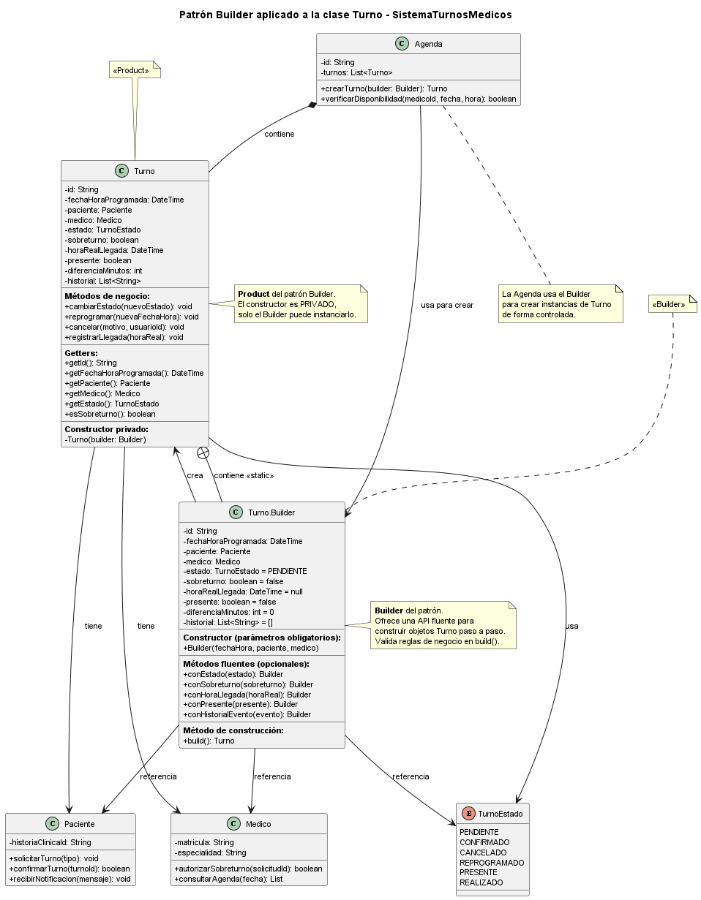

# Patrones de Diseño - SistemaTurnosMedicos

Este directorio contiene la documentación de los patrones de diseño aplicados al Sistema de Turnos Médicos como parte del **Segundo Parcial** de la materia Diseño Orientado a Objetos.

---

## Patrones Aplicados

### Patrones Creacionales

| Patrón | Clase Aplicada | Autor | Rol | Archivo |
|--------|----------------|-------|-----|---------|
| **Builder** | `Turno` | @nachonervi-design | Especialista Creacional | [patron-de-diseno-creacional.md](./patron-de-diseno-creacional.md) |

### Patrones Estructurales

| Patrón | Clase Aplicada | Autor | Rol | Archivo |
|--------|----------------|-------|-----|---------|
| *Pendiente* | *Por definir* | *Por asignar* | Especialista Estructural | *Por crear* |

### Patrones de Comportamiento

| Patrón | Clase Aplicada | Autor | Rol | Archivo |
|--------|----------------|-------|-----|---------|
| *Pendiente* | *Por definir* | *Por asignar* | Especialista Comportamiento | *Por crear* |

---

## Estructura de Archivos

```
anexos/patrones-diseno/
├── patrones_diseno.md              ← Este archivo (índice)
├── patron-de-diseno-creacional.md  ← Patrón Builder aplicado a Turno
├── patron-de-diseno-estructural.md ← (Por crear - Especialista Estructural)
└── patron-de-diseno-comportamiento.md ← (Por crear - Especialista Comportamiento)
```

---

## Diagramas UML Asociados

Los diagramas de clases de los patrones se encuentran en:

```
diagramas/01-diagrama-clases/
├── 01-patron-creacional-builder.puml      ← Diagrama Builder
├── 01-patron-creacional-builder.png       ← Imagen Builder
├── 02-patron-estructural-[nombre].puml    ← (Por crear)
└── 03-patron-comportamiento-[nombre].puml ← (Por crear)
```

---

## Documentación del Proceso IA

La documentación del proceso de diseño asistido por IA se encuentra en:

```
ia/segundo-parcial/
├── especialista-patron-creacional.md     ← Proceso IA del Especialista Creacional
├── especialista-patron-estructural.md    ← (Por crear)
└── especialista-patron-comportamiento.md ← (Por crear)
```

---

## Resumen Ejecutivo

### Patrón Builder (Creacional) - Aplicado a `Turno`

**Problema resuelto:** La clase `Turno` tiene 10 atributos (3 obligatorios + 7 opcionales), lo que genera un constructor telescópico difícil de usar y mantener.

**Solución:** Implementar el patrón Builder con una clase interna estática `Turno.Builder` que ofrece una API fluente para construir objetos `Turno` paso a paso.

**Beneficios:**
- Código más legible y auto-documentado
- Validación centralizada de reglas de negocio
- Objetos inmutables y consistentes
- Fácil extensión para nuevos atributos opcionales

**Diagrama:**



---

## Próximos Pasos

1. ✅ **Especialista Creacional:** Completar patrón Builder (este documento)
2. 🔄 **Especialista Estructural:** Seleccionar y aplicar patrón estructural
3. 🔄 **Especialista Comportamiento:** Seleccionar y aplicar patrón de comportamiento
4. 🔄 **Coordinador:** Integrar todos los patrones en el diagrama final unificado
5. 🔄 **DevOps:** Gestionar branches, PRs y merges según Git Flow

---

## Referencias

- **Gamma, E., et al.** (1994). *Design Patterns: Elements of Reusable Object-Oriented Software*. Addison-Wesley.
- **Bloch, J.** (2018). *Effective Java* (3rd Edition). Addison-Wesley.
- **Freeman, E., et al.** (2004). *Head First Design Patterns*. O'Reilly Media.

---

**Última actualización:** Junio 2026  
**Repositorio:** [SistemaTurnosMedicos](https://github.com/eternalnight04/SistemaTurnosMedicos)
