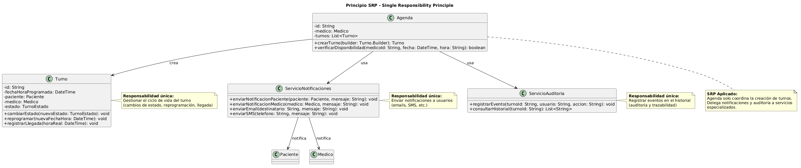

# SRP - Single Responsibility Principle (Principio de Responsabilidad Única)

**Autor:** @nachonervi-design  
**Fecha:** Junio 2026

---

## 1. Definición del Principio

> **"Una clase debe tener una, y solo una, razón para cambiar."**  
> — Robert C. Martin

Esto significa que cada clase debe tener **una única responsabilidad** o propósito bien definido. Si una clase tiene múltiples responsabilidades, los cambios en una pueden afectar o romper las otras.

---

## 2. Aplicación en SistemaTurnosMedicos

### 2.1 Análisis del Diseño Actual

Revisando el diagrama de clases final (`06-clases-diagrama-final.puml`), identificamos que las clases están bien diseñadas siguiendo SRP:

| Clase | Responsabilidad Única | Razón para Cambiar |
|-------|----------------------|-------------------|
| **UsuarioDelSistema** | Gestionar autenticación y datos comunes de usuarios | Cambios en el sistema de autenticación o estructura de datos de usuario |
| **Paciente** | Gestionar operaciones específicas de pacientes (solicitar/confirmar/cancelar turnos) | Cambios en las reglas de negocio de pacientes |
| **Medico** | Gestionar operaciones específicas de médicos (consultar agenda, autorizar sobreturnos) | Cambios en las reglas de negocio de médicos |
| **Secretaria** | Gestionar operaciones administrativas (crear turnos, dar de alta pacientes) | Cambios en los procesos administrativos |
| **Agenda** | Gestionar la disponibilidad y organización de turnos de un médico | Cambios en la lógica de disponibilidad o programación |
| **Turno** | Representar y gestionar el ciclo de vida de un turno médico | Cambios en el flujo de estados o atributos de un turno |

### 2.2 Ejemplo de SRP Correcto: Separación de Responsabilidades

**Situación:** Un turno necesita ser creado, notificado y registrado en el historial.

**Diseño INCORRECTO (viola SRP):**

```text
CLASE Turno
    - fechaHora: DateTime
    - paciente: Paciente
    - medico: Medico
    
    // Responsabilidad 1: Construcción del turno
    PÚBLICO Turno(fechaHora, paciente, medico)
        ...
    FIN
    
    // Responsabilidad 2: Notificación (NO debería estar aquí)
    PÚBLICO notificarPaciente()
        enviarEmail(paciente.email, "Su turno fue confirmado")
        enviarSMS(paciente.telefono, "Turno confirmado")
    FIN
    
    // Responsabilidad 3: Registro de auditoría (NO debería estar aquí)
    PÚBLICO registrarEnHistorial(usuario, accion)
        baseDeDatos.insert("historial", usuario, accion, fechaActual)
    FIN
FIN
```

**Problemas del diseño incorrecto:**
- ❌ `Turno` tiene 3 responsabilidades: construcción, notificación y auditoría
- ❌ Si cambia el sistema de notificaciones, hay que modificar `Turno`
- ❌ Si cambia el sistema de auditoría, hay que modificar `Turno`
- ❌ Dificulta el testing unitario

**Diseño CORRECTO (sigue SRP):**

```text
CLASE Turno
    - fechaHora: DateTime
    - paciente: Paciente
    - medico: Medico
    - estado: TurnoEstado
    
    // Única responsabilidad: gestionar el ciclo de vida del turno
    PÚBLICO cambiarEstado(nuevoEstado: TurnoEstado): void
    PÚBLICO reprogramar(nuevaFechaHora: DateTime): void
    PÚBLICO registrarLlegada(horaReal: DateTime): void
FIN

CLASE ServicioNotificaciones
    // Responsabilidad única: enviar notificaciones
    PÚBLICO enviarNotificacionPaciente(paciente: Paciente, mensaje: String): void
        enviarEmail(paciente.email, mensaje)
        enviarSMS(paciente.telefono, mensaje)
    FIN
FIN

CLASE ServicioAuditoria
    // Responsabilidad única: registrar eventos en el historial
    PÚBLICO registrarEvento(turnoId: String, usuario: String, accion: String): void
        baseDeDatos.insert("historial", turnoId, usuario, accion, fechaActual)
    FIN
FIN
```

**Ventajas del diseño correcto:**
- ✅ Cada clase tiene una única responsabilidad
- ✅ Los cambios en notificaciones NO afectan a `Turno`
- ✅ Los cambios en auditoría NO afectan a `Turno`
- ✅ Fácil de testear cada clase de forma independiente

---

## 3. Diagrama de Clases - SRP



### Descripción del Diagrama

El diagrama muestra cómo se separan las responsabilidades en el sistema:

1. **Turno** (responsabilidad: ciclo de vida del turno)
   - Atributos: fechaHora, paciente, medico, estado
   - Métodos: cambiarEstado(), reprogramar(), registrarLlegada()

2. **ServicioNotificaciones** (responsabilidad: enviar notificaciones)
   - Métodos: enviarNotificacionPaciente(), enviarNotificacionMedico()

3. **ServicioAuditoria** (responsabilidad: registrar eventos)
   - Métodos: registrarEvento(), consultarHistorial()

4. **Agenda** (responsabilidad: coordinar la creación de turnos)
   - Usa `Turno` para crear instancias
   - Usa `ServicioNotificaciones` para notificar
   - Usa `ServicioAuditoria` para registrar

---

## 4. Relación con las Tarjetas CRC

Analizando las tarjetas CRC del sistema:

| Tarjeta CRC | Responsabilidades | Cumple SRP? |
|-------------|-------------------|-------------|
| **Paciente** | Solicitar turno, confirmar/cancelar, recibir notificaciones | ✅ Sí - todas relacionadas con operaciones de paciente |
| **Medico** | Consultar agenda, autorizar sobreturnos, registrar observaciones | ✅ Sí - todas relacionadas con operaciones médicas |
| **Secretaria** | Solicitar turno, cancelar, reprogramar, dar de alta pacientes | ✅ Sí - todas relacionadas con operaciones administrativas |
| **Agenda** | Verificar disponibilidad, crear turnos, registrar en historial | ⚠️ Parcial - "registrar en historial" podría extraerse a un servicio separado |
| **Turno** | Cambiar estado, reprogramar, cancelar, registrar llegada | ✅ Sí - todas relacionadas con el ciclo de vida del turno |

**Recomendación:** Extraer la responsabilidad de "registrar en historial" de `Agenda` a un `ServicioAuditoria` separado para cumplir SRP al 100%.

---

## 5. Ejemplo Práctico: Caso de Uso CU01 (Crear Turno)

### Flujo con SRP Correcto

```text
// 1. La Secretaria solicita crear un turno
Secretaria.solicitarTurno(pacienteId, tipo)

// 2. La Secretaria construye el Turno usando el Builder
builder = new Turno.Builder("2026-06-30 10:00", paciente, medico)
    .conEstado(TurnoEstado.PENDIENTE)

// 3. La Agenda crea el Turno (única responsable de instanciar)
turno = Agenda.crearTurno(builder)

// 4. El ServicioNotificaciones notifica al paciente (responsabilidad separada)
ServicioNotificaciones.enviarNotificacionPaciente(
    paciente, 
    "Su turno fue creado para el 30/06 a las 10:00"
)

// 5. El ServicioAuditoria registra el evento (responsabilidad separada)
ServicioAuditoria.registrarEvento(
    turno.id, 
    "Secretaria SEC-001", 
    "Turno creado"
)
```

**Beneficios de este diseño:**
- ✅ `Agenda` solo se preocupa por crear el turno
- ✅ `ServicioNotificaciones` solo se preocupa por enviar mensajes
- ✅ `ServicioAuditoria` solo se preocupa por registrar eventos
- ✅ Cada clase puede cambiar independientemente

---

## 6. Métricas de Cohesión

Para medir qué tan bien una clase cumple SRP, podemos usar métricas de cohesión:

| Métrica | Valor Ideal | Descripción |
|---------|-------------|-------------|
| **LCOM** (Lack of Cohesion of Methods) | 0 | Mide cuántos métodos NO comparten atributos. 0 = alta cohesión |
| **TCC** (Tight Class Cohesion) | 1.0 | Mide la proporción de métodos que comparten atributos. 1.0 = máxima cohesión |

**Análisis de cohesión en SistemaTurnosMedicos:**

| Clase | LCOM Estimado | TCC Estimado | Evaluación |
|-------|---------------|--------------|------------|
| Turno | Bajo | Alto | ✅ Alta cohesión |
| Agenda | Medio | Medio | ⚠️ Podría mejorar |
| Paciente | Bajo | Alto | ✅ Alta cohesión |
| Medico | Bajo | Alto | ✅ Alta cohesión |

---

## 7. Anti-patrones que Violan SRP

### 7.1 God Class (Clase Dios)

Una clase que hace demasiadas cosas. Ejemplo hipotético:

```text
CLASE SistemaTurnos
    // Responsabilidad 1: Gestión de usuarios
    PÚBLICO autenticarUsuario(usuario, password): boolean
    
    // Responsabilidad 2: Gestión de turnos
    PÚBLICO crearTurno(fecha, paciente, medico): Turno
    
    // Responsabilidad 3: Envío de notificaciones
    PÚBLICO enviarEmail(destinatario, mensaje): void
    
    // Responsabilidad 4: Auditoría
    PÚBLICO registrarLog(evento): void
    
    // Responsabilidad 5: Reportes
    PÚBLICO generarReporteMensual(): Reporte
FIN
```

**Solución:** Dividir en 5 clases separadas, cada una con su responsabilidad.

### 7.2 Feature Envy (Envidia de Características)

Un método que usa más datos de otra clase que de la suya propia. Ejemplo:

```text
CLASE Secretaria
    PÚBLICO notificarPaciente(paciente: Paciente, mensaje: String): void
        // Usa más atributos de Paciente que de Secretaria
        enviarEmail(paciente.email, mensaje)
        enviarSMS(paciente.telefono, mensaje)
    FIN
FIN
```

**Solución:** Mover el método a la clase `Paciente` o a un `ServicioNotificaciones`.

---

## 8. Beneficios de Aplicar SRP

| Beneficio | Descripción |
|-----------|-------------|
| **Mantenibilidad** | Es más fácil encontrar y corregir errores cuando cada clase tiene una sola responsabilidad |
| **Testabilidad** | Se pueden escribir tests unitarios más simples y enfocados |
| **Reutilización** | Clases con una sola responsabilidad son más fáciles de reutilizar en otros contextos |
| **Legibilidad** | El código es más fácil de entender cuando cada clase tiene un propósito claro |
| **Escalabilidad** | Agregar nuevas funcionalidades es más seguro cuando las clases están bien delimitadas |

---

## 9. Conclusiones

El principio SRP está **bien aplicado** en el diseño actual de SistemaTurnosMedicos, especialmente en:

✅ **Jerarquía de usuarios:** `UsuarioDelSistema` y sus subclases tienen responsabilidades bien definidas  
✅ **Clase Turno:** Gestiona solo su ciclo de vida, sin mezclar notificaciones ni auditoría  
✅ **Clases de dominio:** Paciente, Medico, Secretaria tienen responsabilidades específicas  

**Áreas de mejora:**

⚠️ **Agenda:** Podría delegar la responsabilidad de "registrar en historial" a un servicio separado  
⚠️ **Servicios transversales:** Considerar crear `ServicioNotificaciones` y `ServicioAuditoria` para separar responsabilidades transversales  

---

## 10. Referencias

- Martin, R. C. (2002). *Agile Software Development, Principles, Patterns, and Practices*. Prentice Hall.
- Martin, R. C. (2008). *Clean Code: A Handbook of Agile Software Craftsmanship*. Prentice Hall.

---

**Documento generado por:** @nachonervi-design  
**Repositorio:** [SistemaTurnosMedicos](https://github.com/eternalnight04/SistemaTurnosMedicos)
