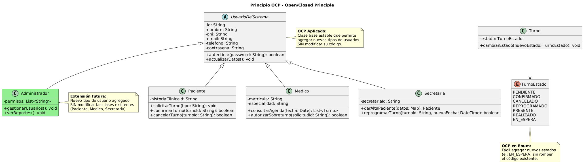

# OCP - Open/Closed Principle (Principio Abierto/Cerrado)

**Autor:** @nachonervi-design  
**Fecha:** Junio 2026

---

## 1. Definición del Principio

> **"Las entidades de software (clases, módulos, funciones) deben estar abiertas para la extensión, pero cerradas para la modificación."**  
> — Bertrand Meyer

Esto significa que podemos **agregar nuevo comportamiento** a una clase sin modificar su código fuente existente. Se logra mediante:
- **Herencia** (subclases)
- **Composición** (interfaces + implementaciones)
- **Polimorfismo** (tratamiento uniforme de diferentes tipos)

---

## 2. Aplicación en SistemaTurnosMedicos

### 2.1 Ejemplo 1: Jerarquía de Usuarios del Sistema

**Situación:** El sistema necesita soportar diferentes tipos de usuarios (Paciente, Médico, Secretaria) y posiblemente nuevos tipos en el futuro (Administrador, Auditor).

**Diseño CORRECTO (sigue OCP):**

```text
CLASE ABSTRACTA UsuarioDelSistema
    - id: String
    - nombre: String
    - dni: String
    - email: String
    - telefono: String
    - contrasena: String
    
    + autenticar(password: String): boolean
    + actualizarDatos(): void
FIN

CLASE Paciente HEREDA UsuarioDelSistema
    - historiaClinicaId: String
    + solicitarTurno(tipo: String): void
    + confirmarTurno(turnoId: String): boolean
    + cancelarTurno(turnoId: String): boolean
FIN

CLASE Medico HEREDA UsuarioDelSistema
    - matricula: String
    - especialidad: String
    + consultarAgenda(fecha: Date): List<Turno>
    + autorizarSobreturno(solicitudId: String): boolean
FIN

CLASE Secretaria HEREDA UsuarioDelSistema
    - secretariaId: String
    + darAltaPaciente(datos: Map): Paciente
    + reprogramarTurno(turnoId: String, nuevaFecha: DateTime): boolean
FIN
```

**Beneficios de este diseño:**

✅ **Abierto para extensión:** Si necesitamos un nuevo tipo de usuario (ej: `Administrador`), solo creamos una nueva subclase:

```text
CLASE Administrador HEREDA UsuarioDelSistema
    - permisos: List<String>
    + gestionarUsuarios(): void
    + verReportes(): void
FIN
```

✅ **Cerrado para modificación:** No necesitamos modificar `UsuarioDelSistema`, `Paciente`, `Medico` ni `Secretaria` para agregar el nuevo tipo de usuario.

✅ **Polimorfismo:** El sistema puede tratar a todos los usuarios de forma uniforme:

```text
// Lista de usuarios genérica
List<UsuarioDelSistema> usuarios = [paciente1, medico1, secretaria1, administrador1]

// El sistema puede autenticar a cualquier tipo de usuario
PARA CADA usuario EN usuarios:
    usuario.autenticar(password)
FIN
```

### 2.2 Ejemplo 2: Estados del Turno

**Situación:** Un turno puede estar en diferentes estados (PENDIENTE, CONFIRMADO, CANCELADO, etc.) y posiblemente necesitemos nuevos estados en el futuro.

**Diseño CORRECTO con Enum (sigue OCP):**

```text
ENUM TurnoEstado
    PENDIENTE
    CONFIRMADO
    CANCELADO
    REPROGRAMADO
    PRESENTE
    REALIZADO
FIN

CLASE Turno
    - estado: TurnoEstado
    
    + cambiarEstado(nuevoEstado: TurnoEstado): void
        // Validación de transiciones
        SI NO esTransicionValida(this.estado, nuevoEstado) ENTONCES
            LANZAR Excepcion("Transición de estado no válida")
        FIN SI
        
        this.estado = nuevoEstado
    FIN
    
    PRIVADO esTransicionValida(estadoActual: TurnoEstado, estadoNuevo: TurnoEstado): boolean
        // Reglas de transición
        SI estadoActual == PENDIENTE Y estadoNuevo == CONFIRMADO ENTONCES
            RETORNAR verdadero
        FIN SI
        
        SI estadoActual == CONFIRMADO Y estadoNuevo == PRESENTE ENTONCES
            RETORNAR verdadero
        FIN SI
        
        // ... más reglas
        
        RETORNAR falso
    FIN
FIN
```

**Beneficios:**

✅ **Abierto para extensión:** Si necesitamos un nuevo estado (ej: `EN_ESPERA`), solo lo agregamos al enum:

```text
ENUM TurnoEstado
    PENDIENTE
    CONFIRMADO
    CANCELADO
    REPROGRAMADO
    PRESENTE
    REALIZADO
    EN_ESPERA  // Nuevo estado agregado
FIN
```

✅ **Cerrado para modificación:** La estructura de `Turno` no cambia, solo agregamos reglas de transición en `esTransicionValida()`.

---

## 3. Diagrama de Clases - OCP



### Descripción del Diagrama

El diagrama muestra dos ejemplos de OCP:

**1. Jerarquía de Usuarios (Herencia):**
- `UsuarioDelSistema` (clase abstracta base)
- Subclases existentes: `Paciente`, `Medico`, `Secretaria`
- Subclase futura (extensión): `Administrador`

**2. Estados del Turno (Enum):**
- `TurnoEstado` con 6 valores posibles
- Fácil de extender con nuevos estados

---

## 4. Ejemplo Práctico: Agregar Nuevo Tipo de Usuario

### Escenario: Necesitamos un "Auditor" que puede ver reportes pero no modificar datos

**Paso 1: Crear la nueva subclase (extensión)**

```text
CLASE Auditor HEREDA UsuarioDelSistema
    - nivelAcceso: String
    
    + generarReporte(tipo: String): Reporte
        // Lógica específica de auditoría
        RETORNAR nuevo Reporte(tipo, fechaActual)
    FIN
    
    + consultarHistorial(turnoId: String): List<String>
        // Solo lectura, sin permisos de modificación
        RETORNAR ServicioAuditoria.consultarHistorial(turnoId)
    FIN
FIN
```

**Paso 2: Usar el nuevo tipo sin modificar código existente**

```text
// El sistema de autenticación funciona igual
Auditor auditor = new Auditor(id: "AUD-001", nombre: "Carlos", ...)
boolean acceso = auditor.autenticar("password123")

// El sistema de notificaciones funciona igual
ServicioNotificaciones.enviarNotificacion(auditor, "Bienvenido al sistema")

// El sistema de gestión de usuarios funciona igual
List<UsuarioDelSistema> todosLosUsuarios = [paciente1, medico1, secretaria1, auditor1]
```

**Resultado:**
- ✅ No modificamos `UsuarioDelSistema`
- ✅ No modificamos `Paciente`, `Medico`, `Secretaria`
- ✅ No modificamos `ServicioNotificaciones`
- ✅ Solo agregamos la nueva clase `Auditor`

---

## 5. Anti-patrones que Violan OCP

### 5.1 Switch/If-Else Masivo

**Diseño INCORRECTO (viola OCP):**

```text
CLASE SistemaTurnos
    PÚBLICO calcularHonorarios(usuario: UsuarioDelSistema): Decimal
        SI usuario.tipo == "MEDICO" ENTONCES
            RETORNAR usuario.honorariosBase * 1.5
        SINO SI usuario.tipo == "SECRETARIA" ENTONCES
            RETORNAR usuario.honorariosBase * 1.0
        SINO SI usuario.tipo == "PACIENTE" ENTONCES
            RETORNAR 0
        SINO
            RETORNAR 0
        FIN SI
    FIN
FIN
```

**Problemas:**
- ❌ Cada vez que agregamos un nuevo tipo de usuario, hay que modificar este método
- ❌ El código crece indefinidamente con cada nuevo tipo
- ❌ Difícil de mantener y propenso a errores

**Solución con OCP (Polimorfismo):**

```text
CLASE ABSTRACTA UsuarioDelSistema
    ABSTRACTO calcularHonorarios(): Decimal
FIN

CLASE Medico HEREDA UsuarioDelSistema
    + calcularHonorarios(): Decimal
        RETORNAR this.honorariosBase * 1.5
    FIN
FIN

CLASE Secretaria HEREDA UsuarioDelSistema
    + calcularHonorarios(): Decimal
        RETORNAR this.honorariosBase * 1.0
    FIN
FIN

CLASE Paciente HEREDA UsuarioDelSistema
    + calcularHonorarios(): Decimal
        RETORNAR 0
    FIN
FIN
```

**Beneficios:**
- ✅ Cada clase sabe cómo calcular sus propios honorarios
- ✅ Agregar un nuevo tipo de usuario no requiere modificar código existente
- ✅ Código más limpio y mantenible

---

## 6. Estrategias para Aplicar OCP

### 6.1 Uso de Interfaces

```text
INTERFAZ Notificable
    + recibirNotificacion(mensaje: String): void
FIN

CLASE Paciente IMPLEMENTA Notificable
    + recibirNotificacion(mensaje: String): void
        // Implementación específica para pacientes
        enviarEmail(this.email, mensaje)
    FIN
FIN

CLASE Medico IMPLEMENTA Notificable
    + recibirNotificacion(mensaje: String): void
        // Implementación específica para médicos
        enviarSMS(this.telefono, mensaje)
    FIN
FIN
```

### 6.2 Uso del Patrón Strategy

```text
INTERFAZ EstrategiaNotificacion
    + enviar(mensaje: String): void
FIN

CLASE NotificacionEmail IMPLEMENTA EstrategiaNotificacion
    + enviar(mensaje: String): void
        // Enviar por email
    FIN
FIN

CLASE NotificacionSMS IMPLEMENTA EstrategiaNotificacion
    + enviar(mensaje: String): void
        // Enviar por SMS
    FIN
FIN

CLASE ServicioNotificaciones
    - estrategia: EstrategiaNotificacion
    
    + setEstrategia(estrategia: EstrategiaNotificacion): void
        this.estrategia = estrategia
    FIN
    
    + notificar(mensaje: String): void
        this.estrategia.enviar(mensaje)
    FIN
FIN
```

---

## 7. Relación con Otros Principios SOLID

| Principio | Relación con OCP |
|-----------|------------------|
| **SRP** | Clases con una sola responsabilidad son más fáciles de extender |
| **LSP** | Las subclases deben poder sustituir a la superclase sin romper el comportamiento |
| **ISP** | Interfaces específicas facilitan la extensión sin modificar implementaciones existentes |
| **DIP** | Depender de abstracciones permite extender el sistema con nuevas implementaciones |

---

## 8. Beneficios de Aplicar OCP

| Beneficio | Descripción |
|-----------|-------------|
| **Mantenibilidad** | No hay que modificar código probado y funcionando |
| **Escalabilidad** | Fácil agregar nuevas funcionalidades |
| **Testabilidad** | Las extensiones se pueden probar de forma aislada |
| **Reducción de bugs** | Menos modificaciones = menos oportunidades de introducir errores |
| **Código estable** | Las clases base permanecen estables a lo largo del tiempo |

---

## 9. Casos de Uso que se Benefician de OCP

### CU01 - Crear Turno
- **Extensión futura:** Crear turnos para nuevos tipos de usuarios (ej: `Auditor`)
- **Beneficio OCP:** No hay que modificar `Agenda.crearTurno()` para soportar nuevos tipos

### CU04 - Autorizar Sobreturno
- **Extensión futura:** Nuevas reglas de autorización según especialidad médica
- **Beneficio OCP:** Se pueden agregar estrategias de autorización sin modificar `Medico.autorizarSobreturno()`

### CU05 - Registrar Llegada
- **Extensión futura:** Nuevos criterios de "presente" según tipo de turno
- **Beneficio OCP:** Se pueden agregar estrategias de validación sin modificar `Turno.registrarLlegada()`

---

## 10. Conclusiones

El principio OCP está **excelentemente aplicado** en SistemaTurnosMedicos:

✅ **Jerarquía de usuarios:** `UsuarioDelSistema` permite agregar nuevos tipos de usuarios sin modificar las clases existentes  
✅ **Enum de estados:** `TurnoEstado` permite agregar nuevos estados fácilmente  
✅ **Polimorfismo:** El sistema puede tratar a diferentes tipos de usuarios de forma uniforme  

**Recomendaciones para mantener OCP:**

1. **Usar interfaces** para definir contratos estables
2. **Preferir composición sobre herencia** cuando sea posible
3. **Aplicar patrones de diseño** como Strategy, Factory Method, Observer
4. **Evitar condicionales masivos** (switch/if-else) que requieren modificación al agregar nuevos casos

---

## 11. Referencias

- Meyer, B. (1988). *Object-Oriented Software Construction*. Prentice Hall.
- Martin, R. C. (2002). *Agile Software Development, Principles, Patterns, and Practices*. Prentice Hall.
- Gamma, E., Helm, R., Johnson, R., Vlissides, J. (1994). *Design Patterns: Elements of Reusable Object-Oriented Software*. Addison-Wesley.

---

**Documento generado por:** @nachonervi-design  
**Repositorio:** [SistemaTurnosMedicos](https://github.com/eternalnight04/SistemaTurnosMedicos)
