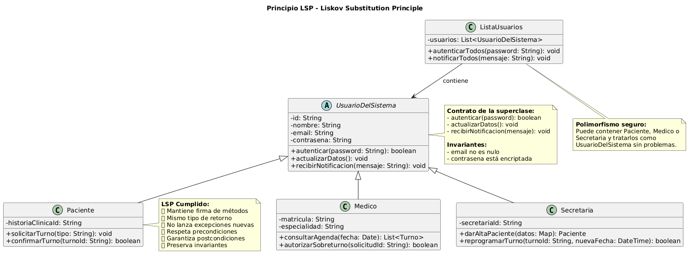

# LSP - Liskov Substitution Principle (Principio de Sustitución de Liskov)

**Autor:** @nachonervi-design  
**Fecha:** Junio 2026

---

## 1. Definición del Principio

> **"Los objetos de una superclase deben poder ser reemplazados por objetos de sus subclases sin afectar la corrección del programa."**  
> — Barbara Liskov (1987)

En otras palabras: si una clase `S` es subclase de `T`, entonces los objetos de tipo `T` pueden ser reemplazados por objetos de tipo `S` sin alterar el comportamiento esperado del programa.

---

## 2. Reglas del Principio de Liskov

Para que una subclase cumpla LSP, debe respetar estas reglas:

| Regla | Descripción |
|-------|-------------|
| **Firma de métodos** | Los métodos de la subclase deben aceptar los mismos parámetros (o más amplios) que la superclase |
| **Tipo de retorno** | Los métodos de la subclase deben devolver el mismo tipo (o más específico) que la superclase |
| **Excepciones** | La subclase no debe lanzar excepciones que la superclase no lance |
| **Precondiciones** | La subclase no debe fortalecer las precondiciones (no exigir más) |
| **Postcondiciones** | La subclase no debe debilitar las postcondiciones (no garantizar menos) |
| **Invariantes** | La subclase debe preservar las invariantes de la superclase |

---

## 3. Aplicación en SistemaTurnosMedicos

### 3.1 Jerarquía de UsuarioDelSistema

**Situación:** El sistema tiene una clase abstracta `UsuarioDelSistema` con tres subclases: `Paciente`, `Medico` y `Secretaria`.

**Diseño CORRECTO (sigue LSP):**

```text
CLASE ABSTRACTA UsuarioDelSistema
    - id: String
    - nombre: String
    - email: String
    - contrasena: String
    
    + autenticar(password: String): boolean
        // Validación genérica de contraseña
        RETORNAR this.contrasena == password
    FIN
    
    + actualizarDatos(): void
        // Actualización genérica de datos
        this.email = nuevoEmail
        this.telefono = nuevoTelefono
    FIN
FIN

CLASE Paciente HEREDA UsuarioDelSistema
    + autenticar(password: String): boolean
        // Mismo comportamiento que la superclase
        RETORNAR super.autenticar(password)
    FIN
    
    + actualizarDatos(): void
        // Extiende el comportamiento, NO lo rompe
        super.actualizarDatos()
        actualizarHistoriaClinica()
    FIN
FIN

CLASE Medico HEREDA UsuarioDelSistema
    + autenticar(password: String): boolean
        // Mismo comportamiento que la superclase
        RETORNAR super.autenticar(password)
    FIN
    
    + actualizarDatos(): void
        // Extiende el comportamiento, NO lo rompe
        super.actualizarDatos()
        actualizarMatricula()
    FIN
FIN
```

**Verificación de LSP:**

✅ **Firma de métodos:** Todas las subclases mantienen la misma firma (`autenticar(password: String): boolean`)

✅ **Tipo de retorno:** Todas devuelven `boolean`

✅ **Excepciones:** Ninguna subclase lanza excepciones nuevas

✅ **Precondiciones:** Ninguna subclase exige más que la superclase

✅ **Postcondiciones:** Todas garantizan el mismo resultado (autenticación exitosa o fallida)

✅ **Invariantes:** Todas mantienen la integridad de los datos del usuario

### 3.2 Ejemplo de Uso con Polimorfismo

```text
// Lista de usuarios de diferentes tipos
List<UsuarioDelSistema> usuarios = [
    new Paciente(id: "PAC-001", nombre: "Juan", ...),
    new Medico(id: "MED-001", nombre: "Dr. García", ...),
    new Secretaria(id: "SEC-001", nombre: "Laura", ...)
]

// El sistema puede autenticar a CUALQUIER usuario sin saber su tipo específico
PARA CADA usuario EN usuarios:
    SI usuario.autenticar("password123") ENTONCES
        ESCRIBIR "Usuario " + usuario.nombre + " autenticado correctamente"
    SINO
        ESCRIBIR "Error de autenticación para " + usuario.nombre
    FIN SI
FIN
```

**Resultado:** El código funciona correctamente sin importar si el usuario es Paciente, Medico o Secretaria. Esto demuestra que LSP se cumple.

---

## 4. Diagrama de Clases - LSP



### Descripción del Diagrama

El diagrama muestra:

1. **Clase abstracta:** `UsuarioDelSistema` con métodos genéricos
2. **Subclases:** `Paciente`, `Medico`, `Secretaria` que heredan y extienden comportamiento
3. **Polimorfismo:** Lista de `UsuarioDelSistema` que contiene objetos de diferentes subclases
4. **Sustitución segura:** Cualquier subclase puede reemplazar a la superclase

---

## 5. Ejemplo Práctico: Sistema de Notificaciones

### Escenario: Notificar a todos los usuarios del sistema

**Código que cumple LSP:**

```text
CLASE ServicioNotificaciones
    + notificarUsuarios(usuarios: List<UsuarioDelSistema>, mensaje: String): void
        PARA CADA usuario EN usuarios:
            // No importa si es Paciente, Medico o Secretaria
            // Todos pueden recibir notificaciones
            usuario.recibirNotificacion(mensaje)
        FIN
    FIN
FIN

// Uso del servicio
List<UsuarioDelSistema> todosLosUsuarios = [
    paciente1, paciente2, medico1, secretaria1
]

ServicioNotificaciones.notificarUsuarios(
    todosLosUsuarios, 
    "El sistema estará en mantenimiento el domingo"
)
```

**Resultado:** El código funciona correctamente porque todas las subclases de `UsuarioDelSistema` pueden recibir notificaciones.

---

## 6. Anti-patrones que Violan LSP

### 6.1 Subclase que Lanza Excepciones Inesperadas

**Diseño INCORRECTO (viola LSP):**

```text
CLASE ABSTRACTA UsuarioDelSistema
    + autenticar(password: String): boolean
        RETORNAR this.contrasena == password
    FIN
FIN

CLASE UsuarioTemporal HEREDA UsuarioDelSistema
    + autenticar(password: String): boolean
        // Viola LSP: lanza una excepción que la superclase no lanza
        SI fechaExpiracion < fechaActual ENTONCES
            LANZAR ExcepcionUsuarioExpirado("Usuario temporal expirado")
        FIN SI
        
        RETORNAR super.autenticar(password)
    FIN
FIN
```

**Problema:** El código cliente que espera un `boolean` puede fallar inesperadamente con una excepción.

**Solución correcta:**

```text
CLASE UsuarioTemporal HEREDA UsuarioDelSistema
    + autenticar(password: String): boolean
        // Retorna false en lugar de lanzar excepción
        SI fechaExpiracion < fechaActual ENTONCES
            RETORNAR falso
        FIN SI
        
        RETORNAR super.autenticar(password)
    FIN
FIN
```

### 6.2 Subclase que Fortalece Precondiciones

**Diseño INCORRECTO (viola LSP):**

```text
CLASE ABSTRACTA UsuarioDelSistema
    + actualizarDatos(nuevoEmail: String): void
        // Precondición: nuevoEmail no es nulo
        this.email = nuevoEmail
    FIN
FIN

CLASE UsuarioPremium HEREDA UsuarioDelSistema
    + actualizarDatos(nuevoEmail: String): void
        // Viola LSP: exige más condiciones que la superclase
        SI nuevoEmail NO contiene "@premium.com" ENTONCES
            LANZAR Excepcion("Solo emails premium permitidos")
        FIN SI
        
        this.email = nuevoEmail
    FIN
FIN
```

**Problema:** El código cliente que funciona con `UsuarioDelSistema` puede fallar con `UsuarioPremium`.

**Solución correcta:**

```text
CLASE UsuarioPremium HEREDA UsuarioDelSistema
    + actualizarDatos(nuevoEmail: String): void
        // Respeta las precondiciones de la superclase
        super.actualizarDatos(nuevoEmail)
        
        // Agrega comportamiento adicional sin romper el contrato
        SI nuevoEmail contiene "@premium.com" ENTONCES
            activarBeneficiosPremium()
        FIN SI
    FIN
FIN
```

### 6.3 Subclase que Debilita Postcondiciones

**Diseño INCORRECTO (viola LSP):**

```text
CLASE ABSTRACTA UsuarioDelSistema
    + autenticar(password: String): boolean
        // Postcondición: si retorna true, el usuario está autenticado
        RETORNAR this.contrasena == password
    FIN
FIN

CLASE UsuarioDebil HEREDA UsuarioDelSistema
    + autenticar(password: String): boolean
        // Viola LSP: no garantiza la postcondición
        // Retorna true incluso si la contraseña es incorrecta
        RETORNAR verdadero
    FIN
FIN
```

**Problema:** El código cliente asume que si `autenticar()` retorna `true`, el usuario está realmente autenticado.

**Solución correcta:**

```text
CLASE UsuarioDebil HEREDA UsuarioDelSistema
    + autenticar(password: String): boolean
        // Respeta la postcondición de la superclase
        RETORNAR super.autenticar(password)
    FIN
FIN
```

---

## 7. Verificación de LSP en SistemaTurnosMedicos

### 7.1 Método `autenticar()`

| Clase | Firma | Tipo Retorno | Excepciones | Cumple LSP? |
|-------|-------|--------------|-------------|-------------|
| UsuarioDelSistema | `autenticar(password: String): boolean` | boolean | Ninguna | ✅ Base |
| Paciente | `autenticar(password: String): boolean` | boolean | Ninguna | ✅ Sí |
| Medico | `autenticar(password: String): boolean` | boolean | Ninguna | ✅ Sí |
| Secretaria | `autenticar(password: String): boolean` | boolean | Ninguna | ✅ Sí |

**Conclusión:** ✅ Todas las subclases cumplen LSP para `autenticar()`

### 7.2 Método `actualizarDatos()`

| Clase | Firma | Tipo Retorno | Excepciones | Cumple LSP? |
|-------|-------|--------------|-------------|-------------|
| UsuarioDelSistema | `actualizarDatos(): void` | void | Ninguna | ✅ Base |
| Paciente | `actualizarDatos(): void` | void | Ninguna | ✅ Sí |
| Medico | `actualizarDatos(): void` | void | Ninguna | ✅ Sí |
| Secretaria | `actualizarDatos(): void` | void | Ninguna | ✅ Sí |

**Conclusión:** ✅ Todas las subclases cumplen LSP para `actualizarDatos()`

---

## 8. Relación con las Tarjetas CRC

Analizando las tarjetas CRC:

| Tarjeta CRC | Superclase | Subclases | Cumple LSP? |
|-------------|------------|-----------|-------------|
| UsuarioDelSistema | - | Paciente, Medico, Secretaria | ✅ Sí |
| Paciente | UsuarioDelSistema | - | ✅ Sí |
| Medico | UsuarioDelSistema | - | ✅ Sí |
| Secretaria | UsuarioDelSistema | - | ✅ Sí |

**Observación:** La jerarquía de herencia está bien diseñada y cumple LSP.

---

## 9. Beneficios de Aplicar LSP

| Beneficio | Descripción |
|-----------|-------------|
| **Polimorfismo seguro** | Se pueden tratar objetos de diferentes subclases de forma uniforme |
| **Código reutilizable** | El código que funciona con la superclase funciona con todas las subclases |
| **Mantenibilidad** | Agregar nuevas subclases no rompe el código existente |
| **Testabilidad** | Se pueden escribir tests genéricos para la superclase que aplican a todas las subclases |
| **Extensibilidad** | Fácil agregar nuevos tipos de usuarios sin modificar el sistema |

---

## 10. Casos de Uso que se Benefician de LSP

### CU01 - Crear Turno
- **Beneficio LSP:** El sistema puede crear turnos para cualquier tipo de usuario sin saber su tipo específico

### CU03 - Cancelar Turno
- **Beneficio LSP:** Tanto `Paciente` como `Secretaria` pueden cancelar turnos de forma uniforme

### Happy Path Global
- **Beneficio LSP:** El flujo puede tratar a `Secretaria`, `Paciente` y `Medico` como `UsuarioDelSistema` cuando es necesario

---

## 11. Conclusiones

El principio LSP está **correctamente aplicado** en SistemaTurnosMedicos:

✅ **Jerarquía de usuarios:** Todas las subclases pueden sustituir a `UsuarioDelSistema` sin romper el comportamiento  
✅ **Métodos heredados:** Mantienen la misma firma, tipo de retorno y excepciones  
✅ **Polimorfismo:** El sistema puede tratar a diferentes tipos de usuarios de forma uniforme  

**Recomendaciones para mantener LSP:**

1. **No fortalecer precondiciones** en las subclases
2. **No debilitar postcondiciones** en las subclases
3. **No lanzar excepciones nuevas** que la superclase no lance
4. **Preservar las invariantes** de la superclase
5. **Usar el contrato de la superclase** como guía para las subclases

---

## 12. Referencias

- Liskov, B. (1987). *Data Abstraction and Hierarchy*. OOPSLA '87 Addendum.
- Martin, R. C. (2002). *Agile Software Development, Principles, Patterns, and Practices*. Prentice Hall.
- Meyer, B. (1997). *Object-Oriented Software Construction* (2nd Edition). Prentice Hall.

---

**Documento generado por:** @nachonervi-design  
**Repositorio:** [SistemaTurnosMedicos](https://github.com/eternalnight04/SistemaTurnosMedicos)
