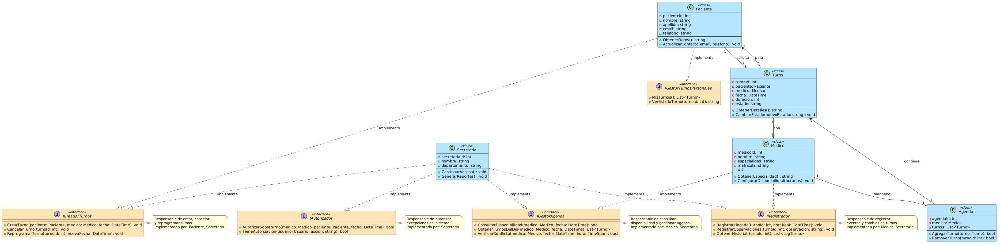

# Principio de Segregación de Interfaces (ISP)

## Propósito y Tipo del Principio SOLID

Una breve explicación del problema y cómo ISP ayuda a solucionarlo, destacando la importancia de interfaces cohesivas y especializadas.

El **Principio de Segregación de Interfaces (ISP)** establece que los clientes no deben depender de interfaces que no utilizan. En otras palabras, es mejor tener muchas interfaces específicas que una sola interfaz general (gorda) que obligue a las clases a implementar métodos que no necesitan.

En el contexto del Sistema de Turnos Médicos, ISP asegura que cada clase solo implemente las responsabilidades que realmente necesita, evitando dependencias innecesarias y mejorando la cohesión del diseño.

---

## Motivación

Detalle más profundo del problema que enfrentaba el sistema y cómo ISP ayuda a resolverlo. Incluir un ejemplo del proyecto que explique la necesidad de aplicar este principio y evitar interfaces "gordas" que obliguen a implementar métodos no utilizados.

### Problema Identificado

En el boceto actual del Sistema de Turnos Médicos, observamos que las clases tienen múltiples responsabilidades:

- **Secretaria**: gestiona turnos, notifica pacientes, autoriza sobreturnos, registra llegadas
- **Médico**: consulta agenda, atiende pacientes, registra observaciones
- **Paciente**: solicita turnos, cancela turnos, reprograma turnos

Si definiéramos una interfaz única "GestorTurnos" que incluya todos estos métodos, entonces:
- La clase **Paciente** tendría que implementar métodos como "autorizarSobreturno()" que no tiene sentido
- La clase **Médico** tendría que implementar "registrarLlegadaPaciente()" que no es su responsabilidad
- La clase **Secretaria** tendría que implementar métodos de "consultarMiAgenda()" aunque ella consulta la agenda de otros

### Solución con ISP

Dividimos las responsabilidades en **interfaces segregadas y cohesivas**:

1. **ICreadorTurnos**: responsable de crear nuevos turnos
2. **IGestorTurnosPersonales**: responsable de consultar y modificar turnos propios
3. **IGestorAgenda**: responsable de consultar la agenda de un profesional
4. **IAutorizador**: responsable de autorizar excepciones como sobreturnos
5. **IRegistrador**: responsable de registrar eventos (llegadas, observaciones)

Cada clase implementa solo las interfaces que necesita:
- **Paciente** implementa `ICreadorTurnos` e `IGestorTurnosPersonales`
- **Médico** implementa `IGestorAgenda` e `IRegistrador`
- **Secretaria** implementa `ICreadorTurnos`, `IGestorAgenda`, `IAutorizador`, `IRegistrador`

De esta forma, cada clase tiene compromisos claros y no depende de métodos que no utiliza.

---

## Explicación de Interfaces

Explicar qué es una interfaz en el diseño orientado a objetos y cómo se aplica específicamente para cumplir con ISP en el diseño del sistema.

### ¿Qué es una Interfaz?

Una interfaz es un contrato que define un conjunto de métodos públicos que una clase DEBE implementar. 

**Características key:**
- Define el "QUÉ" (qué debe hacer), no el "CÓMO" (cómo lo implementa)
- Una clase puede implementar múltiples interfaces (a diferencia de la herencia simple)
- Los métodos en una interfaz son públicos y abstractos por defecto
- NO contiene implementación, solo declaraciones de métodos

### Por qué son importantes en el Sistema de Turnos

Las interfaces permiten:
1. **Desacoplamiento**: Las clases dependen de abstracciones, no de implementaciones concretas
2. **Flexibilidad**: Si agregamos un nuevo tipo de actor (ej: administrativo), podemos hacer que implemente solo las interfaces que necesita
3. **Testabilidad**: Podemos crear mocks/stubs de las interfaces para pruebas unitarias
4. **Extensibilidad**: Nuevas implementaciones pueden adaptarse sin modificar código existente

Ejemplo en nuestro sistema:
```csharp
// Interface segregada
public interface ICreadorTurnos {
    void CrearTurno(Paciente paciente, Medico medico, DateTime fecha);
    void CancelarTurno(int turnoId);
    void ReprogramarTurno(int turnoId, DateTime nuevaFecha);
}

// Tanto Paciente como Secretaria implementan esto
public class Paciente : ICreadorTurnos { ... }
public class Secretaria : ICreadorTurnos { ... }

// Pero Médico NO implementa ICreadorTurnos, porque no crea turnos
public class Medico : IGestorAgenda, IRegistrador { ... }
```

---

## Estructura de Clases

Incluir un diagrama UML que muestre cómo se han diseñado las interfaces segregadas y cómo las clases existentes implementan estas interfaces. Incluir la imagen incrustada con el enlace al diagrama.

### Diagrama de Segregación de Interfaces



**Ver diagrama en detalle:** [01-solid-04-isp.puml](../../diagramas/01-diagrama-clases/01-solid-04-isp.puml)

### Estructura Propuesta

```
┌─────────────────────────────────────────────────────┐
│                   Interfaces                        │
├─────────────────────────────────────────────────────┤
│  • ICreadorTurnos                                   │
│    ├─ CrearTurno()                                  │
│    ├─ CancelarTurno()                               │
│    └─ ReprogramarTurno()                            │
├─────────────────────────────────────────────────────┤
│  • IGestorAgenda                                    │
│    ├─ ConsultarDisponibilidad()                     │
│    ├─ ObtenerTurnosDelDia()                         │
│    └─ VerificarConflicto()                          │
├─────────────────────────────────────────────────────┤
│  • IAutorizador                                     │
│    └─ AutorizarSobreturno()                         │
├─────────────────────────────────────────────────────┤
│  • IRegistrador                                     │
│    ├─ RegistrarLlegada()                            │
│    └─ RegistrarObservaciones()                      │
└─────────────────────────────────────────────────────┘

Implementaciones:
  Paciente       : ICreadorTurnos, IGestorTurnosPersonales
  Medico         : IGestorAgenda, IRegistrador
  Secretaria     : ICreadorTurnos, IGestorAgenda, IAutorizador, IRegistrador
```

---

## Justificación Técnica

Explicar con palabras lo que se observa en el diagrama UML. Detallar cómo las interfaces y clases reflejan la aplicación del ISP y por qué la solución propuesta es correcta desde el punto de vista técnico.

### Análisis de la Solución

#### 1. **Interfaces Segregadas**

Cada interfaz agrupa métodos cohesivos (relacionados a una única responsabilidad):

- **ICreadorTurnos**: Solo métodos para crear, cancelar y reprogramar turnos
- **IGestorAgenda**: Solo métodos para consultar disponibilidad y conflictos
- **IAutorizador**: Solo métodos para autorizar excepciones
- **IRegistrador**: Solo métodos para registrar eventos

Esta segregación **elimina interfaces "gordas"** que obligarían a implementar métodos innecesarios.

#### 2. **Implementación Flexible**

Cada clase implementa exactamente lo que necesita:

- **Paciente** no debe implementar `IAutorizador` (no puede autorizar sobreturnos)
- **Médico** no debe implementar `ICreadorTurnos` (no crea turnos directamente)
- **Secretaria** implementa las 4 interfaces porque tiene todas esas responsabilidades

#### 3. **Beneficios Técnicos**

**Antes (sin ISP):**
```csharp
public interface IGestorTurnosOmnipotente {
    void CrearTurno(...);
    void CancelarTurno(...);
    void ReprogramarTurno(...);
    void ConsultarAgenda(...);
    void AutorizarSobreturno(...);
    void RegistrarLlegada(...);
    void RegistrarObservaciones(...);
}

// ❌ Paciente se ve obligado a implementar TODOS estos métodos
public class Paciente : IGestorTurnosOmnipotente {
    public void CrearTurno(...) { /* OK */ }
    public void CancelarTurno(...) { /* OK */ }
    public void ConsultarAgenda(...) { /* Inútil para Paciente */ throw NotImplementedException(); }
    public void AutorizarSobreturno(...) { /* Inútil */ throw NotImplementedException(); }
    // ... etc
}
```

**Después (con ISP):**
```csharp
// ✅ Paciente implementa solo lo que necesita
public class Paciente : ICreadorTurnos, IGestorTurnosPersonales {
    public void CrearTurno(...) { /* implementación */ }
    public void CancelarTurno(...) { /* implementación */ }
    // Y punto. No es obligado a implementar métodos inútiles.
}
```

#### 4. **Extensibilidad**

Si en el futuro agregamos un nuevo actor, por ejemplo **Administrativo**:

```csharp
public class Administrativo : IGestorTurnosPersonales, IRegistrador {
    // Implementa solo lo que necesita
    // No hereda responsabilidades innecesarias
}
```

Sin ISP, hubieríamos tenido que crear una interfaz gigante que incluye todo, dificultando agregar nuevas funcionalidades sin afectar clases existentes.

#### 5. **Testabilidad**

Con interfaces segregadas, podemos crear mocks pequeños y específicos:

```csharp
// Mock simple solo para pruebas de creación de turnos
public class MockCreadorTurnos : ICreadorTurnos {
    public void CrearTurno(...) { /* mock */ }
    public void CancelarTurno(...) { /* mock */ }
    public void ReprogramarTurno(...) { /* mock */ }
}

// No necesitamos mockeae 7 métodos si solo probamos 3
```

---

## Conclusión

El **Principio de Segregación de Interfaces** en el Sistema de Turnos Médicos garantiza que:

1. ✅ Cada clase solo implementa lo que realmente usa
2. ✅ Las interfaces son cohesivas y enfocadas
3. ✅ El sistema es más flexible y extensible
4. ✅ Nuevos actores pueden agregarse fácilmente
5. ✅ La testabilidad mejora significativamente

Esta aplicación de ISP, combinada con otros principios SOLID, resultará en un diseño robusto, mantenible y escalable.
