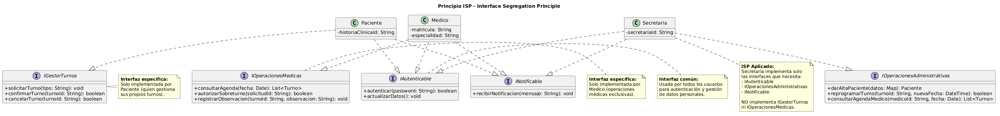

# ISP - Interface Segregation Principle (Principio de Segregación de Interfaces)

**Autor:** @nachonervi-design  
**Fecha:** Junio 2026

---

## 1. Definición del Principio

> **"Los clientes no deben ser forzados a depender de interfaces que no utilizan."**  
> — Robert C. Martin

Esto significa que es mejor tener **muchas interfaces específicas** que una sola interfaz general. Cada interfaz debe definir solo los métodos que un cliente necesita, evitando forzar a las clases a implementar métodos que no usarán.

---

## 2. Aplicación en SistemaTurnosMedicos

### 2.1 Problema: Interfaz "Dios" (Anti-patrón)

**Diseño INCORRECTO (viola ISP):**

```text
INTERFAZ IUsuarioCompleto
    + autenticar(password: String): boolean
    + actualizarDatos(): void
    + solicitarTurno(tipo: String): void
    + confirmarTurno(turnoId: String): boolean
    + cancelarTurno(turnoId: String): boolean
    + consultarAgenda(fecha: Date): List<Turno>
    + autorizarSobreturno(solicitudId: String): boolean
    + darAltaPaciente(datos: Map): Paciente
    + reprogramarTurno(turnoId: String, nuevaFecha: DateTime): boolean
    + recibirNotificacion(mensaje: String): void
FIN
```

**Problemas:**
- ❌ `Paciente` debe implementar `autorizarSobreturno()` aunque no lo use
- ❌ `Medico` debe implementar `darAltaPaciente()` aunque no lo use
- ❌ `Secretaria` debe implementar `solicitarTurno()` aunque no lo use directamente
- ❌ Las clases tienen métodos que lanzan `UnsupportedOperationException`

### 2.2 Solución: Interfaces Segregadas (Correcto)

**Diseño CORRECTO (sigue ISP):**

```text
' Interfaz para autenticación (usada por todos los usuarios)
INTERFAZ IAutenticable
    + autenticar(password: String): boolean
    + actualizarDatos(): void
FIN

' Interfaz para gestión de turnos (usada por Paciente y Secretaria)
INTERFAZ IGestorTurnos
    + solicitarTurno(tipo: String): void
    + confirmarTurno(turnoId: String): boolean
    + cancelarTurno(turnoId: String): boolean
FIN

' Interfaz para operaciones médicas (usada solo por Medico)
INTERFAZ IOperacionesMedicas
    + consultarAgenda(fecha: Date): List<Turno>
    + autorizarSobreturno(solicitudId: String): boolean
    + registrarObservacion(turnoId: String, observacion: String): void
FIN

' Interfaz para operaciones administrativas (usada solo por Secretaria)
INTERFAZ IOperacionesAdministrativas
    + darAltaPaciente(datos: Map): Paciente
    + reprogramarTurno(turnoId: String, nuevaFecha: DateTime): boolean
    + consultarAgendaMedico(medicoId: String, fecha: Date): List<Turno>
FIN

' Interfaz para notificaciones (usada por todos los usuarios)
INTERFAZ INotificable
    + recibirNotificacion(mensaje: String): void
FIN
```

**Implementación en las clases:**

```text
CLASE Paciente IMPLEMENTA IAutenticable, IGestorTurnos, INotificable
    + autenticar(password: String): boolean
        RETORNAR this.contrasena == password
    FIN
    
    + actualizarDatos(): void
        // Actualizar datos del paciente
    FIN
    
    + solicitarTurno(tipo: String): void
        // Solicitar turno
    FIN
    
    + confirmarTurno(turnoId: String): boolean
        // Confirmar turno
    FIN
    
    + cancelarTurno(turnoId: String): boolean
        // Cancelar turno
    FIN
    
    + recibirNotificacion(mensaje: String): void
        // Recibir notificación
    FIN
FIN

CLASE Medico IMPLEMENTA IAutenticable, IOperacionesMedicas, INotificable
    + autenticar(password: String): boolean
        RETORNAR this.contrasena == password
    FIN
    
    + actualizarDatos(): void
        // Actualizar datos del médico
    FIN
    
    + consultarAgenda(fecha: Date): List<Turno>
        // Consultar agenda
    FIN
    
    + autorizarSobreturno(solicitudId: String): boolean
        // Autorizar sobreturno
    FIN
    
    + registrarObservacion(turnoId: String, observacion: String): void
        // Registrar observación
    FIN
    
    + recibirNotificacion(mensaje: String): void
        // Recibir notificación
    FIN
FIN

CLASE Secretaria IMPLEMENTA IAutenticable, IOperacionesAdministrativas, INotificable
    + autenticar(password: String): boolean
        RETORNAR this.contrasena == password
    FIN
    
    + actualizarDatos(): void
        // Actualizar datos de la secretaria
    FIN
    
    + darAltaPaciente(datos: Map): Paciente
        // Dar de alta paciente
    FIN
    
    + reprogramarTurno(turnoId: String, nuevaFecha: DateTime): boolean
        // Reprogramar turno
    FIN
    
    + consultarAgendaMedico(medicoId: String, fecha: Date): List<Turno>
        // Consultar agenda de un médico
    FIN
    
    + recibirNotificacion(mensaje: String): void
        // Recibir notificación
    FIN
FIN
```

**Beneficios de este diseño:**

✅ **Paciente** solo implementa las interfaces que necesita: `IAutenticable`, `IGestorTurnos`, `INotificable`  
✅ **Medico** solo implementa las interfaces que necesita: `IAutenticable`, `IOperacionesMedicas`, `INotificable`  
✅ **Secretaria** solo implementa las interfaces que necesita: `IAutenticable`, `IOperacionesAdministrativas`, `INotificable`  
✅ **No hay métodos innecesarios** en ninguna clase  
✅ **Código más limpio y mantenible**

---

## 3. Diagrama de Clases - ISP



### Descripción del Diagrama

El diagrama muestra:

1. **5 interfaces segregadas:**
   - `IAutenticable` - Autenticación y actualización de datos
   - `IGestorTurnos` - Operaciones de gestión de turnos
   - `IOperacionesMedicas` - Operaciones específicas de médicos
   - `IOperacionesAdministrativas` - Operaciones específicas de secretarias
   - `INotificable` - Recepción de notificaciones

2. **3 clases que implementan solo las interfaces que necesitan:**
   - `Paciente` implementa 3 interfaces
   - `Medico` implementa 3 interfaces
   - `Secretaria` implementa 3 interfaces

---

## 4. Ejemplo Práctico: Sistema de Notificaciones

### Escenario: Enviar notificaciones a diferentes tipos de usuarios

**Código que usa interfaces segregadas:**

```text
CLASE ServicioNotificaciones
    + notificarUsuarios(notificables: List<INotificable>, mensaje: String): void
        PARA CADA notificable EN notificables:
            notificable.recibirNotificacion(mensaje)
        FIN
    FIN
FIN

' Uso del servicio
List<INotificable> usuariosNotificables = [paciente1, medico1, secretaria1]
ServicioNotificaciones.notificarUsuarios(usuariosNotificables, "Mantenimiento programado")
```

**Beneficio:** El servicio solo depende de `INotificable`, no necesita saber si el usuario es Paciente, Medico o Secretaria.

---

## 5. Ejemplo Práctico: Autorización de Sobreturnos

### Escenario: Solo los médicos pueden autorizar sobreturnos

**Código que usa interfaces segregadas:**

```text
CLASE SistemaAutorizacion
    + autorizarSobreturno(medico: IOperacionesMedicas, solicitudId: String): boolean
        RETORNAR medico.autorizarSobreturno(solicitudId)
    FIN
FIN

' Uso del sistema
Medico drGarcia = new Medico(...)
SistemaAutorizacion.autorizarSobreturno(drGarcia, "SOL-001")

' Esto NO compila (correcto):
Paciente juan = new Paciente(...)
SistemaAutorizacion.autorizarSobreturno(juan, "SOL-001")  // Error: Paciente no implementa IOperacionesMedicas
```

**Beneficio:** El compilador evita que intentemos autorizar sobreturnos con usuarios que no tienen esa capacidad.

---

## 6. Relación con las Tarjetas CRC

Analizando las tarjetas CRC, podemos identificar las responsabilidades que deben ir en cada interfaz:

| Tarjeta CRC | Responsabilidades | Interfaces a Implementar |
|-------------|-------------------|--------------------------|
| **Paciente** | Solicitar turno, confirmar/cancelar, recibir notificaciones | `IAutenticable`, `IGestorTurnos`, `INotificable` |
| **Medico** | Consultar agenda, autorizar sobreturnos, registrar observaciones | `IAutenticable`, `IOperacionesMedicas`, `INotificable` |
| **Secretaria** | Solicitar turno, cancelar, reprogramar, dar de alta pacientes | `IAutenticable`, `IOperacionesAdministrativas`, `INotificable` |
| **UsuarioDelSistema** | Autenticarse, actualizar datos | `IAutenticable` |

---

## 7. Anti-patrones que Violan ISP

### 7.1 Interface Pollution (Contaminación de Interfaz)

**Diseño INCORRECTO:**

```text
INTERFAZ ITrabajador
    + trabajar(): void
    + comer(): void
    + dormir(): void
    + programar(): void
    + diseñar(): void
    + vender(): void
FIN

CLASE Programador IMPLEMENTA ITrabajador
    + trabajar(): void
        programar()
    FIN
    
    + comer(): void
        // Implementación
    FIN
    
    + dormir(): void
        // Implementación
    FIN
    
    + programar(): void
        // Implementación
    FIN
    
    + diseñar(): void
        LANZAR UnsupportedOperationException("Programadores no diseñan")
    FIN
    
    + vender(): void
        LANZAR UnsupportedOperationException("Programadores no venden")
    FIN
FIN
```

**Problemas:**
- ❌ `Programador` debe implementar métodos que no usa (`diseñar()`, `vender()`)
- ❌ Los métodos no usados lanzan excepciones

**Solución con ISP:**

```text
INTERFAZ ITrabajador
    + trabajar(): void
    + comer(): void
    + dormir(): void
FIN

INTERFAZ IProgramador
    + programar(): void
FIN

INTERFAZ IDiseñador
    + diseñar(): void
FIN

INTERFAZ IVendedor
    + vender(): void
FIN

CLASE Programador IMPLEMENTA ITrabajador, IProgramador
    + trabajar(): void
        programar()
    FIN
    
    + comer(): void
        // Implementación
    FIN
    
    + dormir(): void
        // Implementación
    FIN
    
    + programar(): void
        // Implementación
    FIN
FIN
```

---

## 8. Beneficios de Aplicar ISP

| Beneficio | Descripción |
|-----------|-------------|
| **Código más limpio** | Las clases solo implementan métodos que realmente usan |
| **Menos acoplamiento** | Los clientes dependen solo de las interfaces que necesitan |
| **Mayor cohesión** | Cada interfaz tiene un propósito específico y bien definido |
| **Fácil mantenimiento** | Cambios en una interfaz no afectan a clases que no la usan |
| **Mejor testabilidad** | Se pueden mockear interfaces específicas para testing |
| **Seguridad en tiempo de compilación** | El compilador evita usos incorrectos de interfaces |

---

## 9. Relación con Otros Principios SOLID

| Principio | Relación con ISP |
|-----------|------------------|
| **SRP** | Interfaces específicas promueven clases con una sola responsabilidad |
| **OCP** | Interfaces segregadas facilitan la extensión sin modificar implementaciones existentes |
| **LSP** | Interfaces bien definidas aseguran que las subclases puedan sustituir a las superclases |
| **DIP** | ISP proporciona las abstracciones específicas que DIP requiere |

---

## 10. Casos de Uso que se Benefician de ISP

### CU01 - Crear Turno
- **Beneficio ISP:** `Secretaria` usa `IOperacionesAdministrativas` para crear turnos, sin depender de métodos médicos

### CU04 - Autorizar Sobreturno
- **Beneficio ISP:** Solo `Medico` implementa `IOperacionesMedicas`, evitando que otros usuarios intenten autorizar sobreturnos

### CU05 - Registrar Llegada
- **Beneficio ISP:** `Turno` implementa solo las interfaces necesarias para su ciclo de vida

---

## 11. Métricas de Calidad

Para evaluar si una interfaz está bien segregada:

| Métrica | Valor Ideal | Descripción |
|---------|-------------|-------------|
| **Número de métodos** | 3-7 | Interfaces con muchos métodos probablemente violan ISP |
| **Cohesión de interfaz** | Alta | Todos los métodos deben estar relacionados |
| **Clientes que usan todos los métodos** | 100% | Si un cliente no usa algunos métodos, la interfaz está mal segregada |

**Análisis de las interfaces propuestas:**

| Interfaz | Métodos | Cohesión | Evaluación |
|----------|---------|----------|------------|
| `IAutenticable` | 2 | Alta | ✅ Bien segregada |
| `IGestorTurnos` | 3 | Alta | ✅ Bien segregada |
| `IOperacionesMedicas` | 3 | Alta | ✅ Bien segregada |
| `IOperacionesAdministrativas` | 3 | Alta | ✅ Bien segregada |
| `INotificable` | 1 | Alta | ✅ Bien segregada |

---

## 12. Conclusiones

El principio ISP **no está explícitamente aplicado** en el diseño actual de SistemaTurnosMedicos, pero se puede mejorar significativamente:

**Estado actual:**
- ⚠️ No hay interfaces definidas en el diagrama de clases
- ⚠️ Las clases tienen todos los métodos directamente
- ⚠️ No hay segregación de responsabilidades a nivel de interfaz

**Mejoras propuestas:**
✅ **Crear interfaces segregadas** para diferentes conjuntos de responsabilidades  
✅ **Hacer que las clases implementen solo las interfaces que necesitan**  
✅ **Usar interfaces en lugar de clases concretas** en las dependencias  

**Recomendaciones:**

1. **Identificar responsabilidades comunes** entre clases y crear interfaces para ellas
2. **Mantener interfaces pequeñas** (3-7 métodos máximo)
3. **Evitar interfaces "Dios"** que tengan muchos métodos no relacionados
4. **Usar composición de interfaces** cuando una clase necesite múltiples capacidades
5. **Preferir interfaces sobre clases abstractas** cuando no hay implementación compartida

---

## 13. Referencias

- Martin, R. C. (2002). *Agile Software Development, Principles, Patterns, and Practices*. Prentice Hall.
- Martin, R. C. (1996). *The Interface Segregation Principle*. C++ Report.
- Gamma, E., Helm, R., Johnson, R., Vlissides, J. (1994). *Design Patterns: Elements of Reusable Object-Oriented Software*. Addison-Wesley.

---

**Documento generado por:** @nachonervi-design  
**Repositorio:** [SistemaTurnosMedicos](https://github.com/eternalnight04/SistemaTurnosMedicos)
