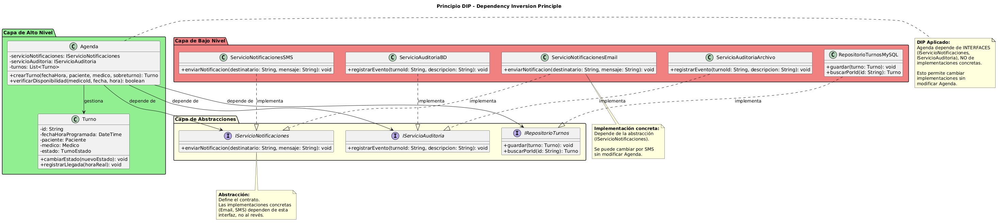

# DIP - Dependency Inversion Principle (Principio de Inversión de Dependencias)

**Autor:** @nachonervi-design  
**Fecha:** Junio 2026

---

## 1. Definición del Principio

> **"Los módulos de alto nivel no deben depender de módulos de bajo nivel. Ambos deben depender de abstracciones. Las abstracciones no deben depender de los detalles. Los detalles deben depender de las abstracciones."**  
> — Robert C. Martin

Esto significa que:
1. Las clases importantes (alto nivel) no deben depender de clases específicas (bajo nivel)
2. Ambas deben depender de **interfaces o clases abstractas**
3. Las interfaces definen el contrato, las implementaciones concretas lo cumplen

---

## 2. Aplicación en SistemaTurnosMedicos

### 2.1 Problema: Dependencias Directas (Anti-patrón)

**Diseño INCORRECTO (viola DIP):**

```text
CLASE Agenda
    - servicioNotificaciones: ServicioNotificacionesEmail  // Dependencia concreta
    - servicioAuditoria: ServicioAuditoriaBD              // Dependencia concreta
    
    + crearTurno(fechaHora, paciente, medico, sobreturno): Turno
        turno = new Turno(fechaHora, paciente, medico, sobreturno)
        turnos.agregar(turno)
        
        // Dependencia directa a implementación concreta
        servicioNotificaciones.enviarEmail(paciente.email, "Turno creado")
        servicioAuditoria.registrarEnBD(turno.id, "Turno creado")
        
        RETORNAR turno
    FIN
FIN
```

**Problemas:**
- ❌ `Agenda` depende directamente de `ServicioNotificacionesEmail` (no puede usar SMS)
- ❌ `Agenda` depende directamente de `ServicioAuditoriaBD` (no puede usar archivos)
- ❌ Difícil de testear (no se pueden mockear los servicios)
- ❌ Difícil de cambiar la implementación (hay que modificar `Agenda`)

### 2.2 Solución: Dependencias de Abstracciones (Correcto)

**Diseño CORRECTO (sigue DIP):**

```text
' Interfaces (abstracciones)
INTERFAZ IServicioNotificaciones
    + enviarNotificacion(destinatario: String, mensaje: String): void
FIN

INTERFAZ IServicioAuditoria
    + registrarEvento(turnoId: String, descripcion: String): void
FIN

' Implementaciones concretas (detalles)
CLASE ServicioNotificacionesEmail IMPLEMENTA IServicioNotificaciones
    + enviarNotificacion(destinatario: String, mensaje: String): void
        // Enviar email
    FIN
FIN

CLASE ServicioNotificacionesSMS IMPLEMENTA IServicioNotificaciones
    + enviarNotificacion(destinatario: String, mensaje: String): void
        // Enviar SMS
    FIN
FIN

CLASE ServicioAuditoriaBD IMPLEMENTA IServicioAuditoria
    + registrarEvento(turnoId: String, descripcion: String): void
        // Registrar en base de datos
    FIN
FIN

CLASE ServicioAuditoriaArchivo IMPLEMENTA IServicioAuditoria
    + registrarEvento(turnoId: String, descripcion: String): void
        // Registrar en archivo
    FIN
FIN

' Clase de alto nivel que depende de abstracciones
CLASE Agenda
    - servicioNotificaciones: IServicioNotificaciones  // Dependencia de abstracción
    - servicioAuditoria: IServicioAuditoria            // Dependencia de abstracción
    
    + Agenda(servicioNotif: IServicioNotificaciones, servicioAudit: IServicioAuditoria)
        this.servicioNotificaciones = servicioNotif
        this.servicioAuditoria = servicioAudit
    FIN
    
    + crearTurno(fechaHora, paciente, medico, sobreturno): Turno
        turno = new Turno(fechaHora, paciente, medico, sobreturno)
        turnos.agregar(turno)
        
        // Usa la abstracción, no la implementación concreta
        servicioNotificaciones.enviarNotificacion(paciente.email, "Turno creado")
        servicioAuditoria.registrarEvento(turno.id, "Turno creado")
        
        RETORNAR turno
    FIN
FIN
```

**Beneficios de este diseño:**

✅ **Agenda** depende de interfaces (`IServicioNotificaciones`, `IServicioAuditoria`), no de implementaciones concretas  
✅ **Fácil cambiar implementación:** Podemos usar SMS en lugar de email sin modificar `Agenda`  
✅ **Fácil de testear:** Podemos mockear las interfaces para testing unitario  
✅ **Desacoplamiento:** `Agenda` no sabe ni le importa cómo se envían las notificaciones  

---

## 3. Diagrama de Clases - DIP



### Descripción del Diagrama

El diagrama muestra:

1. **Capa de alto nivel (abstracciones):**
   - `Agenda` - Clase de negocio
   - `IServicioNotificaciones` - Interfaz de notificaciones
   - `IServicioAuditoria` - Interfaz de auditoría

2. **Capa de bajo nivel (implementaciones):**
   - `ServicioNotificacionesEmail` - Implementación concreta
   - `ServicioNotificacionesSMS` - Implementación concreta
   - `ServicioAuditoriaBD` - Implementación concreta
   - `ServicioAuditoriaArchivo` - Implementación concreta

3. **Inversión de dependencias:**
   - `Agenda` depende de las interfaces (no de las implementaciones)
   - Las implementaciones concretas dependen de las interfaces

---

## 4. Ejemplo Práctico: Inyección de Dependencias

### Escenario: Configurar el sistema para usar diferentes servicios

**Configuración 1: Email + Base de Datos**

```text
' Crear implementaciones concretas
servicioNotif = new ServicioNotificacionesEmail()
servicioAudit = new ServicioAuditoriaBD()

' Inyectar dependencias en Agenda
agenda = new Agenda(servicioNotif, servicioAudit)

' Usar el sistema
agenda.crearTurno(fechaHora, paciente, medico, false)
// Envía email y registra en BD
```

**Configuración 2: SMS + Archivo (sin modificar Agenda)**

```text
' Crear implementaciones concretas diferentes
servicioNotif = new ServicioNotificacionesSMS()
servicioAudit = new ServicioAuditoriaArchivo()

' Inyectar dependencias en Agenda (mismo código)
agenda = new Agenda(servicioNotif, servicioAudit)

' Usar el sistema
agenda.crearTurno(fechaHora, paciente, medico, false)
// Envía SMS y registra en archivo
```

**Resultado:** El mismo código de `Agenda` funciona con diferentes implementaciones sin modificaciones.

---

## 5. Ejemplo Práctico: Testing con Mocks

### Escenario: Testear Agenda sin dependencias reales

**Test unitario con mocks:**

```text
CLASE TestAgenda
    + testCrearTurno(): void
        ' Crear mocks de las interfaces
        mockNotif = new MockServicioNotificaciones()
        mockAudit = new MockServicioAuditoria()
        
        ' Crear Agenda con mocks
        agenda = new Agenda(mockNotif, mockAudit)
        
        ' Ejecutar el método a testear
        turno = agenda.crearTurno(fechaHora, paciente, medico, false)
        
        ' Verificar que se llamaron los métodos correctos
        ASSERT mockNotif.enviarNotificacion fue llamado con (paciente.email, "Turno creado")
        ASSERT mockAudit.registrarEvento fue llamado con (turno.id, "Turno creado")
        ASSERT turno no es nulo
    FIN
FIN
```

**Beneficio:** El test es rápido y no depende de servicios externos (email, base de datos).

---

## 6. Relación con el Patrón Builder

El patrón **Builder** que aplicamos a la clase `Turno` también sigue DIP:

```text
' Turno depende de abstracciones
CLASE Turno
    - paciente: Paciente  // Clase concreta, pero es una entidad de dominio
    - medico: Medico      // Clase concreta, pero es una entidad de dominio
    
    ' El Builder permite inyectar dependencias de forma flexible
    CLASE INTERNA Builder
        + Builder(fechaHora, paciente, medico)
            // Constructor con dependencias obligatorias
        FIN
        
        + build(): Turno
            // Construye el objeto con las dependencias inyectadas
        FIN
    FIN
FIN
```

**Beneficio:** El Builder permite construir objetos complejos con sus dependencias de forma controlada.

---

## 7. Anti-patrones que Violan DIP

### 7.1 Hard-Coded Dependencies (Dependencias Codificadas)

**Diseño INCORRECTO:**

```text
CLASE Secretaria
    + darAltaPaciente(datos: Map): Paciente
        ' Dependencia hard-coded a implementación concreta
        repositorio = new RepositorioPacientesMySQL()
        paciente = new Paciente(datos)
        repositorio.guardar(paciente)
        RETORNAR paciente
    FIN
FIN
```

**Problema:** `Secretaria` está acoplada a `RepositorioPacientesMySQL`. Si queremos usar PostgreSQL, hay que modificar `Secretaria`.

**Solución con DIP:**

```text
INTERFAZ IRepositorioPacientes
    + guardar(paciente: Paciente): void
    + buscarPorId(id: String): Paciente
FIN

CLASE Secretaria
    - repositorio: IRepositorioPacientes  // Dependencia de abstracción
    
    + Secretaria(repositorio: IRepositorioPacientes)
        this.repositorio = repositorio
    FIN
    
    + darAltaPaciente(datos: Map): Paciente
        paciente = new Paciente(datos)
        repositorio.guardar(paciente)
        RETORNAR paciente
    FIN
FIN
```

### 7.2 Service Locator (Localizador de Servicios)

**Diseño INCORRECTO (violación sutil de DIP):**

```text
CLASE Agenda
    + crearTurno(...): Turno
        ' Usa un localizador de servicios (anti-patrón)
        servicioNotif = ServiceLocator.obtener("ServicioNotificaciones")
        servicioNotif.enviarNotificacion(...)
    FIN
FIN
```

**Problema:** Aunque usa una interfaz, la dependencia está oculta y es difícil de testear.

**Solución con DIP (Inyección de Dependencias):**

```text
CLASE Agenda
    - servicioNotif: IServicioNotificaciones  // Dependencia explícita
    
    + Agenda(servicioNotif: IServicioNotificaciones)
        this.servicioNotif = servicioNotif
    FIN
    
    + crearTurno(...): Turno
        servicioNotif.enviarNotificacion(...)
    FIN
FIN
```

---

## 8. Relación con las Tarjetas CRC

Analizando las tarjetas CRC, podemos identificar dependencias que deberían ser abstracciones:

| Tarjeta CRC | Dependencias Actuales | Debería ser Abstracción |
|-------------|----------------------|-------------------------|
| **Agenda** | Turno, Medico, Paciente | ✅ OK (entidades de dominio) |
| **Turno** | Paciente, Medico, TurnoEstado | ✅ OK (entidades de dominio) |
| **Secretaria** | Paciente, Turno, Agenda | ✅ OK (entidades de dominio) |
| **Sistema** (implícito) | ServicioNotificaciones, ServicioAuditoria | ⚠️ Deberían ser interfaces |

**Recomendación:** Las dependencias a servicios transversales (notificaciones, auditoría, persistencia) deberían ser interfaces.

---

## 9. Beneficios de Aplicar DIP

| Beneficio | Descripción |
|-----------|-------------|
| **Desacoplamiento** | Las clases de alto nivel no dependen de implementaciones específicas |
| **Flexibilidad** | Fácil cambiar implementaciones sin modificar el código cliente |
| **Testabilidad** | Se pueden usar mocks para testing unitario |
| **Mantenibilidad** | Los cambios en implementaciones de bajo nivel no afectan a las clases de alto nivel |
| **Escalabilidad** | Fácil agregar nuevas implementaciones sin romper el código existente |
| **Inversión de control** | El flujo de control se invierte: las abstracciones definen el contrato, las implementaciones lo cumplen |

---

## 10. Relación con Otros Principios SOLID

| Principio | Relación con DIP |
|-----------|------------------|
| **SRP** | DIP ayuda a mantener SRP al separar la lógica de negocio de los detalles de implementación |
| **OCP** | DIP facilita OCP al permitir nuevas implementaciones sin modificar el código cliente |
| **LSP** | DIP requiere que las implementaciones cumplan LSP para poder ser sustituidas |
| **ISP** | DIP usa interfaces segregadas (ISP) para definir las abstracciones |

---

## 11. Patrones de Diseño que Implementan DIP

| Patrón | Cómo implementa DIP |
|--------|---------------------|
| **Strategy** | Define una familia de algoritmos mediante interfaces |
| **Factory Method** | Crea objetos mediante interfaces, no clases concretas |
| **Abstract Factory** | Proporciona interfaces para crear familias de objetos |
| **Observer** | Los observadores dependen de interfaces, no de implementaciones concretas |
| **Dependency Injection** | Inyecta dependencias mediante interfaces |

---

## 12. Casos de Uso que se Benefician de DIP

### CU01 - Crear Turno
- **Beneficio DIP:** `Agenda` puede usar diferentes servicios de notificación sin modificar su código

### CU04 - Autorizar Sobreturno
- **Beneficio DIP:** `Medico` puede usar diferentes servicios de auditoría sin modificar su código

### Happy Path Global
- **Beneficio DIP:** Todo el flujo puede configurarse con diferentes implementaciones de servicios

---

## 13. Implementación Práctica en Java

### Ejemplo completo con Spring Framework

```java
// Interfaces
public interface IServicioNotificaciones {
    void enviarNotificacion(String destinatario, String mensaje);
}

public interface IServicioAuditoria {
    void registrarEvento(String turnoId, String descripcion);
}

// Implementaciones
@Service
public class ServicioNotificacionesEmail implements IServicioNotificaciones {
    @Override
    public void enviarNotificacion(String destinatario, String mensaje) {
        // Enviar email
    }
}

@Service
public class ServicioAuditoriaBD implements IServicioAuditoria {
    @Override
    public void registrarEvento(String turnoId, String descripcion) {
        // Registrar en BD
    }
}

// Clase que usa DIP
@Component
public class Agenda {
    private final IServicioNotificaciones servicioNotificaciones;
    private final IServicioAuditoria servicioAuditoria;
    
    // Inyección de dependencias por constructor
    @Autowired
    public Agenda(IServicioNotificaciones servicioNotificaciones,
                  IServicioAuditoria servicioAuditoria) {
        this.servicioNotificaciones = servicioNotificaciones;
        this.servicioAuditoria = servicioAuditoria;
    }
    
    public Turno crearTurno(DateTime fechaHora, Paciente paciente, 
                           Medico medico, boolean sobreturno) {
        Turno turno = new Turno(fechaHora, paciente, medico, sobreturno);
        turnos.add(turno);
        
        servicioNotificaciones.enviarNotificacion(paciente.getEmail(), "Turno creado");
        servicioAuditoria.registrarEvento(turno.getId(), "Turno creado");
        
        return turno;
    }
}
```

---

## 14. Conclusiones

El principio DIP **no está explícitamente aplicado** en el diseño actual de SistemaTurnosMedicos, pero es crucial para un sistema mantenible:

**Estado actual:**
- ⚠️ Las clases dependen directamente de implementaciones concretas
- ⚠️ No hay interfaces definidas para servicios transversales
- ⚠️ Difícil de testear y cambiar implementaciones

**Mejoras propuestas:**
✅ **Crear interfaces** para servicios transversales (notificaciones, auditoría, persistencia)  
✅ **Usar inyección de dependencias** en lugar de crear objetos directamente  
✅ **Depender de abstracciones** en lugar de implementaciones concretas  
✅ **Configurar implementaciones** en el punto de entrada de la aplicación  

**Recomendaciones:**

1. **Identificar dependencias** que deberían ser interfaces
2. **Crear interfaces** para servicios transversales
3. **Usar inyección de dependencias** (constructor injection es preferible)
4. **Configurar implementaciones** en un punto central (main, configuración)
5. **Usar frameworks** como Spring o Guice para gestionar dependencias

---

## 15. Referencias

- Martin, R. C. (2002). *Agile Software Development, Principles, Patterns, and Practices*. Prentice Hall.
- Martin, R. C. (1996). *The Dependency Inversion Principle*. C++ Report.
- Fowler, M. (2004). *Inversion of Control Containers and the Dependency Injection Pattern*.

---

**Documento generado por:** @nachonervi-design  
**Repositorio:** [SistemaTurnosMedicos](https://github.com/eternalnight04/SistemaTurnosMedicos)
