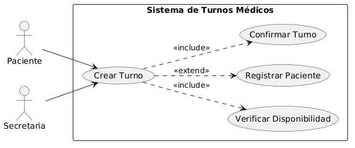
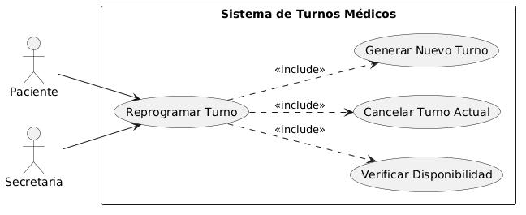
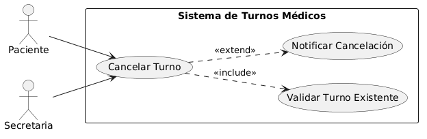
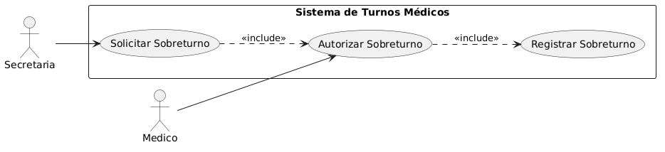
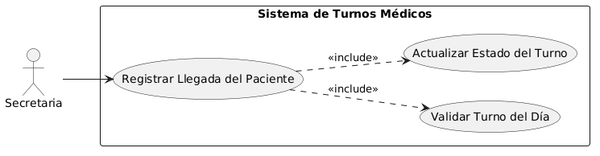

# Índice de Diagramas de Casos de Uso

## Diagramas implementados:

1. *[CU-01: Crear Turno](02-caso-uso-crear-turno.puml)* 
   - Diagrama: 

2. *[CU-02: Reprogramar Turno](02-caso-uso-reprogramar-turno.puml)*
   - Diagrama: 

3. *[CU-03: Cancelar Turno](02-caso-uso-cancelar-turno.puml)*
   - Diagrama: 

4. *[CU-04: Autorizar Sobreturno](02-caso-uso-autorizar-sobreturno.puml)*
   - Diagrama: 

5. *[CU-05: Registrar Llegada](02-caso-uso-registrar-llegada.puml)*
   - Diagrama: 