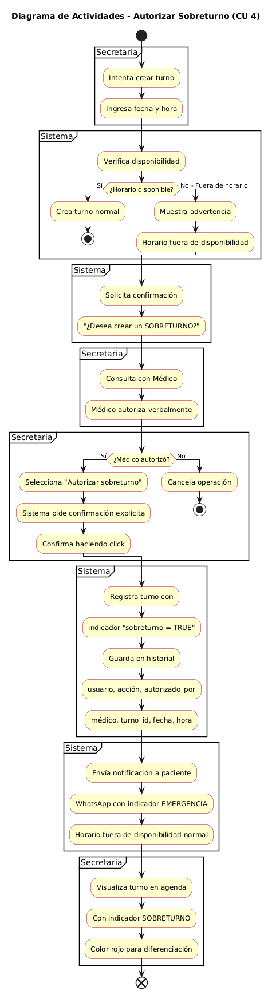

# Diagramas de Actividades

## Índice de Diagramas UML - Actividad Obligatoria N°3

### 1. Diagrama de Actividades - Cancelar Turno (Caso de Uso 3)

**Archivo:** `04-actividad-cancelar-turno-caso-uso-03.puml`  
**Descripción:** Flujo de cancelación de turnos médicos por parte de la secretaria.

**Actores:** Secretaria, Sistema  
**Actividades:** 10+  
**Decisiones:** Confirmación de cancelación (Sí/No)

---

### 2. Diagrama de Actividades - Autorizar Sobreturno (Caso de Uso 4)

**Archivo:** `04-actividad-autorizar-sobreturno-caso-uso-04.puml`  
**Descripción:** Flujo de autorización de turnos fuera de horario con validación médica.

**Actores:** Secretaria, Sistema, Médico  
**Actividades:** 12+  
**Decisiones:** Disponibilidad de horario, Autorización médica

---

### 3. Diagrama de Actividades - Registrar Llegada del Paciente (Caso de Uso 5)

**Archivo:** `04-actividad-registrar-llegada-caso-uso-05.puml`  
**Descripción:** Flujo de registro de llegada del paciente y notificación de puntualidad al médico.

**Actores:** Paciente, Secretaria, Sistema, Médico  
**Actividades:** 11+  
**Decisiones:** Puntualidad (Temprano/A tiempo vs Tarde)

---

## Documentación IA

Véase `ia/a3/esp-actividades-3-4-5.md` para detalles completos de:
- Contexto referenciado
- Prompts utilizados
- Ajustes realizados
- Iteraciones

---

**Responsable:** Natalia Belén Carreras  
**Especialidad:** Especialista en Diagramas de Actividades - Casos de Uso 3, 4 y 5  
**Fecha:** 17 de mayo de 2026
