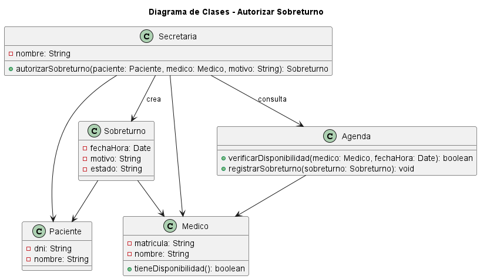
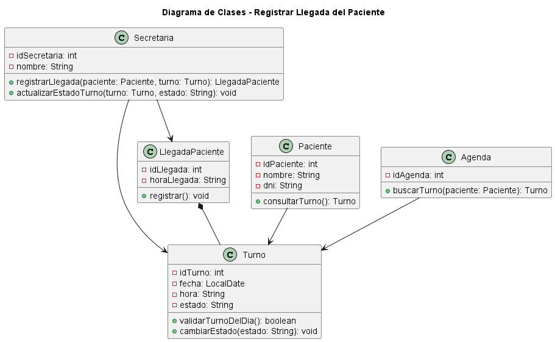

# Caso de Uso N° 04 y 05 - Diagramas de Clases: Autorizar Sobreturno y Registrar Llegada

---

# 1. Descripción y Trazabilidad con Requisitos Funcionales

## 04-clases-autorizar-sobreturno

**Actor/es:** Médico, Secretaria

**Objetivo:** Modelar las clases necesarias para gestionar la autorización de un sobreturno solicitado por un paciente.

**Descripción:**

El caso de uso permite que una secretaria gestione una solicitud de sobreturno asociada a un paciente y que el médico pueda evaluar, autorizar o rechazar dicha solicitud verificando la disponibilidad en la agenda. En caso de autorización, se genera un turno asociado al paciente.

**Requisitos funcionales que satisface:**

| ID | Requisito Funcional (texto exacto de introduccion.md) | Cómo lo satisface este caso de uso |
|----|------------------------------------------------------|-------------------------------------|
| RF[N] | [Completar con requisito literal del repositorio] | Permite gestionar la autorización de solicitudes de sobreturno. |
| RF[N] | [Completar con requisito literal del repositorio] | Permite generar un turno cuando el sobreturno es autorizado. |

---

## 05-clases-registrar-llegada

**Actor/es:** Paciente, Secretaria, Médico

**Objetivo:** Modelar las clases necesarias para registrar la llegada de un paciente y actualizar el estado de su turno.

**Descripción:**

El caso de uso permite que la secretaria registre la llegada de un paciente verificando el turno asignado, actualizando su estado y notificando la presencia al médico correspondiente.

**Requisitos funcionales que satisface:**

| ID | Requisito Funcional (texto exacto de introduccion.md) | Cómo lo satisface este caso de uso |
|----|------------------------------------------------------|-------------------------------------|
| RF[N] | [Completar con requisito literal del repositorio] | Permite registrar la llegada del paciente asociado a un turno. |
| RF[N] | [Completar con requisito literal del repositorio] | Permite actualizar el estado del turno luego de la llegada. |

---

# 2. Diagrama de Casos de Uso

## 04-clases-autorizar-sobreturno


**Actores y relaciones:**

- Secretaria → inicia y gestiona la solicitud de sobreturno.
- Médico → evalúa la solicitud y decide su autorización.
- Include: la autorización requiere consultar disponibilidad de agenda antes de generar el turno.

---

## 05-clases-registrar-llegada


**Actores y relaciones:**

- Paciente → confirma su asistencia al turno asignado.
- Secretaria → registra la llegada y actualiza información del turno.
- Médico → recibe la notificación de presencia del paciente.

---

# 3. Diagrama de Actividades

## 04-clases-autorizar-sobreturno


**Swimlanes:**

- Secretaria: gestiona la solicitud del sobreturno.
- Médico: analiza y decide la autorización.
- Sistema: verifica disponibilidad, actualiza estados y genera el turno.

**Decisiones clave del flujo:**

- Validación de disponibilidad del médico.
- Aprobación o rechazo del sobreturno.

---

## 05-clases-registrar-llegada


**Swimlanes:**

- Secretaria: busca y registra la llegada del paciente.
- Sistema: valida turno, registra información y actualiza estados.
- Paciente: confirma asistencia y espera atención.

**Decisiones clave del flujo:**

- Verificación de existencia del turno.
- Validación de llegada tardía.
- Actualización del estado del turno.

---

# 4. Diagrama de Secuencia

## 04-clases-autorizar-sobreturno


**Participantes:**

- secretaria:Secretaria
- medico:Medico
- sobreturno:Sobreturno
- agenda:Agenda
- turno:Turno

**Mensajes clave:**

- solicitarSobreturno(paciente, medico) → genera la solicitud de sobreturno.
- autorizarSobreturno(sobreturno) → modifica el estado de autorización.
- verificarDisponibilidad() → consulta disponibilidad.
- agregarTurno(turno) → registra el nuevo turno.

**Objetos temporales destruidos:**

No aplica.

---

## 05-clases-registrar-llegada


**Participantes:**

- paciente:Paciente
- secretaria:Secretaria
- medico:Medico
- agenda:Agenda
- turno:Turno

**Mensajes clave:**

- confirmarAsistencia(paciente, turno) → inicia el proceso de registro.
- accederAgendaDiaria(fecha) → consulta los turnos del día.
- buscarTurno(paciente) → obtiene el turno correspondiente.
- registrarLlegada(horaReal) → registra la llegada del paciente.
- cambiarEstado("Presente") → actualiza el estado del turno.
- registrarEnHistorial(horaReal) → guarda la información histórica.

**Objetos temporales destruidos:**

- turno:Turno → finaliza luego del registro de llegada.
- agenda:Agenda → finaliza luego de la consulta.

---

# 5. Diagrama de Clases del Caso de Uso

## 04-clases-autorizar-sobreturno



## 05-clases-registrar-llegada



---

## Clases involucradas:

| Clase | Responsabilidad (según tarjeta CRC) | Tarjeta CRC |
|-------|-------------------------------------|-------------|
| Medico | Autorizar o rechazar solicitudes de sobreturno verificando disponibilidad y recibir notificaciones de llegada. | [link tarjeta CRC] |
| Secretaria | Gestionar solicitudes de sobreturno y registrar la llegada del paciente. | [link tarjeta CRC] |
| Paciente | Representar al paciente asociado al turno y solicitudes realizadas. | [link tarjeta CRC] |
| Sobreturno | Representar la solicitud de atención adicional y administrar su estado. | [link tarjeta CRC] |
| Turno | Administrar información del turno, registrar llegada y modificar estados. | [link tarjeta CRC] |
| Agenda | Gestionar disponibilidad, búsqueda de turnos y registros históricos. | [link tarjeta CRC] |
| LlegadaPaciente | Registrar la llegada del paciente al establecimiento. | [link tarjeta CRC] |

---

## Relaciones UML:

| Relación | Clases | Justificación |
|----------|--------|---------------|
| Asociación | Secretaria → Sobreturno | La secretaria gestiona la solicitud de sobreturno. |
| Asociación | Médico → Sobreturno | El médico evalúa y decide sobre la autorización. |
| Asociación | Médico → Agenda | Consulta disponibilidad antes de autorizar. |
| Asociación | Sobreturno → Turno | Un sobreturno autorizado genera un turno. |
| Asociación | Paciente → Turno | El turno pertenece al paciente correspondiente. |
| Asociación | Agenda → Turno | La agenda administra los turnos registrados. |
| Asociación | Secretaria → LlegadaPaciente | La secretaria registra la llegada del paciente. |
| Asociación | Secretaria → Turno | Permite actualizar información del turno. |
| Asociación | Agenda → Turno | Permite localizar el turno correspondiente. |
| Composición | LlegadaPaciente *-- Turno | La llegada depende de un turno existente. |

---

# 6. Pseudocódigo

## 04-clases-autorizar-sobreturno

```text
INICIO Autorizar Sobreturno

// La secretaria genera la solicitud para un paciente
Sobreturno sobreturno = secretaria.solicitarSobreturno(paciente, medico)

// Se verifica la disponibilidad del médico
resultado = agenda.verificarDisponibilidad()

SI resultado es válido

    // El médico autoriza el sobreturno
    medico.autorizarSobreturno(sobreturno)

    // Se genera el turno asociado
    Turno turno = nuevo Turno()

    // La agenda registra el turno generado
    agenda.agregarTurno(turno)

SINO

    // El médico rechaza la solicitud
    medico.rechazarSobreturno(sobreturno)

FIN SI

FIN