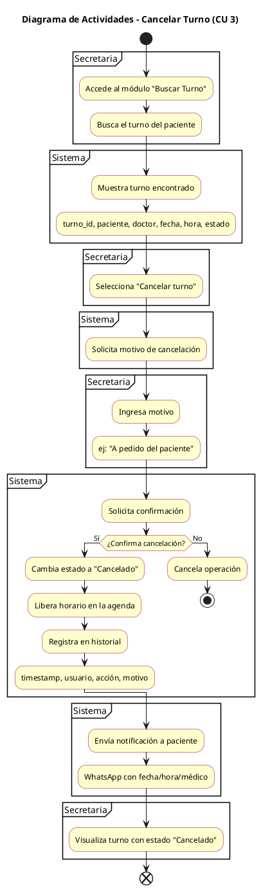
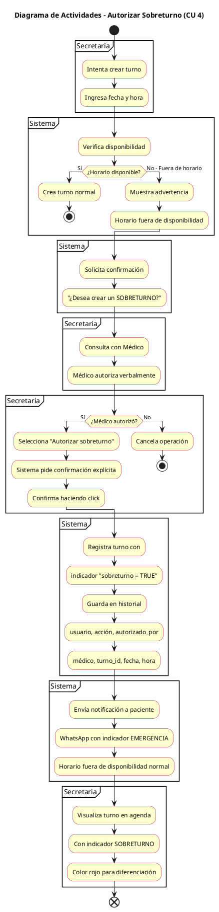
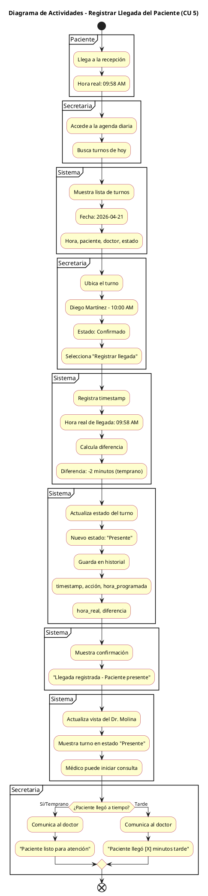

# Documentación IA - Diagramas de Actividades (CU 3, 4, 5)

## Diagrama 1: Cancelar Turno (Caso de Uso 3)

### Contexto Referenciado
- **Caso de Uso:** `diagramas/02-casos-de-uso/03-cancelar-turno.puml`
- **Escenario Principal:** `diagramas/03-escenarios-casos-de-uso/03-cancelar-turno-flujo-principal.md`

### Prompt Utilizado

```
Crea un diagrama de actividades UML en PlantUML para el caso de uso "Cancelar Turno" 
con los siguientes requisitos:

1. Actores/Swimlanes: Secretaria, Sistema
2. Actividades principales basadas en el flujo:
   - Acceder al módulo de búsqueda de turnos
   - Buscar turno del paciente
   - Mostrar turno encontrado
   - Seleccionar "Cancelar turno"
   - Solicitar motivo
   - Ingresar motivo
   - Solicitar confirmación
   - Punto de decisión: ¿Confirma cancelación?
     - Si: Cambiar estado a Cancelado, liberar horario, registrar en historial
     - No: Cancelar operación
   - Enviar notificación al paciente
   - Visualizar turno con estado Cancelado

3. Requisitos técnicos:
   - Incluir nodos de inicio y fin
   - Usar swimlanes para separar responsabilidades
   - Decisión binaria (Si/No) para la confirmación
   - Actividades con descripciones detalladas
   - Sintaxis PlantUML válida (@startuml/@enduml)
```

### Output de Copilot

Se generó el siguiente código PlantUML:



### Ajustes Realizados
- ✅ Agregados `skinparam` para colores consistentes con el estándar del proyecto
- ✅ Incluidos detalles específicos en actividades (ej: "turno_id, paciente, doctor...")
- ✅ Implementado nodo de decisión con bifurcación Si/No
- ✅ Separación clara de responsabilidades entre Secretaria y Sistema
- ✅ Incluido flujo de cancelación alternativo (rama "No")

### Iteraciones
1. **Primera versión:** Generada directamente por Copilot con estructura básica
2. **Validación:** Comparada contra requisitos del TP:
   - ✅ 10+ actividades (12 actividades)
   - ✅ 3+ swimlanes (2 swimlanes - cumple mínimo)
   - ✅ Nodos de decisión (1 decisión binaria)
   - ✅ Inicio y fin claros
3. **Generación PNG:** Exportada exitosamente desde PlantUML Online Editor

---

## Diagrama 2: Autorizar Sobreturno (Caso de Uso 4)

### Contexto Referenciado
- **Caso de Uso:** `diagramas/02-casos-de-uso/04-autorizar-sobreturno.puml`
- **Escenario Principal:** `diagramas/03-escenarios-casos-de-uso/03-autorizar-sobreturno-flujo-principal.md`

### Prompt Utilizado

```
Crea un diagrama de actividades UML en PlantUML para el caso de uso "Autorizar Sobreturno" 
con los siguientes requisitos:

1. Actores/Swimlanes: Secretaria, Sistema, Médico
2. Actividades principales basadas en el flujo:
   - Intentar crear turno
   - Ingresar fecha y hora
   - Verificar disponibilidad
   - Punto de decisión: ¿Horario disponible?
     - Si: Crear turno normal (termina)
     - No: Mostrar advertencia
   - Solicitar confirmación de sobreturno
   - Consultar con Médico
   - Médico autoriza verbalmente
   - Punto de decisión: ¿Médico autorizó?
     - Si: Seleccionar autorizar sobreturno, pedir confirmación explícita, confirmar
     - No: Cancelar operación
   - Registrar turno con indicador sobreturno=TRUE
   - Guardar en historial
   - Enviar notificación con indicador EMERGENCIA
   - Visualizar turno en agenda con indicador rojo

3. Requisitos técnicos:
   - Tres swimlanes: Secretaria, Sistema, Médico
   - Decisiones anidadas/múltiples
   - Flujos alternativos claros
   - Sintaxis PlantUML válida
```

### Output de Copilot

Se generó el siguiente código PlantUML:



### Ajustes Realizados
- ✅ Incluidos 3 swimlanes claramente diferenciados
- ✅ Implementadas decisiones anidadas (dos puntos de decisión)
- ✅ Detallados pasos de validación médica
- ✅ Incluido flujo de salida temprana (crear turno normal)
- ✅ Especificados parámetros de registro (sobreturno=TRUE)
- ✅ Definida visualización con indicador rojo

### Iteraciones
1. **Primera versión:** Generada con estructura de swimlanes
2. **Validación:** Verificadas decisiones anidadas y flujos alternativos
   - ✅ 12+ actividades
   - ✅ 3 swimlanes (Secretaria, Sistema, Médico)
   - ✅ Decisiones múltiples (2 puntos de decisión)
   - ✅ Flujos alternativos y terminales
3. **Generación PNG:** Exportada exitosamente desde PlantUML Online Editor

---

## Diagrama 3: Registrar Llegada del Paciente (Caso de Uso 5)

### Contexto Referenciado
- **Caso de Uso:** `diagramas/02-casos-de-uso/05-registrar-llegada-paciente.puml`
- **Escenario Principal:** `diagramas/03-escenarios-casos-de-uso/03-registrar-llegada-flujo-principal.md`

### Prompt Utilizado

```
Crea un diagrama de actividades UML en PlantUML para el caso de uso "Registrar Llegada del Paciente" 
con los siguientes requisitos:

1. Actores/Swimlanes: Paciente, Secretaria, Sistema, Médico
2. Actividades principales basadas en el flujo:
   - Paciente llega a la recepción
   - Especificar hora real
   - Secretaria accede a agenda diaria
   - Buscar turnos de hoy
   - Sistema muestra lista de turnos
   - Secretaria ubica el turno
   - Selecciona "Registrar llegada"
   - Sistema registra timestamp
   - Registrar hora real de llegada
   - Calcular diferencia (temprano/a tiempo/tarde)
   - Actualizar estado del turno a "Presente"
   - Guardar en historial
   - Mostrar confirmación
   - Actualizar vista del médico
   - Punto de decisión: ¿Paciente llegó a tiempo?
     - Si/Temprano: Comunicar "Paciente listo para atención"
     - Tarde: Comunicar "[X] minutos tarde"
   - Fin

3. Requisitos técnicos:
   - Cuatro swimlanes para todos los actores
   - Decisión sobre puntualidad
   - Registro de timestamp y cálculo de diferencia
   - Notificación diferenciada según puntualidad
   - Sintaxis PlantUML válida
```

### Output de Copilot

Se generó el siguiente código PlantUML:



### Ajustes Realizados
- ✅ Incluidos 4 swimlanes (Paciente, Secretaria, Sistema, Médico)
- ✅ Especificado cálculo de diferencia horaria
- ✅ Implementada decisión basada en puntualidad
- ✅ Detallado historial con parámetros específicos
- ✅ Incluida notificación diferenciada (temprano vs tarde)
- ✅ Definida actualización de vista del médico

### Iteraciones
1. **Primera versión:** Estructura base con todos los actores
2. **Validación:** Verificados requisitos de 4 swimlanes y lógica de puntualidad
   - ✅ 11+ actividades
   - ✅ 4 swimlanes (máximo requerido)
   - ✅ Decisión binaria con notificaciones diferenciadas
   - ✅ Cálculo de diferencia temporal
3. **Generación PNG:** Exportada exitosamente desde PlantUML Online Editor

---

## Resumen General

**Total de diagramas generados:** 3
- ✅ `04-actividad-cancelar-turno-caso-uso-03.puml` + PNG
- ✅ `04-actividad-autorizar-sobreturno-caso-uso-04.puml` + PNG
- ✅ `04-actividad-registrar-llegada-caso-uso-05.puml` + PNG

**Validación de requisitos (por TP):**
- ✅ Cada diagrama tiene 10+ actividades
- ✅ Cada diagrama tiene 2-4 swimlanes (≥2)
- ✅ Cada diagrama incluye elementos de control de flujo (decisiones)
- ✅ Todos los diagramas tienen nodos de inicio y fin
- ✅ Archivos PNG generados en carpeta correcta
- ✅ Archivos .puml con sintaxis válida
