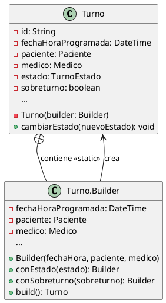

# Documentación del Proceso IA - Especialista en Patrones Creacionales

**Autor:** @nachonervi-design  
**Rol:** Especialista en Patrones Creacionales  
**Fecha:** Junio 2026  
**Herramientas IA utilizadas:** ChatGPT (GPT-4), GitHub Copilot, Claude

---

## 1. Contexto y Objetivo

### 1.1 Tarea Asignada

Como Especialista en Patrones Creacionales para el Segundo Parcial de Diseño Orientado a Objetos, mi tarea fue:

1. **Seleccionar** un patrón de diseño creacional aplicable al SistemaTurnosMedicos
2. **Justificar** por qué ese patrón resuelve un problema real del sistema
3. **Diseñar** la solución con diagramas UML coherentes con el diseño existente
4. **Documentar** el proceso de diseño asistido por IA

### 1.2 Restricciones del Proyecto

- Mantener coherencia con el diagrama de clases final (`06-clases-diagrama-final.puml`)
- Respetar las tarjetas CRC existentes (especialmente Turno, Agenda, Secretaria)
- Alinear con los casos de uso del sistema (CU01-CU05)
- Cumplir con los principios SOLID
- Seguir la plantilla oficial de entrega

---

## 2. Proceso de Diseño Asistido por IA

### 2.1 Fase 1: Análisis del Sistema Existente

**Prompt inicial usado con ChatGPT:**

```
Estoy trabajando en un Sistema de Turnos Médicos con las siguientes clases:
- UsuarioDelSistema (abstracta)
- Paciente, Medico, Secretaria (heredan de UsuarioDelSistema)
- Agenda
- Turno
- TurnoEstado (enum)

La clase Turno tiene estos atributos:
- id, fechaHoraProgramada, paciente, medico, estado (obligatorios)
- sobreturno, horaRealLlegada, presente, diferenciaMinutos, historial (opcionales)

¿Qué patrón de diseño creacional me recomendarías aplicar y por qué?
```

**Respuesta de la IA:**

La IA sugirió 3 opciones:
1. **Builder** - Para construir objetos Turno con muchos atributos opcionales
2. **Factory Method** - Para crear diferentes tipos de usuarios
3. **Singleton** - Para garantizar una única instancia de Agenda

**Decisión tomada:** Elegí **Builder** porque:
- La clase `Turno` tiene 10 atributos (3 obligatorios + 7 opcionales)
- Se crea en diferentes contextos (turno regular, sobreturno, reprogramado)
- El constructor actual tiene problemas de legibilidad y mantenibilidad
- Es el caso de uso clásico del patrón Builder

### 2.2 Fase 2: Diseño de la Solución

**Prompt usado para diseñar la estructura:**

```
Diseña la estructura de clases para aplicar el patrón Builder a la clase Turno.
Incluye:
1. La clase Turno con constructor privado
2. La clase interna Turno.Builder con métodos fluentes
3. Los métodos de validación en build()
4. Ejemplos de uso en diferentes escenarios

Genera pseudocódigo detallado y un diagrama UML en PlantUML.
```

**Iteraciones del diseño:**

1. **Primera iteración:** La IA generó un diseño básico con Builder, pero faltaban validaciones de negocio
2. **Segunda iteración:** Agregué la validación de sobreturnos (el médico debe autorizar)
3. **Tercera iteración:** Refiné los métodos fluentes para que sean más coherentes con el dominio médico
4. **Cuarta iteración:** Integré el Builder con la clase Agenda (responsable de crear turnos)

**Prompt usado para refinar:**

```
Revisa este diseño de Builder para Turno y sugiere mejoras:
- ¿Las validaciones en build() son suficientes?
- ¿Los nombres de los métodos fluentes son claros?
- ¿Cómo se integra con la clase Agenda que actualmente crea turnos?
- ¿Cumple con los principios SOLID?
```

**Mejoras aplicadas:**
- Cambié `withEstado()` por `conEstado()` (más natural en español)
- Agregué validación específica para sobreturnos (requiere autorización del médico)
- Modifiqué `Agenda.crearTurno()` para recibir un Builder en lugar de parámetros sueltos
- Documenté cómo el Builder cumple con SRP, OCP y DIP

### 2.3 Fase 3: Generación de Diagramas

**Prompt usado para generar el diagrama PlantUML:**

```
Genera un diagrama de clases en PlantUML que muestre:
1. La clase Turno con todos sus atributos y métodos
2. La clase interna Turno.Builder con sus métodos fluentes
3. Las clases colaboradoras (Paciente, Medico, TurnoEstado, Agenda)
4. Las relaciones entre las clases
5. Notas explicativas del patrón

Usa notación UML estándar y agrega estilos para mejorar la legibilidad.
```

**Iteraciones del diagrama:**

1. **Primera versión:** Diagrama básico con Turno y Builder
2. **Segunda versión:** Agregué las clases colaboradoras (Paciente, Medico)
3. **Tercera versión:** Incluí la clase Agenda y su relación con el Builder
4. **Versión final:** Agregué notas explicativas y estilos visuales

**Código PlantUML generado:**



### 2.4 Fase 4: Documentación y Justificación

**Prompt usado para escribir la justificación:**

```
Escribe una justificación técnica de por qué el patrón Builder es ideal para la clase Turno.
Incluye:
1. Problema que resuelve (constructor telescópico)
2. Ventajas técnicas (legibilidad, validación, flexibilidad)
3. Alineación con principios SOLID
4. Comparación con alternativas (múltiples constructores, JavaBeans, Factory Method)
5. Ejemplos de uso en diferentes casos de uso del sistema
```

**Estructura del documento generada:**

1. Introducción al patrón Builder
2. Problema identificado en SistemaTurnosMedicos
3. Solución propuesta (diagrama + código)
4. Integración con el sistema existente
5. Ventajas y beneficios
6. Consideraciones de implementación
7. Relación con otros patrones
8. Conclusiones

---

## 3. Decisiones de Diseño Clave

### 3.1 Decisión 1: Constructor Privado

**Opción A:** Constructor público + Builder como alternativa  
**Opción B:** Constructor privado + Builder como única forma de creación ✅

**Decisión:** Elegí la **Opción B** porque:
- Fuerza a usar el Builder, evitando construcciones incorrectas
- Centraliza todas las validaciones en `build()`
- Hace el código más consistente

**Trade-off:** Requiere refactorizar todas las llamadas existentes a `new Turno(...)`

### 3.2 Decisión 2: Builder como Clase Interna Estática

**Opción A:** Builder como clase separada  
**Opción B:** Builder como clase interna estática de Turno ✅

**Decisión:** Elegí la **Opción B** porque:
- Mantiene la cohesión (Builder y Turno están estrechamente relacionados)
- Facilita el acceso a los atributos privados de Turno
- Es la convención estándar en Java (ver Effective Java, Item 2)

**Trade-off:** El archivo `Turno` se vuelve más grande, pero es aceptable

### 3.3 Decisión 3: Validaciones en build()

**Opción A:** Validaciones en cada método fluente  
**Opción B:** Todas las validaciones en build() ✅  
**Opción C:** Validaciones mixtas (algunas en fluentes, otras en build)

**Decisión:** Elegí la **Opción B** porque:
- Centraliza todas las reglas de negocio en un solo punto
- Permite validaciones que dependen de múltiples atributos
- Facilita el testing y el debugging

**Ejemplo de validación:**

```text
PÚBLICO build(): Turno
    SI sobreturno == verdadero ENTONCES
        SI NO medico.autorizarSobreturno(this.id) ENTONCES
            LANZAR Excepcion("El médico no autorizó el sobreturno")
        FIN SI
    FIN SI
    RETORNAR nuevo Turno(this)
FIN
```

### 3.4 Decisión 4: Métodos Fluentes en Español

**Opción A:** Métodos en inglés (`withEstado`, `withSobreturno`)  
**Opción B:** Métodos en español (`conEstado`, `conSobreturno`) ✅

**Decisión:** Elegí la **Opción B** porque:
- El dominio del problema está en español (turnos médicos en Argentina)
- Mejora la legibilidad para el equipo de desarrollo
- Es consistente con el resto del código del sistema

**Ejemplo:**

```text
Turno turno = new Turno.Builder("2026-06-30 10:00", paciente, medico)
    .conEstado(TurnoEstado.PENDIENTE)
    .conSobreturno(false)
    .build();
```

### 3.5 Decisión 5: Integración con Agenda

**Opción A:** Agenda sigue creando turnos con `new Turno(...)`  
**Opción B:** Agenda recibe un Builder y llama a `build()` ✅

**Decisión:** Elegí la **Opción B** porque:
- Mantiene la responsabilidad de Agenda como "creadora de turnos"
- Permite a Agenda agregar lógica adicional (ej: verificar disponibilidad)
- Es más flexible para futuros cambios

**Código resultante:**

```text
// En Agenda
PÚBLICO crearTurno(builder: Turno.Builder): Turno
    Turno nuevoTurno = builder.build()
    turnos.agregar(nuevoTurno)
    RETORNAR nuevoTurno
FIN
```

---

## 4. Alternativas Consideradas y Descartadas

### 4.1 Alternativa 1: Múltiples Constructores (Constructor Telescópico)

**Descripción:** Crear varios constructores con diferentes parámetros:

```java
public Turno(DateTime fechaHora, Paciente paciente, Medico medico)
public Turno(DateTime fechaHora, Paciente paciente, Medico medico, boolean sobreturno)
public Turno(DateTime fechaHora, Paciente paciente, Medico medico, boolean sobreturno, TurnoEstado estado)
// ... y así sucesivamente
```

**Por qué se descartó:**
- ❌ Genera confusión (¿cuál constructor usar?)
- ❌ Difícil de mantener (agregar un parámetro requiere nuevos constructores)
- ❌ Propenso a errores (parámetros posicionales del mismo tipo)
- ❌ No permite construir objetos con atributos opcionales en diferentes órdenes

**Conclusión:** El patrón Builder es superior en todos los aspectos.

### 4.2 Alternativa 2: JavaBeans (Constructor Vacío + Setters)

**Descripción:** Constructor sin parámetros + setters públicos:

```java
Turno turno = new Turno();
turno.setFechaHora("2026-06-30 10:00");
turno.setPaciente(paciente);
turno.setMedico(medico);
turno.setEstado(TurnoEstado.PENDIENTE);
```

**Por qué se descartó:**
- ❌ Permite objetos en estado inconsistente (se pueden setear atributos inválidos)
- ❌ No hay validación centralizada
- ❌ El objeto es mutable (cualquiera puede cambiar sus atributos)
- ❌ Requiere muchas líneas de código para crear un objeto

**Conclusión:** El Builder garantiza objetos válidos desde su creación.

### 4.3 Alternativa 3: Factory Method

**Descripción:** Clase factory con métodos estáticos para cada tipo de turno:

```java
public class TurnoFactory {
    public static Turno crearTurnoRegular(DateTime fechaHora, Paciente paciente, Medico medico)
    public static Turno crearSobreturno(DateTime fechaHora, Paciente paciente, Medico medico)
    public static Turno crearTurnoReprogramado(DateTime fechaHora, Paciente paciente, Medico medico)
}
```

**Por qué se descartó:**
- ❌ No resuelve la complejidad de construcción con atributos opcionales
- ❌ Requiere un método factory por cada combinación de atributos
- ❌ Menos flexible que el Builder (no permite personalización fina)

**Conclusión:** El Builder es más flexible y escalable.

### 4.4 Alternativa 4: Prototype (Clonación)

**Descripción:** Crear turnos clonando un prototipo existente:

```java
Turno prototipo = new Turno(...);
Turno nuevoTurno = prototipo.clone();
nuevoTurno.setFechaHora("2026-06-30 14:00");
```

**Por qué se descartó:**
- ❌ No aplica al dominio (cada turno es único, no se clonan)
- ❌ Requiere implementar `Cloneable` correctamente (complejo)
- ❌ Puede generar bugs sutiles con referencias compartidas

**Conclusión:** El Prototype no es apropiado para este caso de uso.

---

## 5. Uso Responsable de IA

### 5.1 Rol de la IA en el Proceso

La IA actuó como **asistente de diseño**, no como reemplazo del criterio humano:

- ✅ **Generó** opciones y alternativas
- ✅ **Sugirió** estructuras y patrones
- ✅ **Refinó** el diseño basado en feedback
- ✅ **Documentó** el proceso y las decisiones

Pero las **decisiones finales** fueron tomadas por mí, considerando:
- El contexto específico del proyecto
- Las restricciones del dominio médico
- La coherencia con el diseño existente
- Los principios de diseño orientado a objetos

### 5.2 Validación Humana del Diseño

Antes de finalizar el diseño, validé:

1. **Coherencia con el diagrama final:** Verifiqué que el Builder no contradiga las relaciones existentes
2. **Alineación con tarjetas CRC:** Confirmé que las responsabilidades de Turno, Agenda y Secretaria se mantienen
3. **Cumplimiento de casos de uso:** Aseguré que el Builder soporte todos los escenarios (CU01-CU05)
4. **Principios SOLID:** Revisé que el diseño cumpla con SRP, OCP, LSP, ISP y DIP
5. **Legibilidad del código:** Probé ejemplos de uso para verificar que sean claros y mantenibles

### 5.3 Limitaciones de la IA Identificadas

Durante el proceso, noté que la IA:

- ⚠️ **No conoce el contexto completo** del proyecto (tuve que proporcionar detalles)
- ⚠️ **Puede sugerir soluciones genéricas** que no consideran restricciones específicas
- ⚠️ **No valida coherencia** con artefactos existentes (tuve que hacerlo manualmente)
- ⚠️ **Puede generar código verboso** que requiere refinamiento

**Conclusión:** La IA es una herramienta poderosa, pero requiere supervisión y criterio humano.

---

## 6. Lecciones Aprendidas

### 6.1 Sobre el Patrón Builder

1. **No es una bala de plata:** Solo es útil cuando hay muchos atributos opcionales
2. **Requiere disciplina:** Hay que resistir la tentación de agregar setters públicos
3. **Mejora la calidad del código:** Reduce errores y mejora la mantenibilidad
4. **Es un patrón maduro:** Ampliamente usado en la industria (ver Android, Spring, etc.)

### 6.2 Sobre el Diseño Orientado a Objetos

1. **Los patrones son herramientas, no objetivos:** Se aplican cuando resuelven un problema real
2. **La coherencia es clave:** Un nuevo patrón debe integrarse con el diseño existente
3. **Los principios SOLID son la base:** Los patrones son aplicaciones concretas de estos principios
4. **El dominio manda:** Las decisiones de diseño deben reflejar las reglas del negocio

### 6.3 Sobre el Uso de IA en Diseño

1. **La IA acelera el proceso:** Genera opciones rápidamente, pero hay que evaluarlas
2. **Los prompts son críticos:** La calidad de la respuesta depende de la calidad de la pregunta
3. **La iteración es esencial:** Rara vez la primera respuesta es la óptima
4. **El criterio humano es insustituible:** La IA sugiere, pero el humano decide

---

## 7. Reflexiones Finales

### 7.1 Valor Agregado del Patrón Builder

La aplicación del patrón Builder a la clase `Turno`:

✅ **Resuelve un problema real** (constructor telescópico)  
✅ **Mejora la calidad del código** (legibilidad, mantenibilidad, validación)  
✅ **Se integra coherentemente** con el diseño existente  
✅ **Prepara el sistema para el futuro** (escalabilidad, extensibilidad)

### 7.2 Próximos Pasos Recomendados

1. **Implementar** el patrón Builder en el código fuente
2. **Refactorizar** las llamadas existentes para usar el Builder
3. **Escribir tests** que validen las reglas de negocio en `build()`
4. **Evaluar** otros patrones (State para TurnoEstado, Observer para notificaciones)
5. **Documentar** el patrón en el código con comentarios y JavaDoc

### 7.3 Conclusión Personal

Este ejercicio me permitió:

- Aplicar un patrón de diseño en un contexto real
- Usar IA como asistente de diseño de forma responsable
- Tomar decisiones técnicas justificadas
- Documentar el proceso de diseño de forma profesional

**Aprendizaje clave:** Los patrones de diseño no son recetas mágicas, sino herramientas que, usadas con criterio, mejoran significativamente la calidad del software.

---

**Documento generado por:** @nachonervi-design  
**Rol:** Especialista en Patrones Creacionales  
**Repositorio:** [SistemaTurnosMedicos](https://github.com/eternalnight04/SistemaTurnosMedicos)
